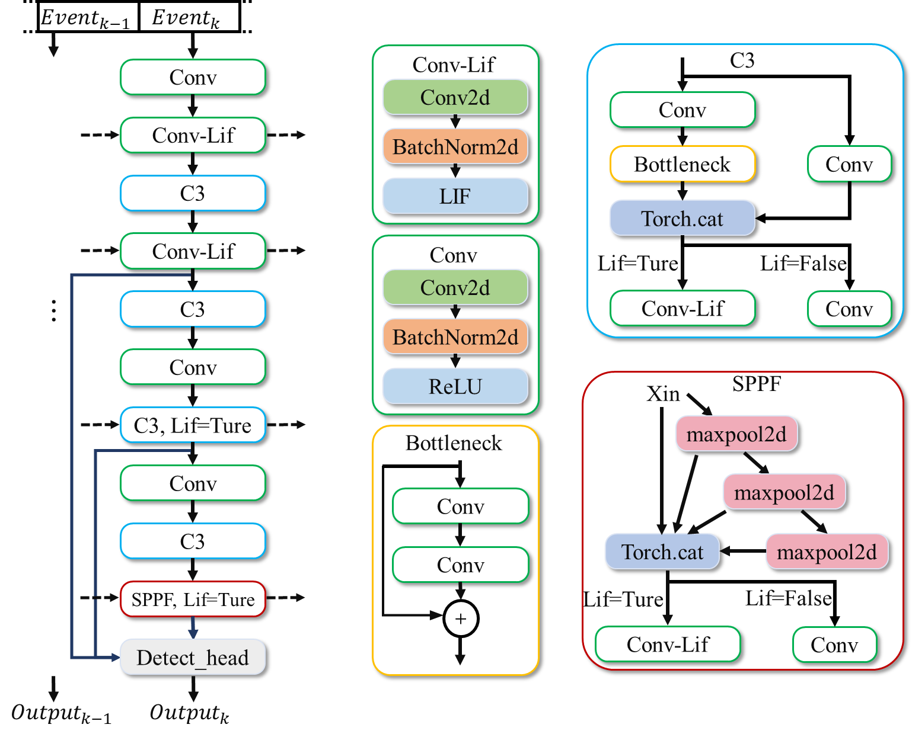

Data and Preprocessing
^^^^^^^^^^^^^^^^^^^^^^^^^^^^^^^^^^^^^^^^^^^^^^^^^^^^^^^^^^^^^^^^^^^^^^^^^^^^^^^^^^^^^^^^^^^^^^^^^^^^^^^^^^^^^^^^^^

The Gen1 dataset is recorded using a PROPHESEE GEN1 sensor mounted on a car dashboard, with a resolution of 
:math:`304 \times 240`\ pixels. Labels are generated by using the gray level estimation function of an ATIS camera 
to create standard gray images at specific frequencies, which are then manually annotated. The dataset contains 
39 hours of open road and various driving scenes, including urban, highway, suburban, and rural scenarios. Manually 
annotated bounding boxes contain two categories: pedestrians and cars.

To facilitate the training of deep learning methods, we cut the continuous shooting data into 60-second segments. 
In total, 2359 samples were obtained: 1460 training samples, 470 test samples, and 429 validation samples. 
Each sample is provided in a binary .dat format, where event coding uses 4 bytes to represent the timestamp and 
4 bytes for position and polarity. More specifically, the x position uses 14 bits, the y position uses 14 bits, 
and the polarity uses 1 bit.

Bounding box annotations are provided in numpy format. Each numpy array contains the following fields:

- -ts, timestamp of the box (in microseconds);
- -x, x-coordinate of the top-left corner (in pixels);
- -y, y-coordinate of the top-left corner (in pixels);
- -w, width of the box (in pixels);
- -h, height of the box (in pixels);
- -class id, category of the object:
  - car is 0;
  - pedestrian is 1.

The preprocessing step first creates a four-dimensional tensor E:

- The first dimension consists of two components representing polarity;
- The second dimension has T components and is related to T discretization steps in time;
- The third and fourth dimensions represent the height and width of the event camera, respectively.

Events within the time interval [:math:`t_{a}`, :math:`t_{b}`] are processed in the following way for the set E:

.. math:: E(p,\ \tau,\ x,\ y) = \sum_{e_{k} \in \varepsilon}^{}{\delta\left( p\  - \ p_{k} \right)\delta\left( x\  - \ x_{k},\ y\  - \ y_{k} \right)\delta\left( \tau\  - \ \tau_{k} \right)},\ {\ \ \ \ \ \ \tau}_{k} = \left\lfloor \frac{t_{k}\  - \ t_{a}}{t_{b}\  - \ t_{a}} \cdot T \right\rfloor

In other words, we create T two-channel frames, where each pixel contains the number of positive and negative events within one of the T time frames. Finally, we flatten the polarity and time dimensions to obtain a three-dimensional tensor of shape (2T, H, W), which is directly compatible with 2D convolutions.

Network Model
^^^^^^^^^^^^^^^^^^^^^^^^^^^^^^^^^^^^^^^^^^^^^^^^^^^^^^^^^^^^^^^^^^^^^^^^^^^^^^^^^^^^^^^^^^^^^^^^^^^^^^^^^^^^

The ST-YOLO network can perform target detection on event stream data based on spatiotemporal dynamics. After 
sequentially inputting the event stream information into the network, it is first processed into tensors 
representing spatial and temporal events. A new event tensor is input into the network at each time step. 
Additionally, specific Lif layers will accept the state from the previous time step. The output of the Lif 
layer after passing through the backbone is used as input for the detection framework. The specific structure 
is shown in the figure below.

   Figure: ST-YOLO Network Architecture Diagram

The network consists of two parts: the backbone and the Detect_head. The backbone part is modified based on 
the yolov5 backbone, mainly replacing ReLU layers with Lif layers to process time dimension information using 
the spatiotemporal characteristics of the Lif layer. The Detect_head includes an FPN network and a YoloXhead.

Demonstration
^^^^^^^^^^^^^^^^^^^^^^^^^^^^^^^^^^^^^^^^^^^^^^^^^^^^^^^^^^^^^^^^^^^^^^^^^^^^^^^^^^^^^^^^^^^^^^^^^^^^^^^^^^^^

When the GEN1 dataset's test set is input into the aforementioned network, it can output a sequence of target detection frames from the event stream data. The following video is a demonstration example:

.. video:: _static/cann.mp4
   :loop:
   :align: center
   :width: 100%
   :caption: ST-YOLO pedestrian vehicle detection demo
