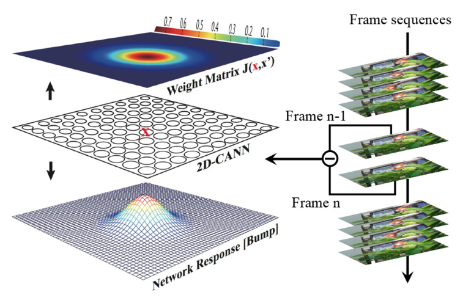

Tiger1 Dataset Object Tracking
~~~~~~~~~~~~~~~~~~~~~~~~~~~~~~~~~~~~~~~~~~~~~~~~~~~~~~~~~~~~~~~~~~~~~~~~~~~~~~~~~~~~~~~~~~

**Data and Preprocessing**

The Tiger1 dataset consists of a video with a resolution of 640×480, totaling 354 frames. Each frame is manually annotated with a bounding rectangle 
(x, y, w, h) as the groundtruth of the tracking target, where x and y are the coordinates of the top-left corner of the rectangle, and w and h are the width and height of the rectangle, respectively. In the video, there are variations in illumination, occlusion of the target, target deformation, motion blur, and both in-plane and out-of-plane target rotations.

To save graphical memory, we first convert each frame of the color image to a grayscale image and then down-sample it to a 30×56 resolution.

**Network Model**

The network model used in this task is the Continuous Attractor Neural Network (CANN), a model inspired by neuroscience. As shown in the figure below, 
x represents coordinates on a two-dimensional plane, and \ :math:`V(x,\ t)`\ is the membrane potential of a neuron at position x and time t.

.. _fig_CANN:

   Figure: Original Dynamic Model of CANN Schematic

.. video:: _static/cann.mp4
   :loop:
   :align: center
   :width: 100%
   :caption: Example of Object Tracking Based on CANN

, r(x,t) is the firing rate of the neuron. It is reasonable to assume that \ :math:`r(x,\ t)`\ increases with \ :math:`V(x,\ t)`\, but saturates under global inhibition. Such a model can be represented as:

.. math::

   \begin{array}{r}
   r(x,t) = \frac{V^{2}(x,t)}{1 + k\int_{- \infty}^{+ \infty} V^{2}\left( x',t \right) dx'}\#(1)
   \end{array}

where \ :math:`k`\ is a small positive hyperparameter that controls the strength of the global inhibition.

In the CANN model, \ :math:`V(x,\ t)`\ is determined by external stimuli and recurrent inputs from other neurons as well as its own relaxation. Denoting \ :math:`V_{ext}(x,t)`\ as the external stimulus to neuron x at time t, the model can be represented as:

.. math::

   \begin{array}{r}
   \tau\frac{\partial V(x,t)}{\partial t} = - V(x,t) + \beta\int_{- \infty}^{+ \infty} J\left( x,x' \right)r\left( x',t \right) dx' + V_{ext}(x,t)\#(2)
   \end{array}

where \ :math:`\tau`\ is a time constant typically on the order of 1 millisecond, and \ :math:`\beta`\ determines the proportion between recurrent input and external stimuli. \ :math:`J\left( x,x^{'} \right)`\ is the interaction (synaptic weight) between the neuron at position \ :math:`x^{'}`\ and the neuron at position \ :math:`x`\.
\ :math:`J\left( x,x^{'} \right)`\ is calculated as follows:

.. math::

   \begin{array}{r}
   J\left( x,x^{'} \right) = \frac{J_{0}}{2\pi a^{2}}e^{- \frac{\left| x - x^{'} \right|^{2}}{2a^{2}}}
   \end{array}

where \ :math:`J_{0}`\ is a constant, \ :math:`a`\ represents the Gaussian interaction range, 
\ :math:`|x - x^{'}|`\ denotes the distance between neurons \ :math:`x`\ and \ :math:`x^{'}`\ 
\ :math:`\frac{J_{0}}{2\pi a^{2}}`\ is the maximum interaction range. The above formula encodes the synaptic pattern (bump shape) with translational invariance, resulting in similar bump patterns represented by high firing rates of neurons. The response bump can predict the location of the object. Additionally, the neuron distance is circular, meaning the topmost and bottommost neurons and those on the far left and right are connected as neighboring neurons. This symmetry ensures stability of the bumps at the boundaries.

As shown in :ref:`fig_CANN`, the differential signals of every two adjacent frames from the video are injected into the network as external stimuli 
\ :math:`V_{ext}(x,t)`\. Each neuron receives the intensity of the corresponding pixel in the 2D differential frame. CANN can smoothly track an object since continuous neural dynamics result in smooth trajectories of response bumps. The trajectories have the following features:

- In the absence of external stimuli, the network can maintain a stationary response bump through recurrent inputs;
- When an object is present, especially a moving one, the network can smoothly alter its response bump according to the moving target.
  The above video shows an example of object tracking based on CANN, where the red bounding box is the gold standard of the object's position, and the yellow bounding box reflects the predicted position based on the response bump.

Since long-range connections typically have minimal impact on the neuron's membrane potential and firing rate, and for easier digital circuit implementation, 
[Equation#2] can be expressed with minimal accuracy loss as:

.. math::

   \begin{array}{r}
   J\left( x,x^{'} \right) = \left\{ \begin{array}{r}
   \frac{J_{0}}{2\pi a^{2}}e^{- \frac{\left| x - x^{'} \right|^{2}}{2a^{2}}},\ if\ neuron\ x^{'} \in CF(x,\ R) \\
   0,\ otherwise
   \end{array} \right.\ 
   \end{array}

where \ :math:`x^{'} \in CF(x,\ R)`\ indicates that each neuron x only has local connections with neighboring neurons within an R×R rectangular area centered on x.

Because digital circuits cannot directly support the continuous differential dynamics in [Equation#1] and [Equation#2],
an iterative state update method can be used to discretize the continuous dynamics into equivalent differential equations. By setting τ=1 and ∂t=1, the continuous state update of the CANN can be modified into an iterative version.

.. math::

   \begin{array}{r}
   \left\{ \begin{array}{r}
   V(x,t + 1) = \beta\sum_{x^{'} \in CF}^{}{J\left( x,x^{'} \right)r\left( x^{'},t \right)} + V_{ext}(x,t) \\
   r(x,t + 1) = \frac{V^{2}(x,t + 1)}{k\sum_{x^{'}}^{}{V^{2}\left( x^{'},t + 1 \right)}}
   \end{array} \right.\ \#(3)
   \end{array}

Thus, the entire computational data flow becomes \ :math:`\{ r(x,\ t)\ \&\ Vext(x,\ t)\}\  \Rightarrow \ V(x,\ t\  + \ 1)\  \Rightarrow \ r(x,\ t\  + \ 1)\  \Rightarrow \ ...`\ .
Through this discretization process, the planar continuous attractor model can be implemented on digital circuits via iteration.

For a better understanding of mapping the CANN topology onto multi-core NN architectures, each iteration of the differential equation (Equation#3) is decomposed into the following 5 steps:

Recurrent Input:

.. math:: V_{1}(x,t + 1) = \beta\sum_{x^{'} \in CF}^{}{J\left( x,x^{'} \right)r\left( x^{'},t \right)}

1. Membrane potential:

   .. math:: V(x,t + 1) = V_{1}(x,t + 1) + V_{ext}(x,t)

2. Potential square:

   .. math:: V^{2}(x,t + 1) = V(x,t + 1) \cdot V(x,t + 1)

3. Inhibition factor:

   .. math:: s_{inh}(t + 1) = \frac{1}{k\sum_{x^{'}}^{}{V^{2}\left( x^{'},t + 1 \right)}}

4. Firing rate:

   .. math:: r(x,t + 1) = V^{2}(x,t + 1) \cdot s_{inh}(t + 1)