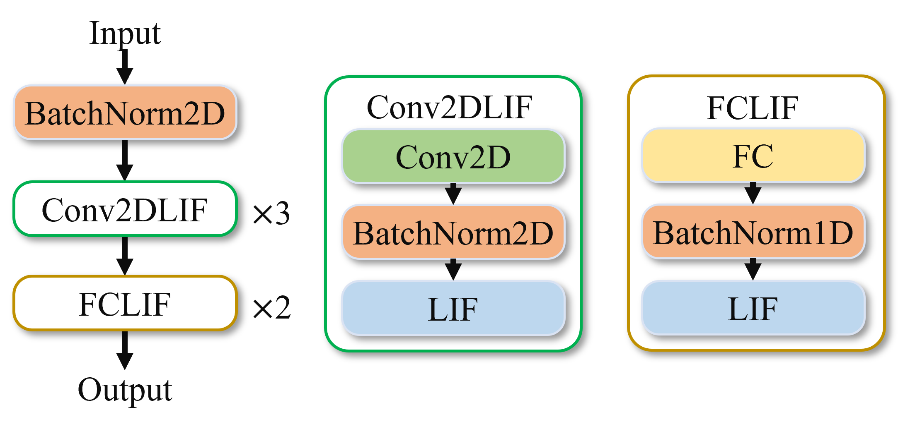
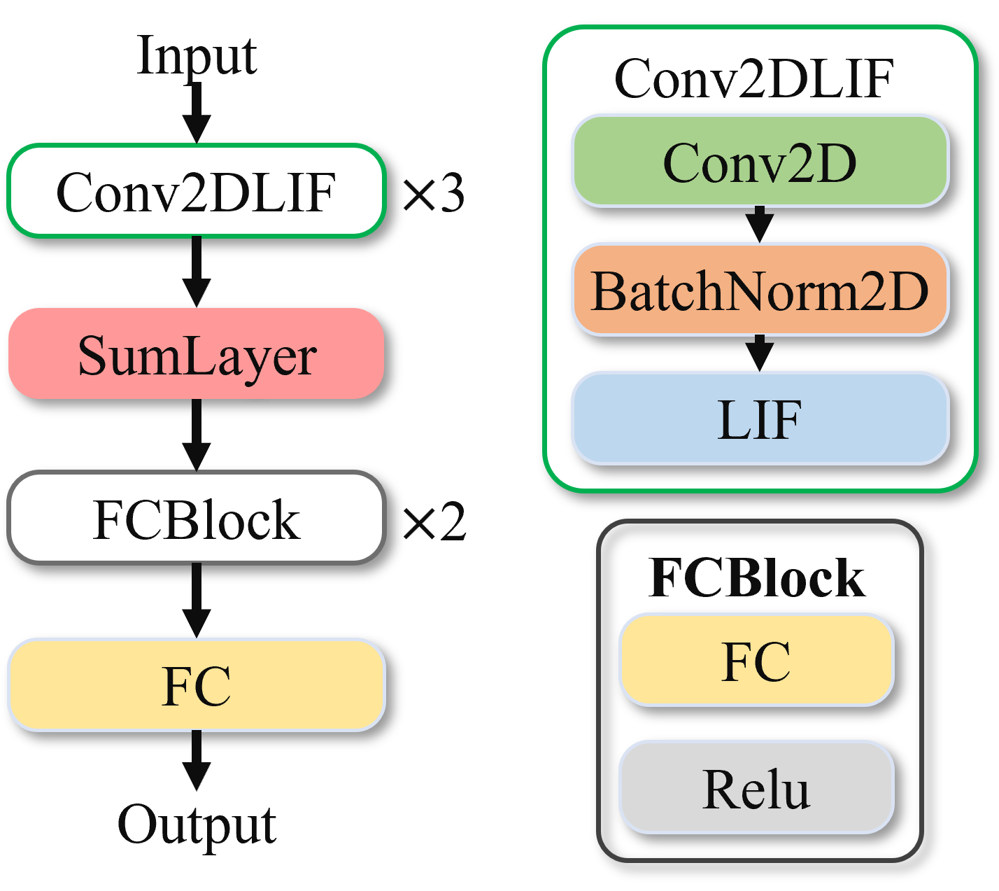
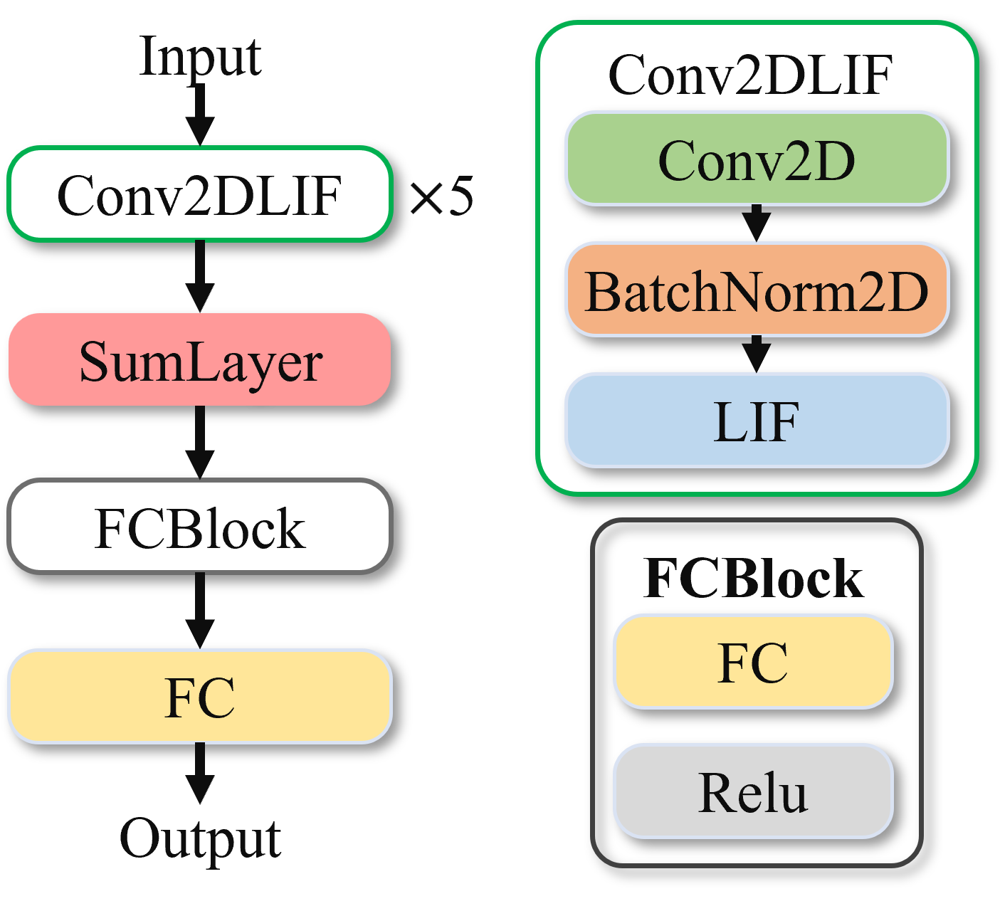
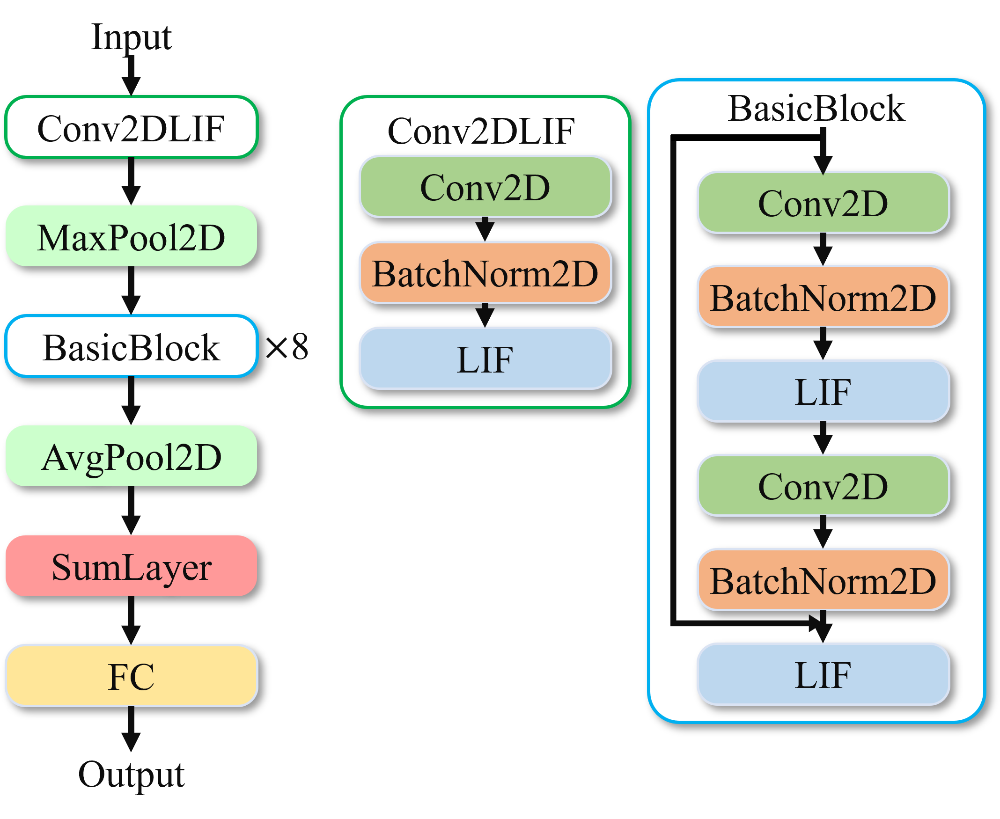
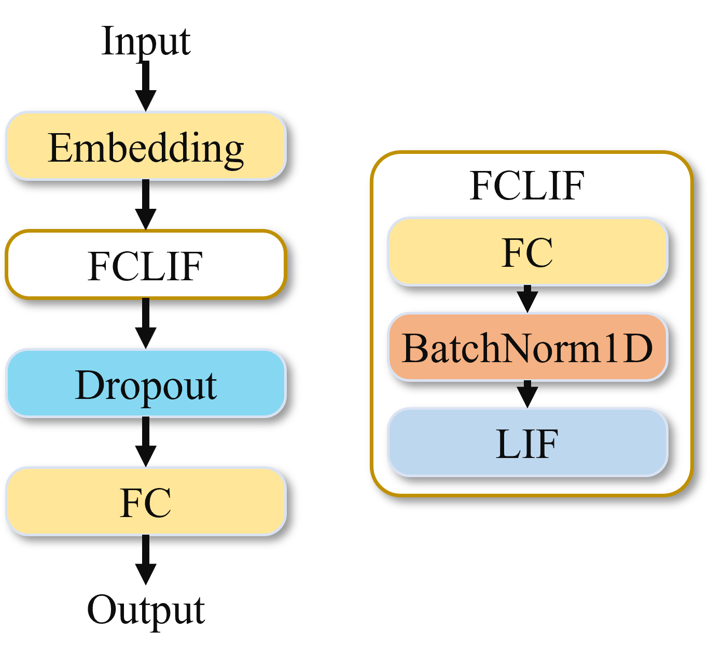

DVS Data Processing
~~~~~~~~~~~~~~~~~~~~~~~~~~~~~~~~~~~~~~~~~~~~~~~~~~~~~~~~~~~~~~~~~~~~~~~~~~~~~~~~~~~~~~~~

Dynamic vision sensor (DVS) is a Silicon Retina device based on neuromorphic engineering that simulates the human retina perception mechanism for information acquisition. DVS fundamentally differs from traditional frame-based sensors. Similar to how the human retina sends impulses to the brain upon receiving light stimuli, DVS asynchronously and independently receives light intensity signals at the pixel level, encoding visual signals into a continuous stream of spatiotemporal events. Neuromorphic vision sensors lack the concept of "frames." When changes occur in the real-world scene, neuromorphic vision sensors generate pixel-level outputs (i.e., events). An event specifically includes (t, x, y, p), where x,y are the pixel coordinates in the 2D space, t is the event timestamp, and p is the event polarity. The event polarity represents the brightness change of the scene: increase (positive) or decrease (negative).

DVS Gesture
^^^^^^^^^^^^^^^^^^^^^^^^^^^^^^^^^^^^^^^^^^^^^^^^^^^^^^^^^^^^^^^^^^^^^^^^^^^^^^^^^^^^^^^^^^

**Network Model**

During both the training and inference processes of the DVS gesture data, a loop operation is performed on the time window T. The model structure executed in each loop is as shown in the figure below, where the input is a single frame with a shape of [b,2,40,40]. The final model output is the sum of the outputs of all 60 frames divided by 60.

   Figure: DVS-gesture Network Model

This model structure consists of three Conv2dLif modules and two FcLif modules. In the last Fclif module, the output_channel of the Fc layer is 11, which is the number of categories in the DVS gesture model.

**Training and Performance**

We randomly selected 1176 samples from the dataset for training and 288 samples for validation. We used the Adam optimizer with a learning rate of 1e-2 and weight decay of 1e-4 to train the network. During training, a learning rate fine-tuning strategy was used. Neuron parameters were set to full-sharing mode. After 100 epochs of training, we achieved a top-1 classification accuracy of 94.09% on the validation set.

MNIST-DVS
^^^^^^^^^^^^^^^^^^^^^^^^^^^^^^^^^^^^^^^^^^^^^^^^^^^^^^^^^^^^^^^^^^^^^^^^^^^^^^^^^^^^^^^^^^

**Network Model**

The MNIST-DVS network model consists of three Conv2dLif blocks. Each sample performs a loop operation over time frames, feeding single-frame samples into these three Conv2dLif blocks for feature extraction. A SumLayer follows, aggregating information over the time dimension by adding all time-frame feature maps element-wise and dividing by T, obtaining average information. The model concludes with an FcBlock for classification, containing three fully connected layers. The last Fc layer's out_channel corresponds to the 10 classification categories.

   
   Figure: MNIST-DVS Network Model

**Training and Performance**

We trained the network using an SGD optimizer with a learning rate of 1e-1, weight decay of 1e-4, and momentum of 0.9. A learning rate fine-tuning strategy was employed during training. Neuron parameters were in full-sharing mode. After 20 epochs of training, we achieved a top-1 classification accuracy of 99.54% on the validation set.

CIFAR10-DVS
^^^^^^^^^^^^^^^^^^^^^^^^^^^^^^^^^^^^^^^^^^^^^^^^^^^^^^^^^^^^^^^^^^^^^^^^^^^^^^^^^^^^^^^^^^

**Model Introduction**

   Figure: CIFAR10-DVS Network Model

Compared to MNIST-DVS, the feature extraction part Conv2dLIf was increased from three to five, while the FcBlock following the SumLayer contains only two Fc layers.

**Training and Performance**

We used the Adam optimizer with a learning rate of 1e-2 and weight decay of 1e-4 to train the network. A learning rate fine-tuning strategy was applied during training. Neuron parameters were in full-sharing mode. After 100 epochs of training, the top-1 classification accuracy reached 68.23% on the validation set.

Short Video Processing
~~~~~~~~~~~~~~~~~~~~~~~~~~~~~~~~~~~~~~~~~~~~~~~~~~~~~~~~~~~~~~~~~~~~~~~~~~~~~~~~~~~~~~~~~~

RGB-gesture
^^^^^^^^^^^^^^^^^^^^^^^^^^^^^^^^^^^^^^^^^^^^^^^^^^^^^^^^^^^^^^^^^^^^^^^^^^^^^^^^^^^^^^^^^^

**Training and Performance**

The model structure for RGB gesture data is consistent with that of DVS gesture. We trained the network using the Adam optimizer with a learning rate of 1e-3 and weight decay of 1e-4, using the model file trained on DVS gesture as a pre-trained model. After 50 epochs of training, we achieved a top-1 classification accuracy of 97.05% on the validation set.

Jester
^^^^^^^^^^^^^^^^^^^^^^^^^^^^^^^^^^^^^^^^^^^^^^^^^^^^^^^^^^^^^^^^^^^^^^^^^^^^^^^^^^^^^^^^^^

**Network Model**

The model used to train the Jester dataset adopts a ResNet18-like structure, as shown below.

   Figure: Jester Dataset Training Model

Similar to other models, operations before the SumLayer are performed on single time steps. In the SumLayer layer, results from all time steps are summed and divided by 16, aggregating information over the time dimension. Finally, an Fc layer is used for classification output.

**Training and Performance**

Training employed an SGD optimizer with a learning rate of 1e-1, weight decay of 1e-4, and momentum of 0.9. A cosine annealing learning rate fine-tuning strategy was used during training. After 200 epochs, a top-1 classification accuracy of 93.87% was achieved on the validation set.

Text Processing
~~~~~~~~~~~~~~~~~~~~~~~~~~~~~~~~~~~~~~~~~~~~~~~~~~~~~~~~~~~~~~~~~~~~~~~~~~~~~~~~~~~~~~~~

IMDB
^^^^^^^^^^^^^^^^^^^^^^^^^^^^^^^^^^^^^^^^^^^^^^^^^^^^^^^^^^^^^^^^^^^^^^^^^^^^^^^^^^^^^^^^^^

**Network Model**

The IMDB model also performs loop operations over time frames, inputting single-frame information into the model each time. The model first uses an Embedding layer for dimensionality reduction, followed by an FcLif layer for upsampling, and finally through an Fc layer for classification output. The model lacks a time aggregation layer, using the last frame's result as output.

   Figure: IMDB Network Model

**Training and Performance**

We used the Adam optimizer with a learning rate of 1e-3 and weight decay of 1e-4 for training, fine-tuning the learning rate based on epochs. After 50 epochs of training, we achieved a classification accuracy of 82.8% on the validation set.

Medical Image Processing
~~~~~~~~~~~~~~~~~~~~~~~~~~~~~~~~~~~~~~~~~~~~~~~~~~~~~~~~~~~~~~~~~~~~~~~~~~~~~~~~~~~~~~~~~

LUNA16Cls
^^^^^^^^^^^^^^^^^^^^^^^^^^^^^^^^^^^^^^^^^^^^^^^^^^^^^^^^^^^^^^^^^^^^^^^^^^^^^^^^^^^^^^^^^^

**Network Model**

The Luna16Cls classification task network model comprises three Conv2dLif blocks. Each sample performs a loop operation for time frames, with single-frame samples sent to these blocks for feature extraction. A SumLayer follows to aggregate information over the time dimension, averaging feature maps across frames. The model concludes with an FcBlock for classification, comprising three fully connected layers, with the last layer's Fc out_channel corresponding to two classification categories.

   Figure: Luna16Cls Network Model

**Training and Performance**

We used an SGD optimizer with a learning rate of 0.05, weight decay of 1e-4, and momentum of 0.9 to train the dataset, employing a learning rate fine-tuning strategy during training. Neuron parameters were in full-sharing mode. After 20 epochs, a top-1 classification accuracy of 90.50% was reached on the validation set, with an inference speed of 72.3 fps on GPU.

Large Scale Event Classification
~~~~~~~~~~~~~~~~~~~~~~~~~~~~~~~~~~~~~~~~~~~~~~~~~~~~~~~~~~~~~~~~~~~~~~~~~~~~~~~~~~~~~~~~~~

ESImagenet
^^^^^^^^^^^^^^^^^^^^^^^^^^^^^^^^^^^^^^^^^^^^^^^^^^^^^^^^^^^^^^^^^^^^^^^^^^^^^^^^^^^^^^^^^^

**Network Model**

The backbone network is resnetlif-18, similar to that of the Jester dataset, with LIF neuron mode set to *analog*, differing from the *spike* mode used in Jester.

**Training and Performance**

We used an SGD optimizer with a learning rate of 0.03, weight decay of 1e-4, and momentum of 0.9 for training, employing a learning rate fine-tuning strategy. Neuron parameters were in full-sharing mode. After 25 epochs of training, the top-1 classification accuracy reached 44.16% on the validation set, with an inference speed of 121.6 fps on GPU.

Large Scale Image  Classification
~~~~~~~~~~~~~~~~~~~~~~~~~~~~~~~~~~~~~~~~~~~~~~~~~~~~~~~~~~~~~~~~~~~~~~~~~~~~~~~~~~~~~~~~~~

Spike-driven Transformer V2
^^^^^^^^^^^^^^^^^^^^^^^^^^^^^^^^^^^^^^^^^^^^^^^^^^^^^^^^^^^^^^^^^^^^^^^^^^^^^^^^^^^^^^^^^^

**introduction**

Spikerformer v2 (Spike driven transformer V2) is a general SNN (Spiking Neural Network) architecture based on Transformer, named "Meta-SpikeFormer", aiming to provide an energy-efficient, high-performance and universal solution for neuromorphic computing. It can serve as the structure of visual backbone network and performs excellently in visual tasks. Its features are as follows:

(1) Low power consumption: It supports the spike-driven paradigm with only sparse addition existing in the network.

(2) Universality: It can handle various visual tasks.

(3) High performance: It shows an overwhelming performance advantage compared with CNN-based SNNs.

(4) Meta-architecture: It provides inspiration for the design of future next-generation Transformer-based neuromorphic chips.

It adopts the Meta-SpikeFormer architecture, drawing on the general visual Transformer architecture. It expands the four convolutional encoding layers in the Spike-driven Transformer into four Conv-based SNN blocks, and adopts pyramid-structured Transformer-based SNN blocks in the last two stages. For specific model introduction, please refer to the original paper [1].

.. figure:: _images/spikeformer.png
  :alt: Spikeformer V2 architecture

  Figure: Network structure diagram of Spike driven transformer V2

**performance**

This network has achieved relatively excellent accuracy results. In image classification (ImageNet-1K dataset), Meta-SpikeFormer has obtained remarkable achievements. For example, when the number of parameters is 55M, the accuracy can reach 80.0% by adopting the distillation strategy. Under different model scales, compared with other methods, it shows advantages in terms of accuracy, parameters and power consumption. In addition, it has also achieved good accuracy results in various tasks such as event-based action recognition tasks (HAR-DVS dataset), object detection (COCO benchmark), and semantic segmentation (ADE20K and VOC2012 datasets).

**Lynxi system deployment**

This network model can be deployed through a single KA200 chip. Currently, the default deployed model is the metaspikformer_8_512 model (pretrained weights, 55M parameter version, T = 4 (4 time steps)). The original code model was designed for the Spikingjelly framework. In this case, certain modifications have been made to it and it has been incorporated into this software stack. This code only supports inference and does not support training. If training is required, it is recommended to use the original code framework. Note: This case only guarantees the correct inference results reproduced on the Lingsi brain-like computing chips, and does not guarantee the reproduction of indicators such as power consumption and energy efficiency in the original paper.

**References**

Original code link: https://github.com/BICLab/Spike-Driven-Transformer-V2

[1]. Yao, Man, et al. "Spike-driven transformer v2: Meta spiking neural network architecture inspiring the design of next-generation neuromorphic chips." arXiv preprint arXiv:2404.03663 (2024).

