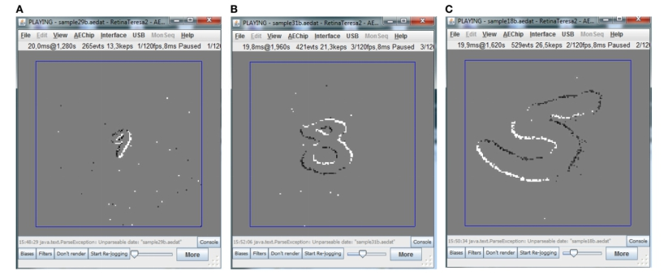
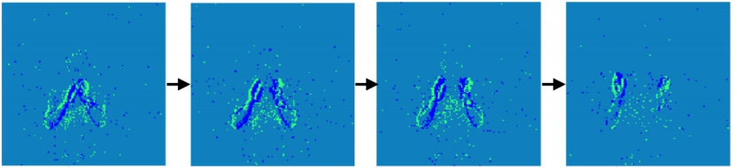
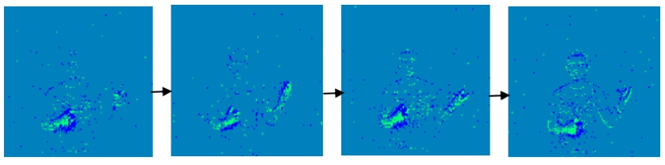
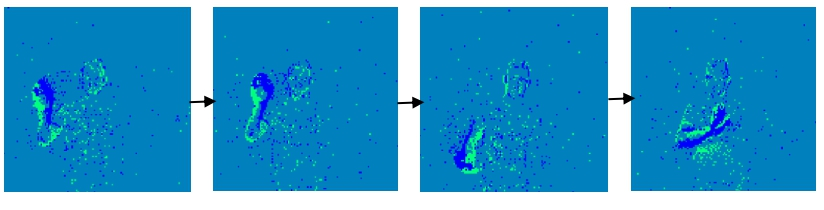
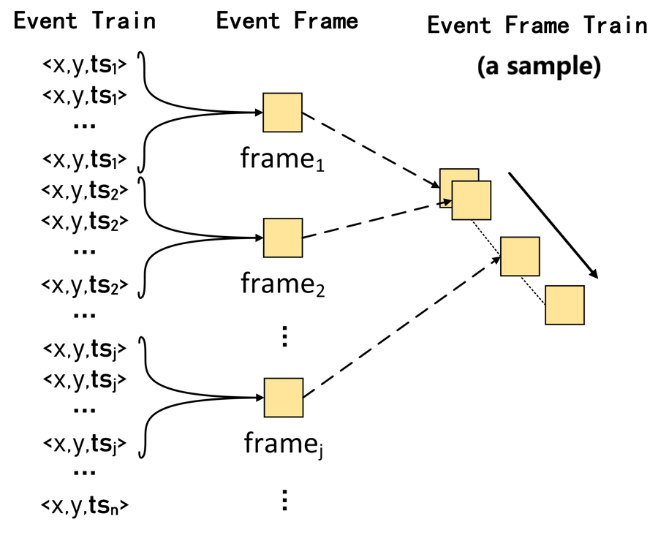
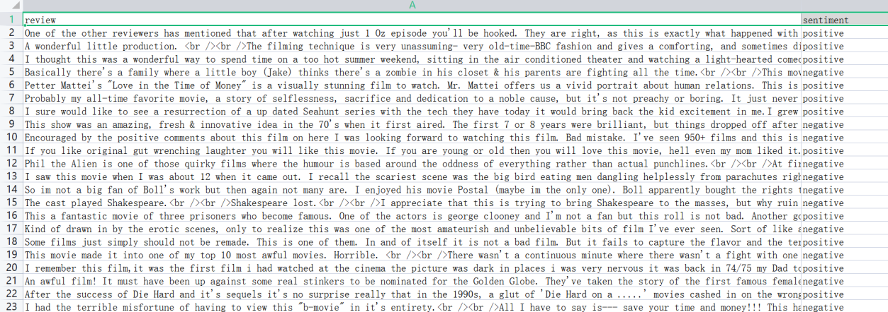
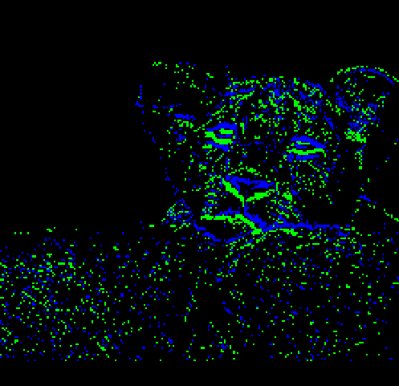
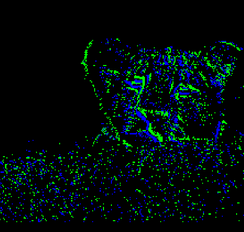
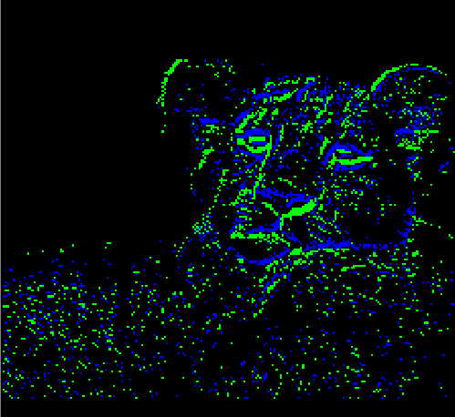

Datasets Introduction
===============================================================================================

.. _data_task:

Supported Datasets
-------------------------------------------------------------------------------

DVS-MNIST
~~~~~~~~~~~~~~~~~~~~~~~~~~~~~~~~~~~~~~~~~~~~~~~~~~~~~~~~~~~~~~~~~~~~~~~~~~~~~~~

The original dataset name is MNIST-DVS, but in the project's code and file naming, it is referred to as DVS-MNIST. This dataset is the DVS version of MNIST, captured with a DVS camera to obtain pulse event samples of handwritten character images. Specifically, each sample in the dataset is obtained by moving the corresponding original image frames on a fixed trajectory on an LCD, recorded using a DVS camera. Event-based data is typically a spike sequence, with each spike triggered by changes in light intensity at each pixel. A spike is represented in quadrature as (x, y, ts, pol), where x and y are spatial coordinates of the spike, ts is the timestamp of the event (in 1us), and pol indicates the type of light intensity change (brighter as 1 or darker as -1). For the MNIST-DVS dataset, there are 10,000 data points, each recorded with three different scales: scale-4, 8, 16. Different sizes simulate the natural environment better, as shown below.

   Figure: Example of numbers in different sizes captured by the DVS camera
   (A) scale-4 (B) scale-8 (C) scale-16

During use, considering the simplicity of handwritten digits, we only cropped 40*40 pixels. The time window T we take is 20, hence the dimension becomes (20, 40, 40, 2), reducing the dataset's memory and effectively speeding up network training.

The dataset has 10 categories as follows:

::

   '0', '1', '2', '3', '4', '5', '6', '7', '8', '9'

Reference: `MNIST-DVS and FLASH-MNIST-DVS Databases <http://www2.imse-cnm.csic.es/caviar/MNISTDVS.html>`__

DVS-Gesture
~~~~~~~~~~~~~~~~~~~~~~~~~~~~~~~~~~~~~~~~~~~~~~~~~~~~~~~~~~~~~~~~~~~~~~~~~~~~~~~~~~

The DVS-Gesture dataset is directly recorded from real scenes by a DVS camera. Unlike traditional cameras that sample at a fixed frame rate, the DVS camera adopts AER asynchronous transmission for differential visual sampling, represented by asynchronous spatio-temporal spike signals to indicate light intensity changes in the scene, as shown below:

   Figure: Example from DVS Gesture dataset (a) hand clap

   Figure: Example from DVS Gesture dataset (b) air guitar

   Figure: Example from DVS Gesture dataset (c) right hand clockwise

The dataset is human gestures recorded directly with a DVS camera, resulting in spike event samples, with 11 categories, similar to RGB-Gesture. Each sample has a temporal resolution of 1/25000 seconds, and a spatial resolution of 128*128. During use, we downsample by 1/3.2 to save graphics memory to a resolution of 40×40. To use the network structure for training, we generate event frames by accumulating spikes within each 25ms window, resulting in frames of size 40×40. Each frame is then extended to two channels depending on whether the brightness of each pixel is decreased or increased. Finally, several adjacent event frames are stacked in time sequence to obtain samples of size (T×2×40×40); we choose a time window T of 60.

The 11 categories are:

::

   'Hand Clapping',
   'Left Hand Wave',
   'Right Hand Wave',
   'Left Arm CW',
   'Left Arm CCW',
   'Right Arm CW',
   'Right Arm CCW',
   'Arm Roll',
   'Air Drums',
   'Air Guitar',
   'Other'

Reference: `IBM Research - DVS128 Gesture Dataset <https://research.ibm.com/interactive/dvsgesture/>`__

CIFAR10-DVS
~~~~~~~~~~~~~~~~~~~~~~~~~~~~~~~~~~~~~~~~~~~~~~~~~~~~~~~~~~~~~~~~~~~~~~~~~~~~~

CIFAR10-DVS is the DVS version of CIFAR10, recorded with a DVS camera to obtain pulse event samples of CIFAR10 images. The processing of pulse event samples is as follows: First, the encoding algorithm uses a sliding window with a specific time length to slide through the time-sorted event stream data. The sliding step of the window is equal to the length of the sliding window. Each time the window slides, an event set can be obtained that represents the data of one time step, containing events consistent in timestamp range with the window length. Then, all events in each event set are expanded into a three-dimensional vector called an event frame based on coordinate and polarity information. Each event frame contains two channels bearing events of different polarities. For example, in the positive polarity channel, events with positive polarity are filled into a 128*128 matrix according to coordinate information, with zero for unfilled coordinates. Each event set yields an event frame converted from a window's length of events, which represents one time step of the data in a sample. After T times processing, a record of time steps T can be obtained with a dimension (T, 128, 128, 2), as shown below. In BIDL use, the time window length is set at 5ms, with T set at 10.

   Figure: Diagram of CIFAR10-DVS Data Preprocessing

CIFAR10-DVS has 10 categories as follows:

::

   'airplane',
   'automobile',
   'bird',
   'cat',
   'deer',
   'dog',
   'frog',
   'horse',
   'ship',
   'truck'

Reference: Li, Hongmin, et al. "Cifar10-dvs: an event-stream dataset for object classification." Frontiers in neuroscience 11 (2017): 309.

Jester
~~~~~~~~~~~~~~~~~~~~~~~~~~~~~~~~~~~~~~~~~~~~~~~~~~~~~~~~~~~~~~~~~~~~~~~~~~~~~~

The video frames collected using an ordinary camera (in RGB format) capture a set of 27 actions recorded by 1376 participants in their unconstrained environments. The 27 categories are:

::

   'Doing other things',
   'Drumming Fingers',
   'No gesture',
   'Pulling Hand In',
   'Pulling Two Fingers In',
   'Pushing Hand Away',
   'Pushing Two Fingers Away',
   'Rolling Hand Backward',
   'Rolling Hand Forward',
   'Shaking Hand',
   'Sliding Two Fingers Down',
   'Sliding Two Fingers Left',
   'Sliding Two Fingers Right',
   'Sliding Two Fingers Up',
   'Stop Sign',
   'Swiping Down',
   'Swiping Left',
   'Swiping Right',
   'Swiping Up',
   'Thumb Down',
   'Thumb Up',
   'Turning Hand Clockwise',
   'Turning Hand Counterclockwise',
   'Zooming In With Full Hand',
   'Zooming In With Two Fingers',
   'Zooming Out With Full Hand',

Jester involves 148,092 short video clips, each with a length of 3 seconds. This dataset contains many symmetrical actions, such as "Sliding Two Fingers Left" and "Sliding Two Fingers Right," so action recognition requires strong temporal modeling capabilities. Each action is read in as multi-frame RGB images. The spatial resolution of the samples is primarily 176*100, consisting of 37 frames. The large quantity of samples is considered the ImageNet of video classification. During use, the images are cropped and padded to 224*224 spatially, and temporally downsampled to 16.

Reference: Materzynska, Joanna, et al. "The jester dataset: A large-scale video dataset of human gestures." Proceedings of the IEEE/CVF International Conference on Computer Vision Workshops. 2019.

RGB-Gesture
~~~~~~~~~~~~~~~~~~~~~~~~~~~~~~~~~~~~~~~~~~~~~~~~~~~~~~~~~~~~~~~~~~~~~~~~~~~~~~~~~

The videos of actions collected by ordinary cameras are processed by frame (in RGB format) to calculate positive and negative events, which are used as samples for recognition. The video is decoded into frame image data storage at a frequency of 25 frames per second. The cameras we used are color cameras, which makes frame differencing inconvenient. For subsequent processing, the color video sequence frames are converted to grayscale images. The basic principle of frame differencing is to use pixel-based temporal differencing to extract motion areas in the image between adjacent frames of the image sequence. The difference image is obtained by subtracting the pixel values of the corresponding pixels of adjacent frames. If the lighting conditions are not considerably changing, and the change in corresponding pixel values is less than a predetermined threshold, it can be considered background pixels. If the pixel value changes significantly, it implies motion in the image area, and these regions are marked as foreground pixels, which can identify the motion target's position in the image. The difference result is processed into two channels for image enhancement and suppression, changing the original three-channel RGB image into a two-channel image.

There are 11 classes of actions, each sample having 60 time steps, with each sample having a spatial resolution of 128*128 and 2 channels, representing positive and negative events. Samples are downsampled to 40*40 during use.

The 11 categories are:

::

   'Hand Clapping',
   'Left Hand Wave',
   'Right Hand Wave',
   'Left Arm CW',
   'Left Arm CCW',
   'Right Arm CW',
   'Right Arm CCW',
   'Arm Roll',
   'Air Drums',
   'Air Guitar',
   'Other'

Luna16Cls
~~~~~~~~~~~~~~~~~~~~~~~~~~~~~~~~~~~~~~~~~~~~~~~~~~~~~~~~~~~~~~~~~~~~~~~~~~~~~~~~~

By conducting mask extraction, convex hull with expansion, and grayscale standardization on the CT images from the Luna16 (\ `Home - Grand Challenge (grand-challenge.org) <https://luna16.grand-challenge.org/>`__\ ) dataset, the Luna16Cls dataset was obtained. It includes CT images of 888 patients with 1186 nodules labeled by radiologists.

The specific preprocessing steps are as follows:

1. First, transform all the original data into HU values;

2. Mask extraction: on the 2D slices, use Gaussian filtering with a standard deviation of 1 and a threshold value of -600 to obtain a mask of the lungs and their surrounding dark parts. Then perform connectivity analysis to remove connected components smaller than 30mm² and those with eccentricity greater than 0.99. Calculate all 3D connected components in the binary 3D matrix, retaining only the non-edge parts (to remove dark parts around the lungs) and components with a volume between 0.68~7.5L;

3. Convex hull and expansion: if the nodule is connected to the outer wall of the lung, it will not appear in the extracted mask. In this case, divide the lung into left and right parts, perform convex hull processing separately on each lung, and expand 10 pixels outward. However, for some 2D slices, the bottom of the lung is similar to a crescent shape. If the area after the convex hull is greater than 1.5 times the initial area, abandon the convex hull to avoid introducing too much other tissue;

4. Grayscale standardization processing: linearly transform the HU values ([-1200,600]) to grayscale values within 0~255. The pixel grayscale values outside the mask are set to 170, and those within the expanded region with grayscale values above 210 are also set to 170.

5. To save graphical memory, downsample the dataset to a resolution of 32×32, set the time step to 8, and obtain 3795 samples of (8×1×32×32), among which 3416 samples are used as the training set, and 379 are used as the validation and test set.

.. figure:: _images/malignant类.png
   :alt: malignant class

   Figure: Luna16Cls dataset: malignant class

.. figure:: _images/benign类.png
   :alt: benign class

   Figure: Luna16Cls dataset: benign class

The dataset has 2 categories, which are:

::

   'malignant',
   'benign'

IMDB
~~~~~~~~~~~~~~~~~~~~~~~~~~~~~~~~~~~~~~~~~~~~~~~~~~~~~~~~~~~~~~~~~~~~~~~~~~~~~~~~~~~~

The IMDB dataset contains 50,000 highly polarized reviews from the Internet Movie Database (IMDB).

The dataset downloaded from the kaggle path includes the IMDB Dataset.csv file <https://www.kaggle.com/datasets/utathya/imdb-review-dataset/code>_. A partial screenshot of the file is as follows:

In this file, the first column 'review' represents the content of the review, and the second column 'sentiment' indicates the label, whether it is positive or negative.

During the IMDB data preprocessing, the training set and validation set are split into a 3:1 ratio, resulting in 37,500 training samples and 12,500 test samples. A dictionary of size 1000 is used to convert each word in the sample data into a numerical representation. Lastly, each sample data is padded to a size of 500 time steps.

For label processing, binary classification is indicated using 0 and 1, where 0 represents negative and 1 represents positive.

ESImagenet
~~~~~~~~~~~~~~~~~~~~~~~~~~~~~~~~~~~~~~~~~~~~~~~~~~~~~~~~~~~~~~~~~~~~~~~~~~~~~~~~~~~~~~~~~~

ES-imagenet is currently the most challenging event stream dataset and was transformed from the popular computer vision dataset ILSVRC2012, generating approximately 1.3 million frames, including 1257K training samples and 50K test samples, classified into 1000 classes. It is the largest es dataset for object classification, dozens of times larger than other neuromorphic datasets. Unlike CIFAR-10 converted from the static dataset CIFAR10 and the event stream data DVS Gesture128 recorded directly by DVS, creating an ESdataset using neuromorphic cameras like Dynamic Vision Sensor (DVS) is a time-consuming and expensive task. The authors of this dataset achieved the transformation by converting RGB image models to HSV color models to acquire brightness information and using an Omni-directional Discrete Gradient (ODG) algorithm they proposed. This algorithm mimics biological features generated by neuron cells to extract essential information for object recognition. Finally, the time axis is used to accumulate time to time frames, generating 8 event frames related to differential information. The event frames are sized 224*224, with two channels indicating the event polarity at each coordinate position. The converted dataset with rich spatiotemporal information typical of pulse event streams can effectively validate a model's spatiotemporal information extraction ability.

|image1| |image2| |image3| |image4|

*Figure: Visualization of sample ILSVRC2012_val_00003013*

