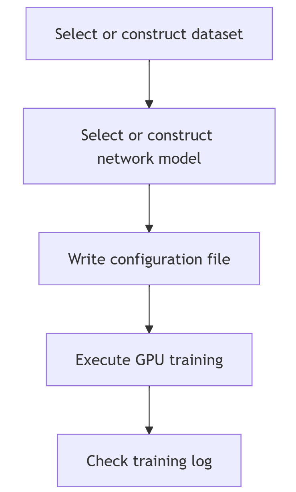

Designing flow
========================================================================================

The usage flow of BIDL is divided into the following steps:

Construction and Network Training Phase:

1. Choose or construct a dataset;
2. Choose or construct a network structure;
3. Modify the config file and training script;
4. Network training process;
5. Use GPU for validation and inference;

Deployment Phase:

6. Compile the network using Lyngor;
7. Implement network inference using LynSDK.

Training Part
----------------------------------------------------------------------------------------

Operation Flow
~~~~~~~~~~~~~~~~~~~~~~~~~~~~~~~~~~~~~~~~~~~~~~~~~~~~~~~~~~~~~~~~~~~~~~~~~~~~~~~~~~~~~~~~

The main operation flow of the training part is shown in the figure below.

   Figure: Training flow

1. Add a custom dataset.
2. Add custom modules.

   a. Add a new backbone network.
   b. Add other components, including new neck, head, and loss function components.

3. Write configuration files.
4. Execute GPU training.
5. Check training results.

Choose or Construct a Dataset
~~~~~~~~~~~~~~~~~~~~~~~~~~~~~~~~~~~~~~~~~~~~~~~~~~~~~~~~~~~~~~~~~~~~~~~~~~~~~~~~~~~~~~~~

Select Supported Datasets
^^^^^^^^^^^^^^^^^^^^^^^^^^^^^^^^^^^^^^^^^^^^^^^^^^^^^^^^^^^^^^^^^^^^^^^^^^^^^^^^^^^^^^^^

Currently, the datasets added to the BIDL framework are defined in the *datasets/* directory. Each dataset corresponds to a file, such as the *bidl_cifar10dvs.py* file, which implements the functionality of adding the CIFAR10-DVS dataset to the BIDL framework. Different files add different datasets to the BIDL framework. For more details on some of these datasets, refer to :ref:`data_task`.

Choose different datasets based on the dataset names defined in the files within the *datasets/* directory. For example, the CIFAR10-DVS dataset is defined with the name CIFAR10DVS in the *bidl_cifar10dvs.py* file. This name can be written into the configuration file that requires the use of this dataset. Specific methods can refer to the *data* section in the :ref:`edit_config_file` paragraph.

Construct a New Dataset
^^^^^^^^^^^^^^^^^^^^^^^^^^^^^^^^^^^^^^^^^^^^^^^^^^^^^^^^^^^^^^^^^^^^^^^^^^^^^^^^^^^^^^^^

Datasets can be divided into three categories based on their structure: frame sequences, DVS event data, and one-dimensional data. Frame sequence data is generally constructed by extracting frames at fixed intervals from video clips, while DVS event data is constructed by converting event information into frame sequences.

Different types of datasets have different preprocessing methods, but when added to the BIDL framework, a corresponding file must be defined in the *datasets/* directory, and a corresponding class must be defined in the file. The specific steps are as follows:

1. Write a new dataset class that inherits from BaseDataset.
2. Overload the ``load_annotations(self)`` method to return a list containing all samples. Each sample is a dictionary containing necessary data information, such as img and gt_label.

The steps for adding a dataset to the BIDL framework are introduced below.

1. Create a *bidl_mydataset.py* file in the *datasets/* directory and create a MyDateset class in this file to load the data.

   ::

      from bidlcls.datasets.base_dataset import BaseDataset
      
      class MyDateset(BaseDataset):
         CLASSES = ['class0', 'class1', 'class2', 'class3', 'class4', 'class5', 'class6', 'class7', 'class8', 'class9']
      
      def load_annotations(self):
         print(f'loading {self.data_prefix}.pkl...')
         with open(self.data_prefix + '.pkl', 'rb') as f:
            dats, lbls, shape = pk.load(f)
         data_infos = []
         for dat, lbl in zip(dats, lbls):
            info = {
               'img': dat, 'pack': shape, # \``np.unpackbits`\`
               'gt_label': np.array(lbl, dtype='int64')
            }
         data_infos.append(info)
         return data_infos

2. Add the newly defined dataset class to *datasets/__init__.py*.

   ::

      from .bidl_mydataset import MyDateset # Import the dataset class from the newly written dataset .py file

      __all__ = [
         ...,
         'MyDateset', # Add the new dataset class
         ...
      ]

3. Use the new dataset in the configuration file in the *configs/* directory. For detailed usage of the configuration file, refer to the *writing configuration file* section in :ref:`edit_config_file`.

   ::

      dataset_type = 'MyDateset' # Name of the new dataset
      ...
      data = dict(
         samples_per_gpu=64,
         workers_per_gpu=2,
         train=dict(
            type=dataset_type,
            data_prefix='./data/mydataset/train', # Path to the new dataset
            pipeline=train_pipeline,
            test_mode=False
         ),
         val=dict(
            type=dataset_type,
            data_prefix='./data/mydataset/test',
            pipeline=test_pipeline,
            test_mode=True
         ),
         test=dict(
            type=dataset_type,
            data_prefix='./data/mydataset/test',
            pipeline=test_pipeline,
            test_mode=True
         )
      )

Choose or Construct a Network Model
~~~~~~~~~~~~~~~~~~~~~~~~~~~~~~~~~~~~~~~~~~~~~~~~~~~~~~~~~~~~~~~~~~~~~~~~~~~~~~~~~~~~~~~~

Select Existing Network Models
^^^^^^^^^^^^^^^^^^^^^^^^^^^^^^^^^^^^^^^^^^^^^^^^^^^^^^^^^^^^^^^^^^^^^^^^^^^^^^^^^^^^^^^^

The existing network models in the BIDL framework are defined in the */backbones* directory. The currently supported network models can be referenced in :ref:`wxhmsdmx`, and can be deployed on Lynxi brain-inspired systems. For VGG7_SNN model ,the *VGG7_SNN.py* and *VGG7_SNNIt.py* define outer loop network models, where the time step loop exists outside the neural network layers, differing from models where the time step loop exists within the network layers.

Based on the characteristics of the dataset, such as scale or complexity, different network models can be selected for training. For example, for the Cifar10Dvs dataset, both the SeqClif5Fc2CdItout and ResNetLifItout network models can be selected at *applications/classification/dvs/cifar10dvs* directory .

The network model selected for a specific dataset needs to have its name written into the configuration file corresponding to the dataset. The specific method can be referenced in the *writing model configuration file* section in :ref:`config_content`.

Construct a New Network Model
^^^^^^^^^^^^^^^^^^^^^^^^^^^^^^^^^^^^^^^^^^^^^^^^^^^^^^^^^^^^^^^^^^^^^^^^^^^^^^^^^^^^^^^^

The suffix of the typical outer loop network model names is *Itout*, which is short for Iterate outside, indicating that the time step loop exists outside the neural network layers.

**Sequential Class Networks**

The process of adding the SeqClif3Fc3DmItout network model, which resembles a VGG-like network, is introduced below as an example of adding a Sequential class outer loop network model to the BIDL framework.

In the file *applications/classification/dvs/dvs_mnist/clif3fc3dm/backbone.py*, add the SeqClif3Fc3DmItout network model with time loops outside the layers.

In the network construction part, the three convolutional layers of this network use conv2dLif and set use_inner_loop=False , it can only handle a single time step. The results of each time step need to be aggregated together. The mode used here is *mean*, indicating averaging, although *sum* or *pick* modes can also be chosen. The data dimension before the Flatten layer is (B,C,H,W), so the Flatten layer combines the CHW dimensions and then inputs them into the following three fully connected network layers. This three-layer fully connected network can use the ``nn.Sequential`` structure to make the code more concise.

In the network ``forward`` part, when running on specific network layers for the first time, it is necessary to explicitly call the reset method to assign the shape to some state variables in the layers. Detailed introductions of these network layers can be found in :ref:`sjymx`. Moreover, depending on whether training is on GPU or inference is on Lynxi brain-inspired systems, there are two branches: for the GPU training branch, the execution process is consistent with the sequence in the network construction part, the three convolutional layers are executed for all time steps using a loop, and the results of all time steps are averaged. Then the data is flattened and input into the fully connected network. For the chip inference branch, as the execution process for all time steps is the same, only one execution of the three convolutional layers is needed, then all time step results are added up using ``ops.custom.tempAdd``, then flattened and input into the fully connected network. By tracing, the corresponding op graph can be generated and mapped onto the chip. The LynSDK cyclic call can achieve the time step loop, and for the averaging corresponding to GPU training, the LynSDK will average the results from tempAdd.

::

   class SeqClif3Fc3DmItout(nn.Module):

      def __init__(self,
                  timestep=20, input_channels=2, h=40, w=40, nclass=10, cmode='spike', amode='mean', soma_params='all_share',
                  noise=0, neuron='lif', neuron_config=None,spike_func=None,use_inner_loop=False):
         super(SeqClif3Fc3DmItout, self).__init__()
         neuron=neuron.lower()
         assert neuron in ['lif']
         self.clif1 = Conv2dLif(input_channels, 32, 3, stride=1, padding=1, mode=cmode, soma_params=soma_params, noise=noise,spike_func=None,use_inner_loop=False)
         self.mp1 = nn.MaxPool2d(2, stride=2)
         self.clif2 = Conv2dLif(32, 64, 3, stride=1, padding=1, mode=cmode, soma_params=soma_params, noise=noise,spike_func=None,use_inner_loop=False)
         self.mp2 = nn.MaxPool2d(2, stride=2)
         self.clif3 = Conv2dLif(64, 128, 3, stride=1, padding=1, mode=cmode, soma_params=soma_params, noise=noise,spike_func=None,use_inner_loop=False)
         self.mp3 = nn.MaxPool2d(2, stride=2)
         assert amode == 'mean'
         self.flat = Flatten(1, -1)
         self.head = nn.Sequential(
               nn.Linear((h // 8) * (w // 8) * 128, 512),
               nn.ReLU(),
               nn.Linear(512, 128),
               nn.ReLU(),
               nn.Linear(128, nclass)
         )
         self.tempAdd = None
         self.timestep = timestep
         self.ON_APU = globals.get_value('ON_APU')
         self.FIT = globals.get_value('FIT')
         self.MULTINET = globals.get_value('MULTINET')
         self.MODE = globals.get_value('MODE')

      def reset(self, xi):
         self.tempAdd = pt.zeros_like(xi)

      def forward(self, xis: pt.Tensor) -> pt.Tensor:
         if self.ON_APU:
               assert len(xis.shape) == 4
               x0 = xis
               x1 = self.mp1(self.clif1(x0))           
               x2 = self.mp2(self.clif2(x1))
               x3 = self.mp3(self.clif3(x2))
               x4 = self.flat(x3)
               x5 = self.head(x4)
               x5 = x5.unsqueeze(2).unsqueeze(3)
               self.reset(x5)
               if self.MULTINET:
                  self.tempAdd = load_kernel(self.tempAdd, f'tempAdd', uselookup=True, mode=self.MODE,init_zero_use_data=x5)
               else:
                  self.tempAdd = load_kernel(self.tempAdd, f'tempAdd', mode=self.MODE,init_zero_use_data=x5)
               self.tempAdd = self.tempAdd + x5 / self.timestep
               output = self.tempAdd.clone()
               if self.MULTINET:
                  save_kernel(self.tempAdd, f'tempAdd', uselookup=True, mode=self.MODE)
               else:
                  save_kernel(self.tempAdd, f'tempAdd', mode=self.MODE)
               return output.squeeze(-1).squeeze(-1)

         else:
               t = xis.size(1)
               xo = 0
               for i in range(t):
                  x0 = xis[:, i, ...]
                  if i == 0: self.clif1.reset(x0)
                  x1 = self.mp1(self.clif1(x0))
                  if i == 0: self.clif2.reset(x1)
                  x2 = self.mp2(self.clif2(x1))
                  if i == 0: self.clif3.reset(x2)
                  x3 = self.mp3(self.clif3(x2))
                  x4 = self.flat(x3)
                  x5 = self.head(x4)
                  xo = xo + x5 / self.timestep
               return xo

Import the custom new backbone network in *backbones/__init__.py* or *applications\classification\__init__.py*.

::

      from .dvs.dvs_mnist.backbone import SeqClif3Fc3DmItout # Import new module class from written new module.py file
      ...
      __all__ = [
         ...,
         'SeqClif3Fc3DmItout' # Add the new module
         ...
      ]

Use the new backbone network in the configuration files under the corresponding folders for each dataset. Refer to the :ref:`edit_config_file` documentation for detailed usage of configuration files.

::

   model = dict(
   ...
      backbone=dict(
         type='SeqClif3Fc3DmItout', # Name of the new module
         timestep=20, 
         c0=2, 
         h0=40, 
         w0=40, 
         nclass=10, 
         cmode='analog',
         amode='mean', 
         noise=0
      ),
   ...
   )

**Non-Sequential Network**

Below is an example of adding a ResNetLifItout network model to introduce the steps for adding non-Sequential class external loop network models in the BIDL framework.

Add the ResNetLifItout network model with the time loop outside the layers in the file *backbones\ResNet_SNN\ResNet_SNN.py*.

For the network construction part, refer to the classic ResNet build method to construct the network, using global average pooling for the pooling layer.

Due to the complexity of non-Sequential network structures, during the first run of specific network layers, the state variables are not assigned shapes via a manual explicit call to the ``reset`` method, but rather through registering custom hooks.

Use the ``register_forward_pre_hook`` method provided by ``nn.modules`` to traverse all layers of the network in the ``_register_lyn_reset_hook`` function, registering a custom ``lyn_reset_hook`` for layers where the state variables need to be assigned shapes. In our custom hook, add an attribute ``lyn_cnt`` to layers registered with this hook and initialize it to ``0``. During the first time step of a sample ``forward``, the layer calls its ``reset`` method to assign shapes to the state variables and increments its ``lyn_cnt``. At other time steps, since ``lyn_cnt`` is not ``0``, the layer's ``reset`` method is not called.

After all time steps of a sample ``forward`` are completed, call the ``self._reset_lyn_cnt`` method to reset the ``lyn_cnt`` to zero for the next sample to assign shapes to the state variables in specific layers.

On GPU training, execution follows the same order as the network build part, with layers before the fully connected ones executed in a loop for all time steps, then averaging the results of all time steps before inputting to the fully connected network.

::

   # Define BasicBlock class referencing the classic ResNet build method
   class BasicBlock(nn.Module):
      pass # Omitted here

   # Define BottleNeck class referencing the classic ResNet build method
   class Bottleneck(nn.Module):
      pass # Omitted here

   # Define ResNetLifItout class
   class ResNetLifItout(nn.Module):

      # ResNet depth and corresponding Block structure and quantity
      arch_settings = {
         10: (BasicBlock, (1, 1, 1, 1)),
         18: (BasicBlock, (2, 2, 2, 2)),
         34: (BasicBlock, (3, 4, 6, 3)),
         50: (Bottleneck, (3, 4, 6, 3)),
         101: (Bottleneck, (3, 4, 23, 3)),
         152: (Bottleneck, (3, 8, 36, 3))
      }

      def __init__(
         self,
         depth,
         nclass,
         low_resolut=False,
         timestep=8,
         input_channels=3, 
         stem_channels=64, 
         base_channels=64,
         down_t=(4, 'max'),
         zero_init_residual=False,
         noise=1e-3,
         cmode='spike', 
         amode='mean', 
         soma_params='all_share',
         norm =None
      ):

      super(ResNetLifItout, self).__init__()

      # Other special initialization processes
      assert down_t[0] == 1
      ...

      # Generate corresponding layers based on different Block structures referencing classic ResNet implementation method, specifics not covered here
      @staticmethod
      def _make_layer(block, ci, co, blocks, stride, noise, mode='spike', soma_params='all_share', hidden_channels=None):
         pass # Omitted here

      # Register custom self.lyn_reset_hook to all Lif2d layers
      def _register_lyn_reset_hook(self):
         for child in self.modules():
            if isinstance(child, Lif2d): # Lif, Lif1d, Conv2dLif, FcLif...
               assert hasattr(child, 'reset')
               child.register_forward_pre_hook(self.lyn_reset_hook)

      # In this hook, the reset method for specific layers is only called once when their attribute lyn_cnt is 0
      def lyn_reset_hook(m, xi: tuple):
         assert isinstance(xi, tuple) and len(xi) == 1
         xi = xi[0]
         if not hasattr(m, 'lyn_cnt'):
            setattr(m, 'lyn_cnt', 0)
         if m.lyn_cnt == 0:
            # print(m)
            m.reset(xi)
            m.lyn_cnt += 1
         else:
            m.lyn_cnt += 1
      
      # This method is called after all time steps of a sample are completed
      def _reset_lyn_cnt(self):
         for child in self.modules():
            if hasattr(child, 'lyn_cnt'):
               child.lyn_cnt = 0
      
      # Rewrite forward method, input is sample, return value is the result of the last fully connected layer of ResNet, specifics not covered here
      def forward(self, x):
         x5s = []
         for t in range(xis.size(1)):
            xi = xis[:, t, ...]
            x0 = self.lif(self.conv(xi))
            x0 = self.pool(x0)
            x1 = self.layer1(x0)
            x2 = self.layer2(x1)
            x3 = self.layer3(x2)
            x4 = self.layer4(x3)
            x5 = self.gap(x4)
            x5s.append(x5)
            xo = (sum(x5s) / len(x5s))[:, :, 0, 0]
            xo = self.fc(xo)
            self._reset_lyn_cnt()
            return xo

Import the custom new backbone network in *bidlcls/models/backbones/__init__.py*.

::
   
   from .ResNet_SNN.ResNet_SNN import ResNetLifItout # Import new module class from written new module.py file
   ...
   
   __all__ = [
      ...,
      'ResNetLifItout', # Add the new module
      ...
   ]

Use the new backbone network in the configuration files under the corresponding directories for each dataset. Refer to the configuration file writing instruction document for the detailed usage method.

:: 

   model = dict(
      ...
      backbone = dict(
         type = 'ResNetLifItout',      # Name of the new module
         depth = 10,                   # Configuration information of the new module
         nclass = 11,
         other_args = xxx
      ),
      ...
   )

.. _edit_config_file:

Writing Configuration Files
~~~~~~~~~~~~~~~~~~~~~~~~~~~~~~~~~~~~~~~~~~~~~~~~~~~~~~~~~~~~~~~~~~~~~~~~~~~~~~~~~~~~~~~~

All configuration files are placed in the corresponding directory of *application*. The basic structure of the directory is:

*Category of dataset/Name of dataset/Model name used for the dataset/Configuration file*

Naming Rules for Configuration Files
^^^^^^^^^^^^^^^^^^^^^^^^^^^^^^^^^^^^^^^^^^^^^^^^^^^^^^^^^^^^^^^^^^^^^^^^^^^^^^^^^^^^^^^^

The configuration file name consists of three parts:

- Model information
- Training information
- Data information

Words belonging to different parts are connected by a hyphen ``-``.

**Model Information**

Refers to the information of the backbone network model, such as:

- clif3fc3dm_itout
- clif3flif2dg_itout
- clif5fc2cd_itout
- resnetlif10_itout

*itout* is an abbreviation for iterate outside, indicating that the time step loop is outside the neural network layer. Typical external loop network model names have an *itout* suffix.

**Training Information**

Refers to the settings of the training strategy, including:

- Batch size
- Number of GPUs
- Learning rate strategy, optional

Examples:

- ``b16x4`` means the batch size per GPU is 16, and the thread count per GPU is 4;
- ``cos160e`` means using the cosine annealing learning rate strategy with a maximum epoch of 160.

**Data Information**

Indicates the dataset used, such as:

- dvsmnist
- cifar10dvs
- jester

Example of Configuration File Naming
^^^^^^^^^^^^^^^^^^^^^^^^^^^^^^^^^^^^^^^^^^^^^^^^^^^^^^^^^^^^^^^^^^^^^^^^^^^^^^^^^^^^^^^^

*resnetlif18-b16x4-jester-cos160e.py*

It uses resnetlif18 as the backbone network. The training strategy is that the batch size per GPU is 16, the thread count per GPU is 4, the dataset is the jester dataset, and it adopts the cosine annealing learning rate strategy with a maximum of 160 epochs.

.. _config_content:

Content of the Configuration Files
^^^^^^^^^^^^^^^^^^^^^^^^^^^^^^^^^^^^^^^^^^^^^^^^^^^^^^^^^^^^^^^^^^^^^^^^^^^^^^^^^^^^^^^^

There are 4 basic components in the configuration files:

- Model (model)
- Data (data)
- Training strategy (schedule)
- Runtime settings (runtime)

Take *applications/classification/dvs/dvs-mnist/clif3fc3dm/clif3fc3dm_itout-b16x1-dvsmnist.py* as an example to explain the above four parts respectively.

**Model (model)**

In the configuration file, the model parameter 'model' is a Python dictionary, mainly including network structure, loss function, etc.:

- type: Name of the classifier, currently only ImageClassifier is supported;
- backbone: Backbone network, optional items refer to the supported model description document;
- neck: Neck network type, currently not in use;
- head: Head network model;
- loss: Type of loss function, supporting CrossEntropyLoss, LabelSmoothLoss, etc.

::

   model = dict(
      type='ImageClassifier',
      backbone=dict(
         type='SeqClif3Fc3DmItout', timestep=20, c0=2, h0=40, w0=40, nclass=10, 
         cmode='analog', amode='mean', noise=0, soma_params='all_share', 
         neuron='lif',           # neuron mode: 'lif' or 'lifplus'
         neuron_config=None      # neron configs: 
                                 # 1.'lif': neuron_config=None;
                                 # 2.'lifplus': neuron_config=[input_accum, rev_volt, fire_refrac,
                                 # spike_init, trig_current, memb_decay], eg.[1,False,0,0,0,0]
         ),
      neck=None,
      head=dict(
         type='ClsHead',
         loss=dict(type='LabelSmoothLoss', label_smooth_val=0.1, loss_weight=1.0),
         topk=(1, 5),
         cal_acc=True
      )
   )

.. note::

   Currently, the models of the BIDL framework are mainly integrated into the backbone, with the neck temporarily unused, and the head only specifying the loss function and evaluation metrics of the classification head network.

**Data (data)**

The model parameter 'model' in the configuration file is a Python dictionary, mainly including construction data loader (dataloader) configuration information:

- samples_per_gpu: When building the dataloader, the batch size per GPU;
- workers_per_gpu: The number of threads per GPU when building the dataloader;
- train \| val \| test: Construct the dataset.
- type: Dataset type, supporting ImageNet, Cifar, DVS-Gesture, etc.
- data_prefix: Root directory of the dataset.
- pipeline: Data processing pipeline.

::

   dataset_type = 'MyDateset' # Dataset name

   # Training data processing pipeline
   train_pipeline = [
      dict(type='RandomCropVideo', size=40, padding=4),           # Random crop with time axis samples
      dict(type='ToTensorType', keys=['img'], dtype='float32'),   # Convert image to torch.Tensor
      dict(type='ToTensor', keys=['gt_label']),                   # Convert gt_label to torch.Tensor
      dict(type='Collect', keys=['img', 'gt_label'])              # Decide which keys in the data should be passed to the detector, pass img and gt_label during training
   ]

   # Test data processing pipeline
   test_pipeline = [
      dict(type='ToTensorType', keys=['img'], dtype='float32'),   # Convert image to torch.Tensor
      dict(type='Collect', keys=['img'])                          # No need to pass gt_label during testing
   ]
   data = dict(
      samples_per_gpu=16,                    # Batch size per GPU
      workers_per_gpu=2,                     # Number of threads per GPU
      train=dict(
         type=dataset_type,                  # Dataset name
         data_prefix='./data/mydataset/train', # Dataset directory file
         pipeline=train_pipeline             # Data processing pipeline required for the dataset
      ),
      val=dict(
         type=dataset_type, # Dataset name
         data_prefix='./data/mydataset/test',   # Dataset directory file
         pipeline=test_pipeline,             # Data processing pipeline required for the dataset
         test_mode=True
      ),
      test=dict(
         type=dataset_type,
         data_prefix='./data/mydataset/test',
         pipeline=test_pipeline,
         test_mode=True
      )
   )

The data processing pipeline (pipeline) defines all the steps for preparing the data dictionary, composed of a series of operations, each of which takes a dictionary as input and outputs a dictionary. The methods of operations in the data pipeline are defined in the *bidlcls/datasets/pipeline* folder.

Operations in the data pipeline can be divided into the following three categories:

- Data loading: Load image from the file, defined in *pipelines/bidl_loading.py*
- Preprocessing: Rotate and crop images, defined in *pipelines/bidl_formating.py* and
  *pipelines/bidl_transform.py*, such as ``RandomCropVideo()`` for random cropping on images.
- Formatting: Convert images or labels to the specified data type, defined in *pipelines/bidl_formating.py*, 
  such as ``ToTensorType()`` to convert processed images to Tensor type.

**Training Strategy (schedule)**

It mainly includes optimizer settings, optimizer hook settings, learning rate strategies, and runner settings.

- optimizer: Optimizer setting information, supporting all optimizers in PyTorch, with parameter settings consistent with those in PyTorch. Refer to the relevant PyTorch documentation for details.
- optimizer_config: Configuration file for optimizer hook, such as setting gradient clipping.
- lr_config: Learning rate strategy, supporting CosineAnnealing, Step, etc.

::

   optimizer = dict(
      type='SGD',          # Type of optimizer
      lr=0.1,              # Learning rate of the optimizer
      momentum=0.9,        # Momentum
      weight_decay=0.0001  # Weight decay coefficient
   ) 
   optimizer_config = dict(grad_clip=None)               # Most methods do not use gradient clipping (grad_clip)
   lr_config = dict(policy='CosineAnnealing', min_lr=0)  # Learning rate adjustment strategy
   runner = dict(type='EpochBasedRunner', max_epochs=40) # Type of runner used

**Runtime Settings (runtime)**

It mainly includes the weight-saving strategy, log configuration, training parameters, breakpoint weight path, and working directory information:

::

   checkpoint_config = dict(interval=1)   # The interval of saving checkpoints is 1, the unit can be epoch or iter depending on the runner
   log_config = dict(interval=50,         # The interval of logging
   dist_params = dict(backend='nccl')     # Parameters for setting up distributed training, and the port can also be set
   log_level = 'INFO'                     # Log output level
   load_from = None                       # Restore from the given checkpoint path. The training mode will be restored from the round saved in the checkpoint.
   resume_from = None                     # Restore from the given checkpoint path. The training mode will be restored from the round saved in the checkpoint.

Execute GPU Training
~~~~~~~~~~~~~~~~~~~~~~~~~~~~~~~~~~~~~~~~~~~~~~~~~~~~~~~~~~~~~~~~~~~~~~~~~~~~~~~~~~~~~~~~

The entry point for training is *tools/train.py*, and *dist_train.sh* in the same directory provides single-machine multi-card training.

Prerequisite: The configuration file has been written, including model, data, training strategies, etc. Specific instructions are in :ref:`edit_config_file`.

For example, use the *resnetlif10-b16x1-dvsmnist.py* configuration file.

Execute the following command in the *tools/* directory to start training.

::

   python train.py --config resnetlif10-b16x1-dvsmnist

View Training Logs
~~~~~~~~~~~~~~~~~~~~~~~~~~~~~~~~~~~~~~~~~~~~~~~~~~~~~~~~~~~~~~~~~~~~~~~~~~~~~~~~~~~~~~~~

The logs and checkpoints from training are archived in *work_dirs/resnetlif10-b16x1-dvsmnist/*. For the directory of saved files, refer to :ref:`mxxl`.

Evaluation and Deployment to Lynxi Brain-inspired Chips (APU)
----------------------------------------------------------------------------------------

The deployment section includes evaluation on the GPU initially and then methods to replace the backbone suited to Lyngor compilations. Finally, conducting evaluations/deployments on the APU.

Evaluating with GPU
~~~~~~~~~~~~~~~~~~~~~~~~~~~~~~~~~~~~~~~~~~~~~~~~~~~~~~~~~~~~~~~~~~~~~~~~~~~~~~~~~~~~~~~~

Evaluation entry point: *tools/test.py*

Prerequisites: A configuration file containing necessary details about the model, data, and training strategies should be prepared. For detailed instructions, see :ref:`edit_config_file`.

Set the ``use_lyngor`` flag to 0, indicating that GPU is used for compilation.

::

   --use_lyngor 0 # Whether to use Lyngor for compilation, set to 0 for GPU

Set the ``--config`` and ``--checkpoint`` to select the predefined configuration file and the corresponding checkpoint file.

For example, utilize the *latest.pth* weight file from the resource package *weight_files* under the corresponding path to evaluate model performance on the Jester validation set:

Run the following command in the *tools/* directory:

::

   python test.py --config resnetlif18-itout-b20x4-16-jester --checkpoint latest.pth --use_lyngor 0 --use_legacy 0
   
The inference speed and accuracy will be displayed in the terminal.

.. _build-and-install:

Compilation and Deployment using Lynxi brain-inspired systems
~~~~~~~~~~~~~~~~~~~~~~~~~~~~~~~~~~~~~~~~~~~~~~~~~~~~~~~~~~~~~~~~~~~~~~~~~~~~~~~~~~~~~~~~

.. note:: This section requires deploying the software package on Lynxi brain-inspired systems (server or embedded box) without GPU support.

To compile and deploy using Lynxi brain-inspired systems, append the parameter ``--use_lyngor 1`` when executing commands.

Compiling with Lyngor
^^^^^^^^^^^^^^^^^^^^^^^^^^^^^^^^^^^^^^^^^^^^^^^^^^^^^^^^^^^^^^^^^^^^^^^^^^^^^^^^^^^^^^^^

To compile using Lyngor, additionally append the parameter ``--use_legacy 0`` after executing the command, meaning it will not load historical compiled artifacts but directly compile.

Prerequisites: Using Lyngor for compilation requires executing the *build_run_lif.sh* script in the *lynadapter* directory and registering custom operators in Lyngor.

::

   if args.use_lyngor == 1:
      globals.set_value('ON_APU', True)
      globals.set_value('FIT', True)      
      if 'soma_params' in cfg.model["backbone"] and cfg.model["backbone"]['soma_params'] == 'channel_share':
         globals.set_value('FIT', False)
   else:
      globals.set_value('ON_APU', False)
      cfg.data.samples_per_gpu = 1

In the code above, if it detects APU compilation, it will set the backbone configuration parameters ``on_apu`` and ``fit`` to ``True``, meaning each LIF class instance will generate a UUID and part of the LIF neuron's computation will be implemented using custom operators. Additionally, the dataset ``batchsize`` is set to ``1``, and input type is set to ``uint8`` to fit the underlying requirements.

::

   dataset,_ = get_data(data_name, data_set, cfg)
   t, c, h, w = dataset.__getitem__(0)['img'].shape
   in_size = [((1, c, h, w),)]
   input_type=”uint8”
   from lynadapter.lyn_compile import model_compile
   model_compile(model.eval(),model_file,in_size,args.v,args.b,input_type="float16",post_mode=post_mode, profiler=profiler)

In the code above, the input size, i.e., t,c,h,w values, is obtained from the dataset. Then, the ``model_compile`` method from lyn_compilee is used to execute Lyngor compilation with ``in_size`` as a four-dimensional size and ``batchsize`` set to ``1``.

In the ``model_compile`` method, the main call is to the ``run_custom_op_in_model_by_lyn()`` function for compilation operations. This function calls Lyngor-related interface functions to load and compile the model. The specific implementation code is as follows:

::

   def run_custom_op_in_model_by_lyn(in_size, model, dict_data,out_path,target="apu"):
      dict_inshape = {}
      dict_inshape.update({'data':in_size[0]})
   
      # 1.DLmodel load
      lyn_model = lyn.DLModel()
      model_type = 'Pytorch'
      lyn_model.load(model, model_type, inputs_dict = dict_inshape)
      
      # 2.DLmodel build
      # lyn_module = lyn.Builder(target=target, is_map=False, cpu_arch='x86', cc="g++")
      lyn_module = lyn.Builder(target=target, is_map=True)
      opt_level = 3
      module_path=lyn_module.build(lyn_model.mod, lyn_model.params, opt_level, out_path=out_path)

Assuming the configuration file is named *clif3fc3dm_itout-b16x1-dvsmnis.py*, it will generate a folder named *Clif3fc3dm_itoutDm* in the same directory as the configuration file. The compiled artifacts will be stored in this folder, as detailed below:

::

   .

   ├── Net_0
   │   ├── apu_0
   │   │   ├── apu_lib.bin
   │   │   ├── apu_x
   │   │   │   ├── apu.json
   │   │   │   ├── cmd.bin
   │   │   │   ├── core.bin
   │   │   │   ├── dat.bin
   │   │   │   ├── ddr_config.bin
   │   │   │   ├── ddr.dat
   │   │   │   ├── ddr_lut.bin
   │   │   │   ├── lookup_ddr_addr.bin
   │   │   │   ├── lyn__2023-12-11-16-28-59-076024.mdl
   │   │   │   ├── pi_ddr_config.bin
   │   │   │   ├── snn.json
   │   │   │   └── super_cmd.bin
   │   │   ├── case0
   │   │   │   └── net0
   │   │   │   └── chip0
   │   │   │   └── tv_mem
   │   │   │   └── data
   │   │   │   ├── input.dat
   │   │   │   ├── output.dat
   │   │   │   └── output_ddr.dat
   │   │   ├── data
   │   │   │   └── 100
   │   │   │   ├── dat.bin
   │   │   │   ├── input.dat
   │   │   │   ├── output.dat
   │   │   │   ├── output_ddr_2.dat
   │   │   │   └── output_ddr.dat
   │   │   ├── fpga_config.log
   │   │   └── prim_graph.bin
   │   └── top_graph.json
   └── net_params.json

Skipping Lyngor Compilation
^^^^^^^^^^^^^^^^^^^^^^^^^^^^^^^^^^^^^^^^^^^^^^^^^^^^^^^^^^^^^^^^^^^^^^^^^^^^^^^^^^^^^^^^

If there are already compiled artifacts for the relevant model, one can skip the recompilation steps and directly load the historical artifacts. This can be done by adding ``--use_legacy 1`` when running the command.

SDK Inference
^^^^^^^^^^^^^^^^^^^^^^^^^^^^^^^^^^^^^^^^^^^^^^^^^^^^^^^^^^^^^^^^^^^^^^^^^^^^^^^^^^^^^^^^

Once the model's compiled artifacts are available, SDK inference can proceed. First, instantiate the ``ApuRun`` class using the chip ID, path to the compiled artifacts, and timestamp.

::

   arun = ApuRun(chip_id, model_path,t)

During instantiation, the ``self._sdk_initialize()`` function is called to perform model initialization.

::

   def _sdk_initialize(self):
   ret = 0

   self.context, ret = sdk.lyn_create_context(self.apu_device)
   error_check(ret != 0, "lyn_create_context")

   ret = sdk.lyn_set_current_context(self.context)
   error_check(ret != 0, "lyn_set_current_context")

   ret = sdk.lyn_register_error_handler(error_check_handler)
   error_check(ret != 0, "lyn_register_error_handler")

   self.apu_stream_s, ret = sdk.lyn_create_stream()
   error_check(ret != 0, "lyn_create_stream")

   self.apu_stream_r, ret = sdk.lyn_create_stream()
   error_check(ret != 0, "lyn_create_stream")
   
   self.mem_reset_event, ret = sdk.lyn_create_event()
   error_check(ret != 0, "lyn_create_event")

Then the ``self._model_parse()`` function is called for model parameter parsing and memory space allocation.

::

   def _model_parse(self):
      ret = 0
      self.modelDict = {}
      model_desc, ret = sdk.lyn_model_get_desc(self.apu_model)
      error_check(ret != 0, "lyn_model_get_desc")
      self.modelDict['batchsize'] = model_desc.inputTensorAttrArray[0].batchSize
      self.modelDict['inputnum'] = len(model_desc.inputTensorAttrArray)
      inputshapeList = []
      
      for i in range(self.modelDict['inputnum']):
         inputDims = len(model_desc.inputTensorAttrArray[i].dims)
         inputShape = []
      
      for j in range(inputDims):
         inputShape.append(model_desc.inputTensorAttrArray[i].dims[j])
         inputshapeList.append(inputShape)
         self.modelDict['inputshape'] = inputshapeList
         self.modelDict['inputdatalen'] = model_desc.inputDataLen
         self.modelDict['inputdatatype'] = model_desc.inputTensorAttrArray[0].dtype
         self.modelDict['outputnum'] = len(model_desc.outputTensorAttrArray)
         outputshapeList = []
      
      for i in range(self.modelDict['outputnum']):
         outputDims = len(model_desc.outputTensorAttrArray[i].dims)
         outputShape = []
      
      for j in range(outputDims):
         outputShape.append(model_desc.outputTensorAttrArray[i].dims[j])
         outputshapeList.append(outputShape)
         self.modelDict['outputshape'] = outputshapeList
         self.modelDict['outputdatalen'] = model_desc.outputDataLen
         self.modelDict['outputdatatype'] = model_desc.outputTensorAttrArray[0].dtype
         # print(self.modelDict)
         print('######## model informations ########')
      
      for key,value in self.modelDict.items():
         print('{}: {}'.format(key, value))
         print('####################################')
      
      for i in range(self.input_list_len):
         apuinbuf, ret = sdk.lyn_malloc(self.modelDict['inputdatalen'] * self.modelDict['batchsize'] * self.time_steps)
         self.apuInPool.put(apuinbuf)
         setattr(self, 'apuInbuf{}'.format(i), apuinbuf)
         apuoutbuf, ret = sdk.lyn_malloc(self.modelDict['outputdatalen'] * Self.modelDict['batchsize'] * self.time_steps)
         self.apuOutPool.put(apuoutbuf)
         setattr(self, 'apuOutbuf{}'.format(i), apuoutbuf)
         self.hostOutbuf = sdk.c_malloc(self.modelDict['outputdatalen'] * self.modelDict['batchsize'] * self.time_steps)
      
      for i in range(self.input_list_len):
         self.input_list[i] = np.zeros(self.modelDict['inputdatalen'] * self.modelDict['batchsize'] * self.time_steps/dtype_dict[self.modelDict['inputdatatype']][1], dtype = dtype_dict[self.modelDict['inputdatatype']][0])
         self.input_ptr_list[i] = sdk.lyn_numpy_to_ptr(self.input_list[i])
         self.dev_ptr, ret = sdk.lyn_malloc(self.modelDict['inputdatalen'] * self.modelDict['batchsize'])
         self.dev_out_ptr, ret = sdk.lyn_malloc(self.modelDict['outputdatalen'] * self.modelDict['batchsize'])
         self.host_out_ptr = sdk.c_malloc(self.modelDict['outputdatalen'] * self.modelDict['batchsize'])

Subsequently, inference can be performed on the test set.

::

   for epoch in range(num_epochs):
      for i, data in enumerate(data_loader):
         data_img = data["img"]
         arun.run(data_img.numpy())
         prog_bar.update()
         output = arun.get_output()

The code iterates over each batch of test data. The data_img stores the data of a single test sample (with ``batchsize`` set to ``1``). Then, the ``run`` method of the ``arun`` class is called to run the data on Lynxi chip. The ``run`` function is as follows:

::

   def run(self, img):
      assert isinstance(img, np.ndarray)

      currentInbuf = self.apuInPool.get(block=True)
      currentOutbuf = self.apuOutPool.get(block=True)

      ret = 0
      sdk.lyn_set_current_context(self.context)
      img = img.astype(dtype_dict[self.modelDict['inputdatatype']][0])
      i_id = self.run_times % self.input_list_len
      self.input_list[i_id][:] = img.flatten()
      # img_ptr, _ = sdk.lyn_numpy_contiguous_to_ptr(self.input_list[i_id])
      ret = sdk.lyn_memcpy_async(self.apu_stream_s, currentInbuf,
      self.input_ptr_list[i_id], self.modelDict['inputdatalen'] * self.modelDict['batchsize'] * self.time_steps, C2S)
      error_check(ret != 0, "lyn_memcpy_async")
      apuinbuf = currentInbuf
      apuoutbuf = currentOutbuf
      
      for step in range(self.time_steps):
         if step == 0:
            if self.run_times > 0:
               sdk.lyn_stream_wait_event(self.apu_stream_s, self.mem_reset_event)
            ret = sdk.lyn_model_reset_async(self.apu_stream_s, self.apu_model)
            error_check(ret != 0, "lyn_model_reset_async")
            # ret = sdk.lyn_execute_model_async(self.apu_stream_s, self.apu_model, apuinbuf, apuoutbuf, self.modelDict['batchsize'])
            # error_check(ret!=0, "lyn_execute_model_async")
            ret = sdk.lyn_model_send_input_async(self.apu_stream_s, self.apu_model, apuinbuf, apuoutbuf, self.modelDict['batchsize'])
            error_check(ret != 0, "lyn_model_send_input_async")
            ret = sdk.lyn_model_recv_output_async(self.apu_stream_r, self.apu_model)
            error_check(ret != 0, "lyn_model_recv_output_async")
            apuinbuf = sdk.lyn_addr_seek(apuinbuf, self.modelDict['inputdatalen'] * self.modelDict['batchsize'])
            apuoutbuf = sdk.lyn_addr_seek(apuoutbuf, self.modelDict['outputdatalen'] * self.modelDict['batchsize'])
            if step == self.time_steps - 1:
               ret = sdk.lyn_record_event(self.apu_stream_r, self.mem_reset_event)
            # sdk.lyn_memcpy_async(self.apu_stream_r,self.hostOutbuf,self.apuOutbuf,self.modelDict['outputdatalen']*self.modelDict['batchsize']*self.time_steps,S2C)
            ret = sdk.lyn_stream_add_callback(self.apu_stream_r, get_result_callback, [self, currentInbuf, currentOutbuf])
            self.run_times += 1

During the above inference process, multi-frame data is first copied to the device side, then the temporal frames are looped, with each frame being inferred once. If it is the first frame, call the SDK interface ``sdk.lyn_model_reset_async`` to reset the state variables. After all frames are inferred, call the ``sdk.lyn_stream_add_callback`` interface to transfer the inference results back to the host side. For detailed interface descriptions, refer to "LynSDK Development Guide (C&C++/Python)".

Taking the dvs-mnist dataset as an example, the final inference results show:

   Figure: dvs-mnist data inference results

Single machine multi-card deployment
~~~~~~~~~~~~~~~~~~~~~~~~~~~~~~~~~~~~~~~~~~~~~~~~~~~~~~~~~~~~~~~~~~~~~~~~~~~~~~~~~~~~~~~~

Design scheme for single machine multi-card
^^^^^^^^^^^^^^^^^^^^^^^^^^^^^^^^^^^^^^^^^^^^^^^^^^^^^^^^^^^^^^^^^^^^^^^^^^^^^^^^^^^^^^^^

.. _fig_11:

   Figure: Pipeline parallel design diagram

As shown in :ref:`fig_11`, horizontal denotes time-slicing, vertical denotes model-slicing, achieving multi-card pipeline parallel inference through spatiotemporal slicing. Data transfer and synchronization between Devices are done as shown by the arrows in :ref:`fig_11`. After horizontal A00 inference completion, confirm the event of receiving A01 inference complete (such as the red arrow), A00 sends the membrane potential to A01 and sends the membrane potential sent completion event (such as the red arrow), A01, after confirming the receipt of the membrane potential sent completion event, begins inference. After vertical A00 completes inference, it first confirms the receipt of the A10 inference complete event (such as the orange arrow), then sends the output to A10 and sends the output sent completion event (such as the green arrow), A10 begins inference using the A00 output as input after confirming receipt of the output sent completion event.

Single machine multi-card test results
^^^^^^^^^^^^^^^^^^^^^^^^^^^^^^^^^^^^^^^^^^^^^^^^^^^^^^^^^^^^^^^^^^^^^^^^^^^^^^^^^^^^^^^^

For situations where single-sample inference time is much greater than other overheads, frame rate increases linearly with the number of chips. The test results are shown in the following graphs.

.. figure:: _images/推理帧率1.png
   :alt: Inference frame rate 1

For the same number of chips, inference frame rate after spatiotemporal slicing is better than only time-frame slicing, as shown in the following graphs.

.. figure:: _images/推理帧率2.png
   :alt: Inference frame rate 1

With the same input size, model slicing results in shorter inference time compared to single model inference. As shown above, model two with two chips after slicing has an inference speed greater than double the speed of a single chip with no slicing.

.. figure:: _images/测试结果3.png
   :alt: Test results 1

Source code and operation
^^^^^^^^^^^^^^^^^^^^^^^^^^^^^^^^^^^^^^^^^^^^^^^^^^^^^^^^^^^^^^^^^^^^^^^^^^^^^^^^^^^^^^^^

Code path: *./tools/*

- apuinfer_mutidevice.py: Single machine multi-card inference test script;
- lyn_sdk_model_multidevice.py: Spatiotemporal slicing pipeline parallel SDK encapsulation class file;
- complie_for_mp.py: Model slicing compilation script;

**Compilation of Resentlif50 model slicing**

Configuration file: *resnetlif50-itout-b8x1-cifar10dvs_mp.py*

::

   models_compile_inputshape = [[1, 2, 128, 128], [1, 512, 16, 16]] # dim 0 represents the number of model slice; dim 1 represent the input shape of model slice;

   model_0 = dict(
      type='ImageClassifier',
      backbone=dict(
         type='ResNetLifItout_MP',
         timestep=10,
         depth=50, nclass=10,
         down_t=[1, 'avg'],
         input_channels=2,
         noise=1e-5,
         soma_params='channel_share',
         cmode='spike',
         split=[0, 6] # layers included of model_0
      ),

      neck=None,
      head=dict(
         type='ClsHead',
         # loss=dict(type='CrossEntropyLoss', loss_weight=1.0),
         loss=dict(type='LabelSmoothLoss', label_smooth_val=0.1, loss_weight=1.0),
         topk=(1, 5),
         cal_acc=True
      )
   )
   
   model_1 = dict(
      type='ImageClassifier',
      backbone=dict(
         type='ResNetLifItout_MP',
         timestep=10,
         depth=50, nclass=10,
         down_t=[1, 'avg'],
         input_channels=2,
         noise=1e-5,
         soma_params='channel_share',
         cmode='spike',
         split=[6, 16] # layers included of model_1
      ),
      neck=None,
      head=dict(
         type='ClsHead',
         # loss=dict(type='CrossEntropyLoss', loss_weight=1.0),
         loss=dict(type='LabelSmoothLoss', label_smooth_val=0.1, loss_weight=1.0),
         topk=(1, 5),
         cal_acc=True
      )
   )

**Resnetlif50 Single Machine Multi-card Inference**

Configuration file: 

*resnetlif50-itout-b8x1-cifar10dvs.py*

::

   # dim 0 represents the number of timesteps slices;
   # dim 1 represents the number of model segments;
   # value represents the device id;
   # eg. lynxi_devices = [[0,1],[2,3],[4,5]], timesteps slices are 3, model segments are 2, device ids are 0,1,2,3,4,5.
   # lynxi_devices = [[0],[1],[2],[3],[4],[5],[6],[7],[8],[9],[10],[11],[12],[13],[14],[15],[16],[17],[18],[19],[20],[21],[22],[23]]

   lynxi_devices = [[0],[1]]

*resnetlif50-itout-b8x1-cifar10dvs_mp.py*

::

   # dim 0 represents the number of timesteps slices;
   # dim 1 represents the number of model segments;
   # value represents the device id;
   # eg. lynxi_devices = [[0,1],[2,3],[4,5]], timesteps slices are 3, model segments are 2, device ids are 0,1,2,3,4,5.
   # lynxi_devices = [[0,1],[2,3],[4,5],[6,7],[8,9],[10,11],[12,13],[14,15],[16,17],[18,19],[20,21],[22,23]]

   lynxi_devices = [[0,1]]

**Test Environment**

- SDK version 1.11.0
- ``apuinfer_mutidevice.py's default lyn_sdk_model_multidevice.via_p2p = False`` indicates P2P function is not used.
  If set to True, device support for P2P function is required. The red outlined section in the image below (``size=4G``) indicates device support for P2P function.

