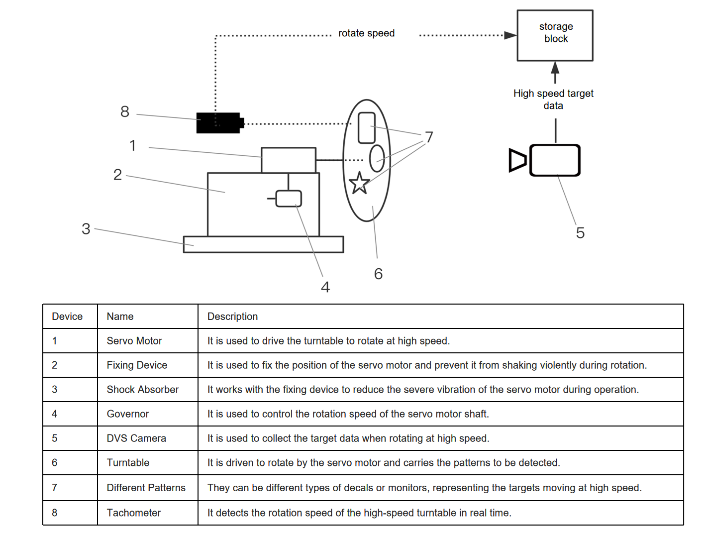

Data and Preprocessing
^^^^^^^^^^^^^^^^^^^^^^^^^^^^^^^^^^^^^^^^^^^^^^^^^^^

This dataset was collected using Lynxi proprietary high-speed moving target data acquisition device, as depicted in the following figure. After collecting the DVS event stream data, it undergoes processes such as event stream framing, label generation, and dataset integration to form a complete DVS high-speed rotary target detection dataset. The dataset contains three types of targets: {0: 'Cross', 1: 'Triangle', 2: 'Circle'}.

   Figure: High-speed moving target data acquisition device

Network Model
^^^^^^^^^^^^^^^^^^^^^^^^^^^^^^^^^^^^^^^^^^^^^^^^^^^

The dvs_high-speed_rotary_target_detection utilizes the ST-YOLO network, based on spatiotemporal dynamics, for event stream data target detection. Unlike :ref:`st-yolo` for vehicle and pedestrian detection, the network head part in this task adopts the yolov5 head due to differences in dataset annotation formats.

Demonstration
^^^^^^^^^^^^^^^^^^^^^^^^^^^^^^^^^^^^^^^^^^^^^^^^^^^^^^^^^^^^^^^^^^^^^^^^^^^^^^^^^^^^^^^^^^

The data from the test set is fed into the above network to output a sequence of high-speed turntable event stream data target detection frames. the following video shows a demonstration example:

.. video:. _static/turn_table.mp4
   :loop.
   :align. center
   :width. 100%
   :caption. Example of DVS high-speed turntable target detection demo