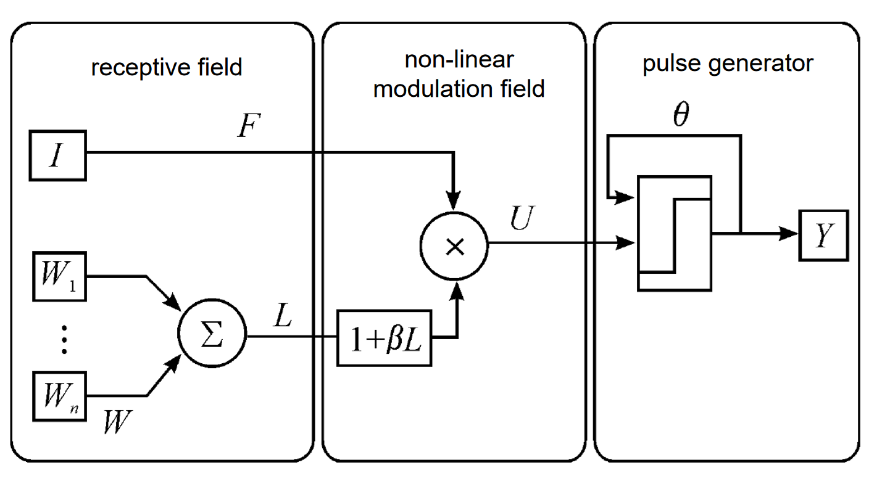
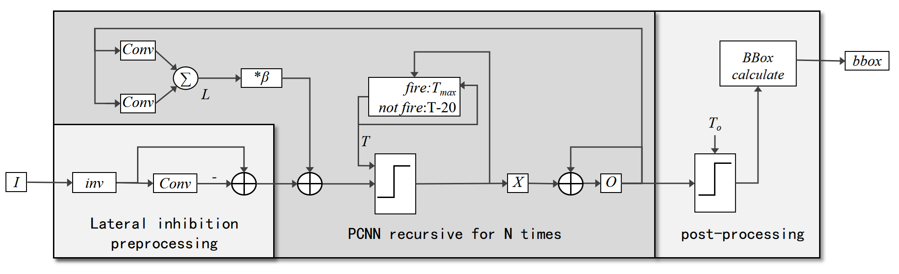

PCNN
~~~~~~~~~~~~~~~~~~~~~~~~~~~~~~~~~~~~~~~~~~~~~~~~~~~~~~~~~~~~~~~~~~~~~~~~~~~~~~~~~~~~~~~~
The Pulse-Coupled Neural Network (PCNN) is an algorithm inspired by neurobiology, designed mainly for image processing fields such as image segmentation, target recognition, and texture analysis. PCNN simulates the neuron activity in the biological visual system, particularly how neurons in the retina respond to visual stimuli by synchronously firing pulses. 

**Network Model**

The model processes the input image based on PCNN (Pulse-Coupled Neural Network), achieving background suppression and target enhancement. It is used for the detection task of infrared moving small targets.

   
   Figure: PCNN network model

**Training and Performance**

The PCNN network does not require training. The following video shows the detection effect of the PCNN network deployed on the APU.

.. video:: _static/PCNN_APU.mp4
   :loop:
   :align: center
   :width: 100%
   :caption: PCNN network deployed on APU detection effect

PCNN Detection
~~~~~~~~~~~~~~~~~~~~~~~~~~~~~~~~~~~~~~~~~~~~~~~~~~~~~~~~~~~~~~~~~~~~~~~~~~~~~~~~~~~~

This case demonstrates the detection of small visible targets (airplanes) based on an improved PCNN. The algorithm requires no complex training and can be used for small sample target detection.

The PCNN network in this case consists of lateral inhibition filters and dynamic neurons with variable thresholds. The first part uses lateral inhibition for image filtering preprocessing to suppress complex backgrounds. The second part uses variable thresholds to generate pulse signals for separating targets from backgrounds. Separation is achieved through pulse firing, with firing neurons representing the target foreground and non-firing representing the background. This process continues for N iterations. During the iteration, the threshold dynamically changes, and through convolution operations, gradually raises the pixel values around firing targets, thereby expanding the target area. Finally, the target area is obtained, and the target area's position and boundary are calculated for detection output. The adjustment rule for the firing threshold of pixels is as follows: the threshold T varies for each pixel. When the input image pixel is detected as a foreground pixel, T takes the higher value Tmax. When an input pixel does not reach the threshold, T decreases by a fixed amount, making it easier to fire in the next round. The signal O adds itself to X over multiple iterations, collecting all fired neurons to obtain the foreground target. Post-processing further binarizes O and calculates the target box position. The overall process is shown in the figure below.

   Figure:pcnn_det algorithm flowchart

The input for detection is a video, and the effect is shown in the video below.

.. video:: _static/pcnn_det_video.mp4
   :loop:
   :align: center
   :width: 100%
   :caption: pcnn_det algorithm detection effect example
