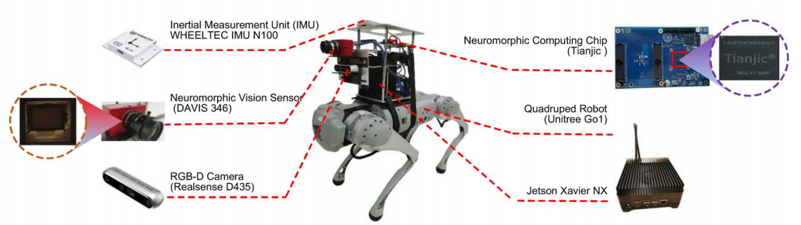
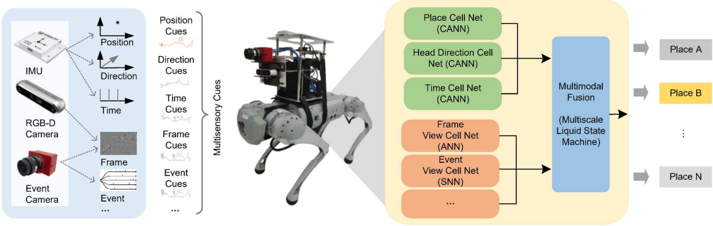

**Location Recognition Robot Introduction**

This quadruped robot is equipped with multiple sensors: an IMU inertial measurement unit for obtaining positional information, an RGB camera for capturing image data, and an event camera for capturing event data; a neuromorphic chip for processing multimodal data.

   Figure: Location Recognition Robot

**Network Model**

The architecture of the location recognition network is shown in the figure below. The network consists of four modules: a convolutional neural network (which can use pre-trained ResNet50 or MobileNet_V2) for processing image data, an SNN network for processing event data, a Continuous Attract子 Network (CANN) for processing GPS information, and the multimodal data processed by these three modules is input into the MLSM module (Liquid State Machine) for processing, ultimately obtaining positional information.

   Figure: Location Recognition Network Architecture