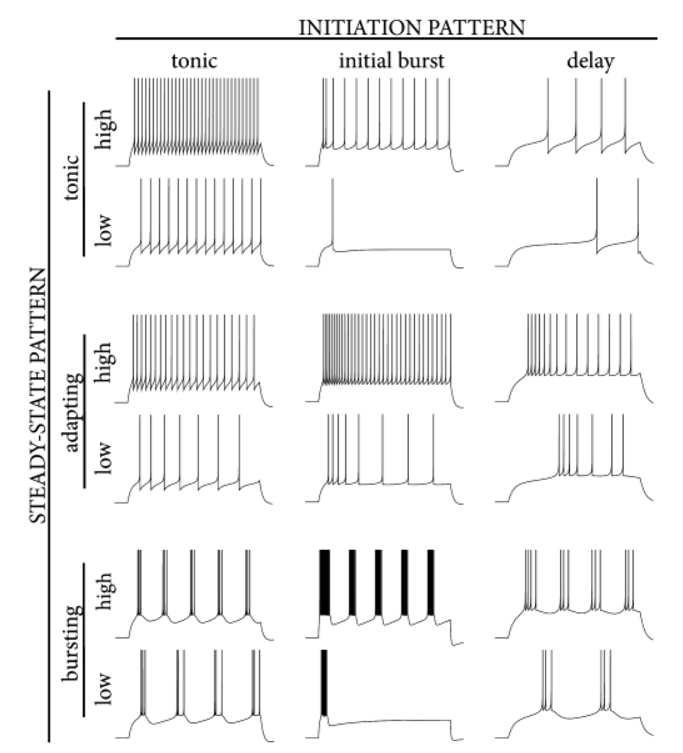
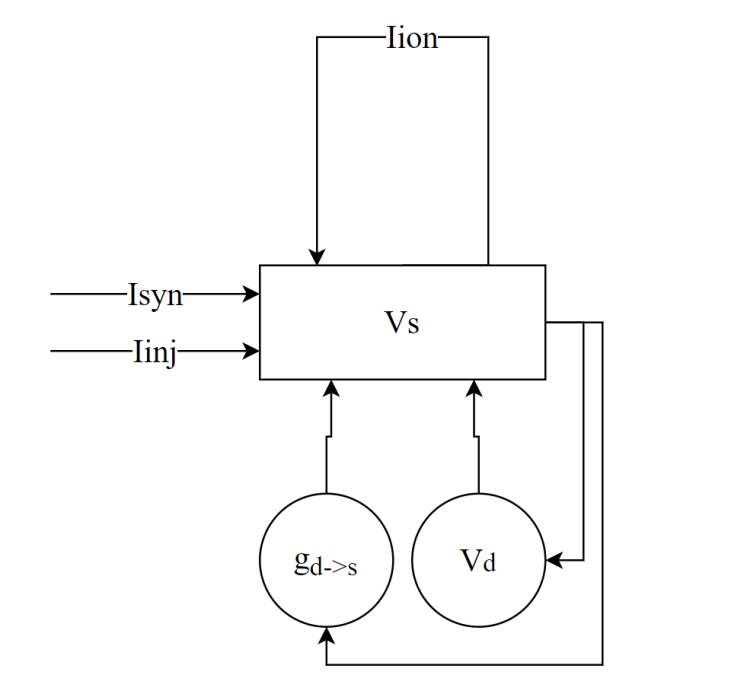
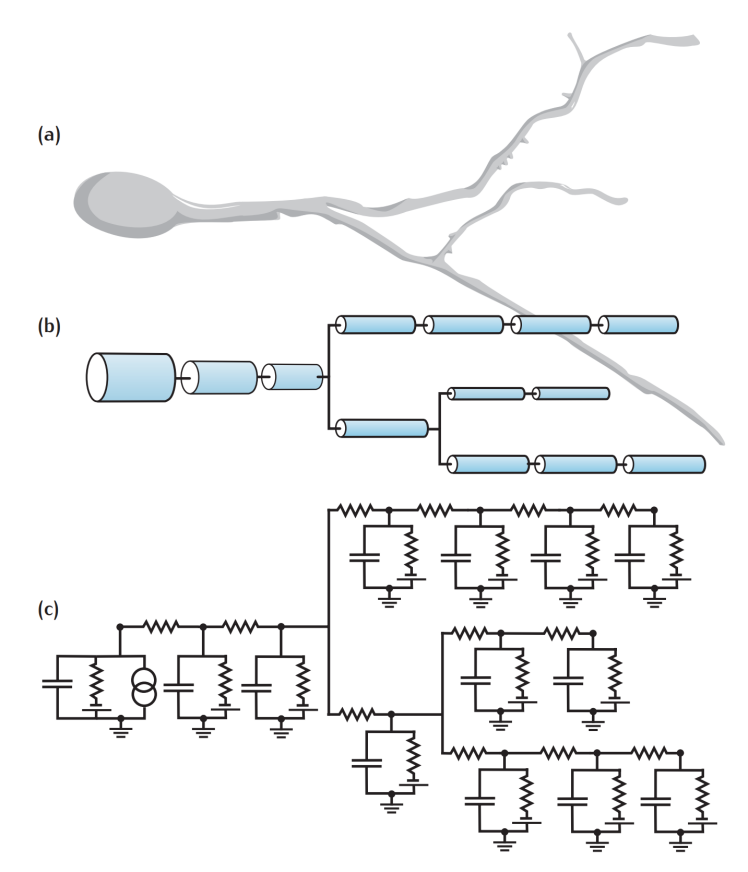
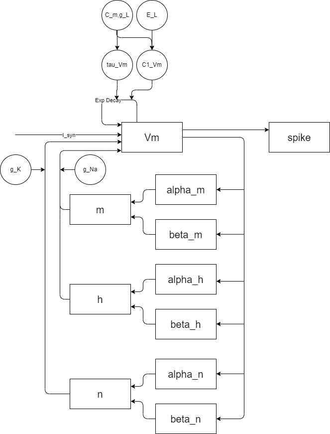
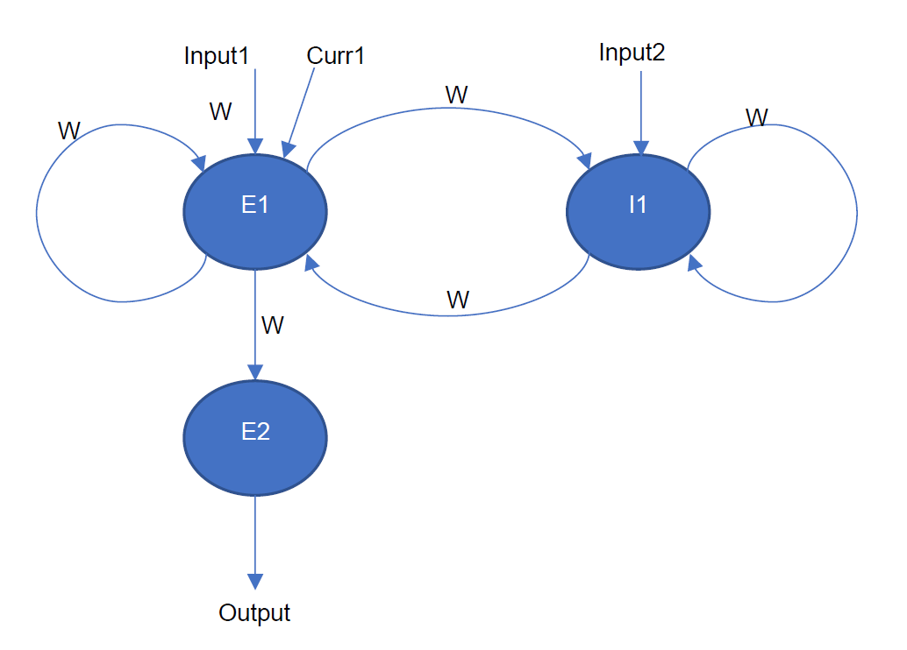
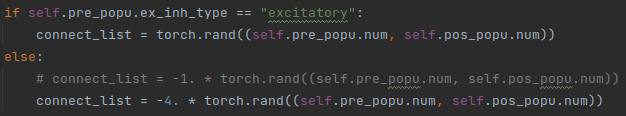
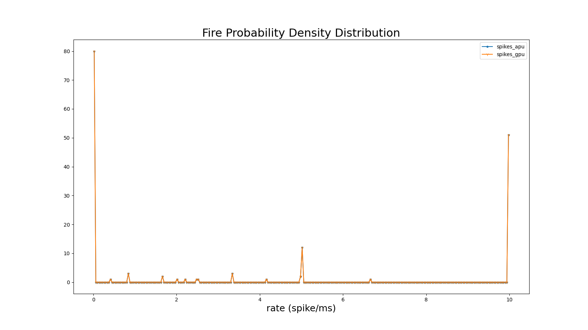
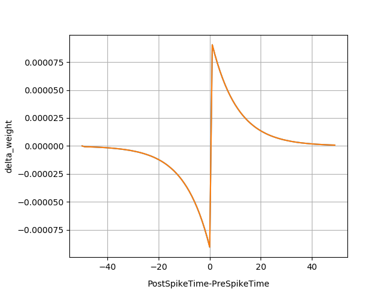

Neuron Simulation Toolkit 
=========================================================================================

This chapter mainly introduces how to use Lynxi brain-inspired systems for neuron simulation, including the principles and characteristics of neuron simulation, functional features, simulation range, simulation process, typical neuron simulation cases, etc.

Neuron Simulation Toolkit mainly supports the following functions:

- Supports constructing neuron clusters using the Pytorch language to simulate the dynamic characteristics of one or multiple neuron clusters;
- Supports building neuronal models such as LIF, Izhikevich, LIF+, AdEx, Hodgkin-Huxley, multi-compartment models, etc.;
- Supports new custom neuronal models;
- Supports neural networks built by custom neuronal models;
- Supports BP training (offline) to obtain optimal neuron parameters;
- Supports full automatic compilation using Lyngor and multi-time step scheduling, input, and stimulation source configuration using LynSDK;
- Supports analysis of release results and membrane potential results, such as statistical curve analysis of Raster, Fire Rate, CV ISI, Pearson Correlation, etc., and time-series variation analysis of neuron status information (such as membrane potential).

.. _limitation:

Limitations
----------------------------------------------------------------------------------------

Neuron Simulation Toolkit is mainly developed for brain-inspired neuronal models. When deployed in Lynxi brain-inspired chip, the models that can be simulated must meet the following characteristics and constraints:

- It has one or multiple current inputs;
- It has at least one output, such as pulse release output, membrane potential output;
- It has multi-time step running logic;
- Neurons are simulated in units of "clusters," with one or more neurons per cluster;
- These neurons have differential dynamic descriptions (code descriptions);
- It is clear which state variables of the current time step depend on the historical time steps;
- There is no if logic in the neuron differential description (as if is difficult to implement in vector calculation). A similar if description scheme will be provided below;
- There are no dynamic loops in the neuron differential description (loop ending conditions determined inside the loop). It can have static loops (regarded as unrolling);
- The operators required for neuron descriptions are within the range of Pytorch operators supported by Lyngor;
- All computation and storage precision of neurons use 16-bit floating-point;
- Synaptic structure can be expressed as fully-connected structures or simple neural network structures;
- Network input-output tensor shape constraints: input-output tensors are described using Pytorch Tensor, with the shape [B,D2,D1,D0], with requirements including:

  - The total size (size) of the input vectors is less than 6MB, or in other words, less than 6M/dsize data (if the input is of type fp32, dsize=4, if the input is of type fp16, dsize=2);
  - Each dimension D2, D1, D0 does not exceed 4095, B=1;
  - size/D2 <= 256K, equivalent to D1×D0×dsize <= 256K;
  - When there are multiple Tensor inputs, the compiler will merge them into a large tensor. When D1, D0 are the same, the D2 dimension is merged; when D2=1 and D0 are the same, they are merged at the D1 dimension, otherwise, all tensors will be expanded into one dimension for merging. The merged tensor needs to meet the conditions above.

- Considering user experience, it is recommended that the total number of neurons simulated is within ten thousand.

.. attention::

   The current simulation method used is clock-driven, not event-driven, and cannot simulate continuous dynamical models.

Installation Directory
----------------------------------------------------------------------------------------

The custom neuron simulation tool package is located in the *applications/neuralsim/neurons* directory. 
The directory structure of the tool package is shown in the table below.

Table: Custom Neuron Simulation Tool Installation Directory Description

+-----------------------+-------------------------------------------------------------+
| Directory/File        | Description                                                 |
+=======================+=============================================================+
| snnviz                | Drawing tool package                                        |
+-----------------------+-------------------------------------------------------------+
| multi_cluster_config  | Configuration files for multi-cluster models                |
+-----------------------+-------------------------------------------------------------+
| multi_cluster_modules | Implementation of multi-cluster mode                        |
+-----------------------+-------------------------------------------------------------+
| neurontypes           | Implementation of neurons, including:                       |
|                       |                                                             |
|                       | - lif_neuron.py is the implementation of LIF neuron;        |
|                       | - izhikevich.py is the implementation of Izhikevich neuron; |
|                       | - adex.py is the implementation of AdEx neuron;             |
|                       | - hodgkin_huxley.py is the implementation of HH neuron;     |
|                       | - multicompartment.py is the implementation of              |
|                       |   multi-compartment neuron.                                 |
+-----------------------+-------------------------------------------------------------+

Operation Instructions
--------------------------------------------------------------------------------

Operation Process
~~~~~~~~~~~~~~~~~~~~~~~~~~~~~~~~~~~~~~~~~~~~~~~~~~~~~~~~~~~~~~~~~~~~~~~~~~~~~~~~

The operation process of Neuron Simulation Toolkitis shown in the figure below.

      
   .. figure:: _images/神经元仿真流程图.png
      :width: 50%
      :alt: Neuron Simulation Flow Chart
      
      Figure: Neuron Simulation Flow Chart

Describe the neuron differential equation. Use the vectorized description method, through Pytorch language, based on the template or case provided by this development package for description, only the iterative process of a single time step needs to be described.

Compile the model. Use Lyngor to convert the model structure described by Pytorch into a chip-executable file.

Set and execute model simulation:

1. Set the stimuli;
2. Schedule the model operation process of multiple event shots;
3. Record the pulse or membrane potential results.

Post-analysis, such as using statistical result analysis and plotting tools to analyze the neuron release statistical characteristics.

Describe the Neuron Differential Equation
~~~~~~~~~~~~~~~~~~~~~~~~~~~~~~~~~~~~~~~~~~~~~~~~~~~~~~~~~~~~~~~~~~~~~~~~~~~~~~~~

Use the vectorized description method, through Pytorch language, based on the template or case provided by this development package for description, only the iterative process of a single time step needs to be described.

Descriptions of each step in neuron simulation
^^^^^^^^^^^^^^^^^^^^^^^^^^^^^^^^^^^^^^^^^^^^^^^^^^^^^^^^^^^^^^^^^^^^^^^^^^^^^^^^^

**Description of neuron dynamic process and their differential equations**

The default dynamic process of neurons is described in differential form. Before simulation, the user first needs to convert it into a differential equation through an approximate method, usually completed with the aid of a solver or manual calculation, such as using the Euler method to solve the obtained differential equation.

In the differential equation, the operation process of neurons can be deduced by time-shot, and the update of the current shot depends on the nearby historical time shot.

See the neuron definition section in :ref:`case` for descriptions of the differential and differential equations of each neuron.

Differential equations are usually described with a single neuron, but to simulate the characteristics of a cluster of neurons, a cluster of neurons can be described, in which variables in the above equation can be vectors (one-dimensional), tensors (multi-dimensional), or scalars.

Below is an explanation using LIF neurons as an example.

**Description of neuron cluster**

The description of neuron clusters is done using Pytorch code (modified based on the provided framework code for reference neurons).

Variables are expressed using Pytorch Tensor, and the calculation process is also calculated based on Tensor units. Tensor can be in [B, L] form (for one-dimensional data processing) or [B, H, W, C] form (for image processing). Where B is Batch and defaults to 1.

The description of the differential equation above can be transformed into the following code logic:

::

   temp1 = self.v_rest - self.v
   temp2 = self.R * inpt
   self.v = self.v + self.dt * temp1 / self.tau_m + temp2
   fire = spike_func(self.v - self.v_th)
   fire_inv = 1. - fire
   self.v = fire * self.v_reset + fire_inv * self.v

.. note:: 
   
   Refer to :ref:`zdysjymx` for the storage and reference of state variables in neurons.

**Neuron Simulation Pseudocode**

Pseudocode when constructing neurons:

::

   #init all state variables
   v = initial_value
   
   #loop for all time steps
   for i in range(ts):
      Iinj = Inject stimuli() # can be DC, poisson, etc.
   
   #this part is for compile
   Isyn = synaptic_integration(pre_spike)
   spike = neuron_processing(Iinj, Isyn)
   
   # end of compile
   record_spike.append(spike)
   pre_spike = spike
   analysis_result(record_spike) #plot raster, fire prob. Etc.

Pseudocode during compilation:

::

   #define the model
   Model={
      Isyn = synaptic_integration(pre_spike)
      spike = neuron_processing(Iinj, Isyn)
   }
   #define I/O
   Input = [Isyn, Iinj]
   Output = [spike]

Pseudocode when performing inference with LynSDK:

::

   #init all state variables
   v = initial_value
   
   #loop for all time steps
   for i in range(ts):
      Iinj = Inject stimuli() # can be DC, poisson, etc.
      copy_to_chip(Iinj)
      Spike = Forward_model(Iinj)
      Copy_to_host(spike)
      record_spike.append(spike)
      pre_spike = spike
      analysis_result(record_spike) #plot raster, fire prob. Etc.

**Simple Synapse Structure (Adding FC)**

Using Pytorch operators can build simple synaptic structures, such as fully interconnected between neurons:

::
   
   Isyn=torch.mul(spike_pre, syn_weight)

You can also use the slice operation to extract part of the input pulses and connect them with the current neuron cluster, such as:

::

   Isyn[0:9]=torch.mul(spike_pre[0:9], syn_weight1) + torch.mul(spike_pre[20:29], syn_weight2)

**Statistical Result Analysis**

After the simulation is over, some typical analysis methods, such as those below, can be used to analyze neuron characteristics. The analysis below is mainly used to analyze the group characteristics of neuron releases (spikes) and is to plot the analysis results of APU and CPU or GPU on the same graph.

Typical analysis methods include the following four items:

1. Pulse Release Results Over Time

   Show the pulse release process of each neuron over time. The pulse release timing and release density of neurons can be intuitively observed.

   .. figure:: _images/随时间脉冲发放结果相关系数.png
      :alt: Pulse Release Correlation Coefficient Over Time

      Figure: Pulse Release Correlation Coefficient Over Time

2. Average Firing Rate

   The average firing rate defines the average activity of the network. Defined as:

   .. math:: FR = \frac{n_{sp}}{T}

   Where \ :math:`n_{sp}`\ represents the number of pulse events within the time interval T.

   .. figure:: _images/平均脉冲发放率相关系数.png
      :alt: Average Firing Rate Correlation Coefficient

      Figure: Average Firing Rate Correlation Coefficient

3. Coefficient of Variation of Interspike Interval (CV ISI)

   The coefficient of variation of the interspike interval is the ratio of the standard deviation to the mean of spike intervals, analyzing the temporal characteristics of spikes. Defined as:

   .. math:: CV = \frac{\sqrt{\frac{1}{n - 1}\sum_{i = 1}^{n}{({ISI}_{i} - \overline{ISI})}^{2}}}{\overline{ISI}}

   .. math:: {ISI}_{i} = t_{i + 1} - t_{i}

   .. math:: \overline{ISI} = \frac{1}{n}\sum_{i = 1}^{n}{ISI}_{i}

   Where n represents the number of pulse intervals \ :math:`{ISI}_{i}`\, \ :math:`t_{i}`\ represents the time of the i-th pulse emitted by a neuron, and \ :math:`\overline{ISI}`\ represents the mean of \ :math:`\ ISI`. Refer to (Shinomoto et.al., 2003).

   .. figure:: _images/CV_ISI相关系数.png
      :alt: CV ISI Correlation Coefficient

      Figure: CV ISI Correlation Coefficient

4. Pearson Correlation Analysis

   The Pearson correlation coefficient defines a measure to quantify the time correlation of two binned pulse sequences (i, j) under defined bin sizes.

   Using \ :math:`b_{i}`\ to represent the pulse sequence, \ :math:`u_{i}`\ represents its mean. The correlation coefficient between pulse sequences \ :math:`b_{i}`\ and \ :math:`j`\ is represented as:

   .. math:: C\lbrack i,j\rbrack = \frac{{< b}_{i} - u_{i},b_{j} - u_{j} >}{\sqrt{{< b}_{i} - u_{i},b_{i} - u_{i} > \cdot {< b}_{j} - u_{j},b_{j} - u_{j} >}}

   Where <,> denotes dot product. For example, for a pulse sequence of length N, an NxN correlation matrix can be obtained, with the distribution of off-diagonal elements of the matrix indicating Pearson correlation. Refer to (Gruen, 2010).

   .. figure:: _images/皮尔逊相关系数.png
      :alt: Pearson Correlation Coefficient

      Figure: Pearson Correlation Coefficient

Some Instructions for Building Neuronal Model Code
^^^^^^^^^^^^^^^^^^^^^^^^^^^^^^^^^^^^^^^^^^^^^^^^^^^^^^^^^^^^^^^^^^^^^^^^^^^^^^^^^^^^^^^^^^

Expression methods for typical neuron business logic include:

**How to Represent Conditional Logic**

Since KA200 uses Tensor-based computing logic, the conditional logic is applied to the variable as a whole rather than each element.
There are two cases:

The condition of the conditional logic is a constant at the compilation stage, such as an attribute variable, for example:

::

   if self.on_apu:
      fire = ops.custom.cmpandfire(self.v.clone(), self.theta)
   else:
   v_ = self.v - self.theta
   fire = v_.gt(0.).float()

Here, ``self.on_apu`` is a switch attribute. At compilation time, the switch attribute is determined, and Lyngor will construct and compile the computation graph based on this switch attribute, meaning only the branch where the attribute switch (conditional logic) is true will be compiled, while other branches not pointed to by the switch are ignored. Lyngor supports such compilation. If the conditional logic is unclear during the compilation stage, it can be for scalar or vector, such as a variable input to the neuron:

::

   if(self.v - self.theta > 0.):
   self.v = self.v_0
   else:
   self.v = self.v.clone()

Then it needs to be rewritten in the following vector form to complete compilation:

::

   v_ = self.v - self.theta
   fire = v_.gt(0.).float()
   fire_inv = 1. - fire
   self.v = fire * self.v_0 + fire_inv * self.v.clone()

When ``self.v`` and ``self.theta`` have unequal dimensions, support automatic broadcasting to equal dimensions before computation.

**How to Represent Loops**

If the loop condition is determined at compilation time, the loop will be expanded. For example:

::

   for i in range(3):
      layers.append(block(co, co, noise=noise))

Will be expanded to the following expression:

::

   layers.append(block(co, co, noise=noise))
   layers.append(block(co, co, noise=noise))
   layers.append(block(co, co, noise=noise))

Dynamic loop conditions will be supported in future versions, currently unsupported.

**Efficiency Optimization Methods**

Neurons typically have reset and decay computations. Lynxi brain-inspired systems support underlying acceleration instructions, for example when reset and decay logic are expressed as follows:

::

   V = (V>=Vth) ? Vreset: Vin
   V = alpha * V + beta

Through the following custom function, the reset and decay process can be accelerated:

::

   V = ops.custom.resetwithdecay(V.clone(), Vth, Vreset, lpha, beta)

Model Compilation and Inference
~~~~~~~~~~~~~~~~~~~~~~~~~~~~~~~~~~~~~~~~~~~~~~~~~~~~~~~~~~~~~~~~~~~~~~~~~~~~~~~~

Refer to :ref:`build-and-install` for the compilation and inference process and specific code implementation process, but note that there are a few considerations:

First, define b, n, t, c, h, w, that is, the batch of test data (for APU inference, the batch is fixed at 1). For neuron scale restrictions, see :ref:`limitation`.

The number of samples in each batch, the number of time steps for each sample, and the size of the c, h, w dimensions of the data in each step.

input_data = torch.randn(b,n,t,c,h,w), i.e., randomly set input values. For neurons, these inputs are external DC inputs. If you want to control pulse firing, try modifying the external DC values.

.. _case:

Typical Cases
--------------------------------------------------------------------------------

LIF Model
~~~~~~~~~~~~~~~~~~~~~~~~~~~~~~~~~~~~~~~~~~~~~~~~~~~~~~~~~~~~~~~~~~~~~~~~~~~~~~~~

**Usage Scenario**

The structure of the LIF model is relatively simple, making it widely applicable. 
In addition to general brain simulation scenarios, it is also common in theoretical 
model analysis and multi-layer SNN learning models. The downside of the LIF model is 
its excessive linearity and lack of detail in the neurons. Typically, a single LIF 
model is not used alone; instead, it is composed of the LIF model plus a simple synaptic 
model. We will illustrate with the common form of LIF model + current input + exponential 
synapse + white noise.

**Model Variables and Parameters**

Variables and parameters of the LIF model:

.. csv-table:: 
    :header: Variable, Meaning, Type, Typical Value, Common Range, Common Initialization Method

    :math:`V_{m}` , Neuronal membrane potential, State value, -65, -80~-55, Uniform initialization/Uniform distribution
    :math:`I_{tot}` , Input current, Instantaneous value/Externally input, 300, -1000~1000, Set to 0
    spike, Whether the neuron fires pulses, Instantaneous value, 0/1, 0/1, Set to 0
    
.. csv-table:: 
    :header: Parameter, Meaning, Common Reuse, Typical Value,  Common Range, Common Initialization Method

    :math:`C_{m}` , Neuronal capacitance, Shared within group, 250, 100~1000, Uniform initialization
    :math:`g_{L}` , Leakage current conductance, Shared within group, 25, 0~100, Uniform initialization
    :math:`E_{L}` , Leakage current equilibrium voltage, Shared within group, -65, -60~-80, Uniform initialization
    :math:`V_{th}`, Firing threshold, Shared within group, -50, -40~-60, Uniform initialization
    :math:`V_{reset}`, Voltage reset after firing, Shared within group, -65, -60~-80, Uniform initialization

**Model Formula**

The LIF model can be expressed as:

.. math:: C_{m}\frac{dV_{m}}{dt} = - g_{L}\left( V_{m} - E_{L} \right) + I_{tot}

.. math:: if{\ \ V}_{m} > V_{th},\ V_{m} = V_{reset}

Before simulation, the user needs to convert it into a differential equation using an approximation method such as Euler's method to solve the following differential equation:

.. math:: V_{m} = V_{m} - g_{L}\left( V_{m} - E_{L} \right) \cdot dt/C_{m} + I_{tot} \cdot dt/C_{m}

That is

.. math:: V_{m} = (1 - g_{L} \cdot dt/C_{m})V_{m} + E_{L} \cdot g_{L} \cdot dt/C_{m} + I_{tot} \cdot dt/C_{m}

That is

.. math:: V_{m} = \alpha V_{m} + \beta + I_{e}

.. math:: if{\ \ V}_{m} > V_{th},\ V_{m} = V_{reset}

Where：

- :math:`\alpha = 1 - g_{L} \cdot dt/C_{m}`\ represents the multiplicative leakage coefficient； 
- :math:`\beta = E_{L} \cdot g_{L} \cdot dt/C_{m}`\ represents the additive leakage coefficient, 
- :math:`I_{e} = I_{tot} \cdot dt/C_{m}`\ input current.

Therefore, in the reference program code provided, the actual input parameters are\ :math:`\alpha`\ ,
\ :math:`\beta`\ ,\ :math:`I_{e}`\ ,\ :math:`V_{reset}`\ (named V_0 in code),
\ :math:`V_{th}`\ (named theta in code), and initial value of the membrane potential v_init.

AdEx Model
~~~~~~~~~~~~~~~~~~~~~~~~~~~~~~~~~~~~~~~~~~~~~~~~~~~~~~~~~~~~~~~~~~~~~~~~~~~~~~~~

**Usage Scenario**

The full name of the AdEx model is the adaptive exponential model. As the name suggests, it adds an exponential term to the LIF model and increases the model's adaptability. This makes the AdEx model capable of simulating more diverse discharge behaviors, as shown in the following figure.

   Figure: AdEx Model Simulation Discharge Illustration

**Model Variables and Parameters**

The meanings and values of each variable and parameter are as follows:

.. csv-table:: 
    :header: Variable, Meaning, Type, Typical Value, Common Range, Common Initialization Method

    :math:`V_{m}` , Neuronal membrane potential, State value, -65, -80~-55, Uniform initialization/Uniform distribution
    :math:`w` , Adaptation variable, State value, 0, 0~100, Uniform initialization
    :math:`I` , Input current, Instantaneous value/Externally input, 10, 0~100, Set to 0

.. csv-table:: 
    :header: Parameter, Meaning, Common Reuse, Typical Value, Common Range, Common Initialization Method

    :math:`V_{rest}` , Resting membrane potential, Shared within group, -70, -75~-65, Uniform initialization
    :math:`\mathrm{\Delta}` , Steepness constant, Shared within group, 2, 1~10, Uniform initialization
    :math:`R` , Resistance, Shared within group, 0.5, 0.1~1, Uniform initialization
    :math:`V_{th}` , Discharge threshold, Shared within group, -50, -50~0, Uniform initialization
    :math:`V_{peak}` , Discharge peak value, Shared within group, 35, 20~50, Uniform initialization

**Model Formula**

The AdEx model consists of two differential equations, as follows:

.. math:: \tau_{m}\frac{dV_{m}}{dt} = - \left( V_{m} - V_{rest} \right) + \mathrm{\Delta}exp\left( \frac{V_{m} - V_{th}}{\mathrm{\Delta}} \right) - Rw + RI

.. math:: \tau_{w}\frac{dw}{dt} = a\left( V_{m} - V_{rest} \right) - w

.. math:: ifV_{m} \geq V_{peak},\ V_{m} \leftarrow V_{reset},\ w \leftarrow w + b

The differential equation obtained using Euler's method is as follows:

.. math:: V_{m} = V_{m} + \frac{dt}{\tau_{m}}( - \left( V_{m} - V_{rest} \right) + \mathrm{\Delta}\exp\left( \frac{V_{m} - V_{th}}{\mathrm{\Delta}} \right) - Rw + RI

.. math:: w = w + \frac{dt}{\tau_{w}}(a\left( V_{m} - V_{rest} \right) - w)

.. math:: if{\ \ V}_{m} > V_{peak},\ V_{m} = V_{reset},\ w = w + b

Izhikevich Model
~~~~~~~~~~~~~~~~~~~~~~~~~~~~~~~~~~~~~~~~~~~~~~~~~~~~~~~~~~~~~~~~~~~~~~~~~~~~~~~~

**Usage Scenario**

The Izhikevich model is relatively simple computationally but introduces non-linearity, making it more dynamic than the LIF model. With different parameters, it can exhibit various pulse time response characteristics. Due to this feature, this model is commonly used in brain-like simulation models sensitive to temporal characteristics, such as studying brain time rhythms.

**Model Variables and Parameters**

.. csv-table:: 
   :header: Variable, Meaning, Type, Typical Value, Common Range, Common Initialization Method

   :math:`V_{m}` , Neuronal membrane potential, State value, -65, -80~30, Uniform initialization/Uniform distribution
   :math:`u` , Membrane voltage recovery variable, State value, 0, 0~10, Set to 0
   spike, Whether the neuron fires pulses, Instantaneous value, 0/1, 0/1, Set to 0

.. csv-table:: 
   :header: Parameter, Meaning, Common Reuse, Typical Value, Common Range, Common Initialization Method

   a, Attenuation constant, Reusable within group, 0.02, 0.01~0.02, Uniform initialization
   b, Recovery sensitivity, Reusable within group, 0.2, 0.2, Uniform initialization
   c, Reset voltage, Reusable within group, -55, -55, Uniform initialization
   d, Recovery constant, Reusable within group, 2, 1~4, Uniform initialization

**Model Formula**

.. math:: \frac{dV_{m}}{dt} = 0.04V_{m}^{2} + 5V_{m} + 140 - u + I

.. math:: \frac{du}{dt} = a\left( bV_{m} - u \right)

.. math::

   \begin{equation}
   \text{if } V_{m} \geq 30, \text{ then} \begin{cases}
   V_{m} = c \\
   u = u + d
   \end{cases}
   \end{equation}

Here, \ :math:`0.04V_{m}^{2} + 5V_{m} + 140`\ are parameters obtained through experimental fitting.

**Differential Form**

.. math:: u = u + \ a\left( bV_{m} - u \right)*\Delta t

.. math:: V_{m} = V_{m} + \left( 0.04V_{m}^{2} + 5V_{m} + 140 - u + I \right)*\Delta t

.. math::

   \begin{equation}
   \text{if } V_{m} \geq 30, \text{ then} \begin{cases}
   V_{m} = c \\
   u = u + d
   \end{cases}
   \end{equation}

Multicompartment Model
~~~~~~~~~~~~~~~~~~~~~~~~~~~~~~~~~~~~~~~~~~~~~~~~~~~~~~~~~~~~~~~~~~~~~~~~~~~~~~~~

**Usage Scenario**

The multicompartment neuronal model aims to simulate the real shape of neurons in the biological brain, with multiple dendrites and a relatively complex structure, leading to considerable computational requirements. Hence, it is currently used in limited scenarios. Typically, a multicompartment neuronal model can be used alone to study the properties of a single neuron, or multiple multicompartment models can be combined into a neural network to examine neural circuit characteristics. Generally, the number of multicompartment neurons in a neural circuit ranges from a few to thousands. Below, we will illustrate with the common form of a single multicompartment neuronal model.

**Model Diagram**

   Figure: Multicompartment neuronal model

**Model Variables and Parameters**

Variables and parameters of the multicompartment neuronal model (Only multicompartment neuronal model-specific parameters are listed; others are consistent with the LIF model and HH model):

.. csv-table:: 
   :header: Parameter, Meaning, Common Reuse, Precision Requirement, Typical Value, Common Range, Common Initialization Method

   :math:`R_{a}` , Axial resistivity, Shared within group, FP32, 1, 0.1-100, Uniform initialization
   :math:`d` , Compartment diameter, Each compartment independent, FP32, 1, 0.1-10, Uniform initialization
   :math:`l` , Compartment length, Each compartment independent, FP32, 1, 0.1-1000, Uniform initialization

**Model Formula**

In the multicompartment neuronal model, neurons are divided (discretized) into many interconnected cylinders (compartments). Depending on the degree of detail in characterizing the neuron's shape, the number of compartments ranges from 2 to several thousand, typically with about 10 compartments to depict the basic neuron shape. The level of detail in characterizing neuron shape is also related to the speed of information transmission. For example, if there are n compartments between compartment A and compartment B, it will take n time steps to transfer information from compartment A to compartment B. In actual computation, if the time step is small enough (e.g., 0.01 ms), the delay can be negligible for network impact.

Generally, each branch of a neuron will have 2 forks, with 1-5 compartments on each fork. Each cylinder contains an RC circuit (can be simulated using the LIF model or HH model), as shown below:

The multicompartment neuronal model can be expressed as:

.. math:: C_{m}\frac{dV_{s}}{dt} = - \sum_{}^{}I_{ion} - \sum_{i}^{}{g_{d_{i} \rightarrow s}\left( V_{s} - V_{d_{i}} \right)} - I_{syn} + \frac{I_{inj}}{\pi d_{s}l_{s}}

.. math:: C_{m}\frac{dV_{d_{j}}}{dt} = - \sum_{}^{}I_{ion} - g_{s \rightarrow d_{j}}\left( V_{d_{j}} - V_{s} \right) - \sum_{i}^{}{g_{d_{i} \rightarrow d_{j}}\left( V_{d_{j}} - V_{d_{i}} \right)} - I_{syn} + \frac{I_{inj}}{\pi d_{d_{j}}l_{d_{j}}}

In the calculation of the soma's membrane potential, \ :math:`V_{s}`\ is the soma's membrane potential, \ :math:`\sum_{}^{}I_{ion}`\ 
is the current generated by the ion channels in the compartment (i.e., in the LIF model \ :math:`g_{L}\left( V_{m} - E_{L} \right)`\ 
and in the HH model \ :math:`- g_{L}\left( V_{m} - E_{L} \right) - g_{Na}m^{3}h\left( V - E_{Na} \right) - g_{K}n^{4}\left( V - E_{k} \right)`\ ),
\ :math:`g_{d_{i} \rightarrow s}`\ is the conductive connection from dendrite \ :math:`d_{i}`\ connected to the soma,
\ :math:`V_{d_{i}}`\ is the membrane potential of dendrite \ :math:`d_{i}`\ , \ :math:`I_{syn}`\ is the synaptic current,
\ :math:`I_{inj}`\ is the externally injected current (can be in various forms such as white noise, ramp current, constant current),
\ :math:`d_{s}`\ is the diameter of the soma compartment, \ :math:`l_{s}`\ is the length of the soma compartment.

In the calculation of the dendrite's membrane potential, \ :math:`V_{d_{j}}`\ is the membrane potential of dendrite \ :math:`d_{j}`\ ,
\ :math:`\sum_{}^{}I_{ion}`\ is the current generated by the ion channels in the compartment (i.e., in the LIF model
\ :math:`g_{L}\left( V_{m} - E_{L} \right)`\ and in the HH model
\ :math:`- g_{L}\left( V_{m} - E_{L} \right) - g_{Na}m^{3}h\left( V - E_{Na} \right) - g_{K}n^{4}\left( V - E_{k} \right)`\ ),
\ :math:`g_{s \rightarrow d_{j}}`\ is the conductive connection between soma and dendrite \ :math:`d_{j}`\ (if the dendrite is not directly connected to the soma, this term is 0), \ :math:`g_{d_{i} \rightarrow d_{j}}`\ is the conductive connection from dendrite \ :math:`d_{i}`\ connected to dendrite \ :math:`d_{j}`\ ,
\ :math:`V_{d_{i}}`\ is the membrane potential of dendrite \ :math:`d_{i}`\ ,
\ :math:`I_{syn}`\ is the synaptic current, \ :math:`I_{inj}`\ is the externally injected current (can be various forms such as white noise, ramp current, constant current),
\ :math:`d_{d_{j}}`\ is the diameter of dendrite \ :math:`d_{j}`\ compartment,
\ :math:`l_{d_{j}}`\ is the length of dendrite \ :math:`d_{j}`\ compartment.

The conductive connection from compartment i to compartment j is calculated as follows:

.. math:: g_{i \rightarrow j} = \frac{1}{2R_{a}\left( \frac{l_{i}}{{d_{i}}^{2}} + \frac{l_{j}}{{d_{j}}^{2}} \right)d_{j}l_{j}}

Where\ :math:`R_{a}`\ is the axial resistivity.

Hodgkin-Huxley Model (HH_PSC_ALPHA)
~~~~~~~~~~~~~~~~~~~~~~~~~~~~~~~~~~~~~~~~~~~~~~~~~~~~~~~~~~~~~~~~~~~~~~~~~~~~~~~~

**Use Cases**

The HH model includes modeling of various ion channels, and its model equations can correspond one-to-one with the structure of channel proteins. Mathematically, it constitutes a special dynamical system with multiple states. The characteristics of the HH model are:

- Rich sub-threshold dynamical characteristics;
- Simulates the shape and firing process of pulses;
- Better biological interpretability.

These characteristics make the HH model commonly used in brain simulation models that emphasize cellular and molecular biological principles. For example, when studying the effects of a newly discovered protein on neuronal activity, one can construct a neuronal model based on the HH model to study its dynamical features.

.. attention::

   This model is currently in the experimental phase. Due to the chip's FP16 precision, the simulation precision is limited and cannot yet be used in high-precision simulation scenarios.

**Model Schematic Diagram**

The classic HH model contains a sodium ion channel and a potassium ion channel. The schematic is as follows:

   Figure: HH Model Computation Flowchart

**Model Variables and Parameters**

.. csv-table:: 
   :header: Variable, Meaning, Type, Typical Value, Common Range, Common Initialization Method

   :math:`V_{m}` , Neuron membrane potential, State Value, -65, -80~-55, Uniform Initialization/Uniform Distribution
   m, Sodium ion channel protein 1 open ratio, State Value, 0.1, 0~1 (Strict Constraint), Uniform Initialization/Set 0
   :math:`\alpha_{m}` , Opening rate of m protein, Instantaneous Value, 0.5,  0~20, Set 0
   :math:`\beta_{m}` , Closing rate of m protein, Instantaneous Value, 0.5, 0~100, Set 0
   h, Sodium ion channel protein 2 open ratio, State Value, 0.1, 0~1 (Strict Constraint), Uniform Initialization/Set 0
   :math:`\alpha_{h}` , Opening rate of h protein, Instantaneous Value, 0.5, 0~100, Set 0
   :math:`\beta_{h}` , Closing rate of h protein, Instantaneous Value, 0.5, 0~100, Set 0
   n, Potassium ion channel protein open ratio, State Value, 0.1, 0~1 (Strict Constraint), Uniform Initialization/Set 0
   :math:`\alpha_{n}` , Opening rate of n protein, Instantaneous Value, 0.5, 0~100, Set 0
   :math:`\beta_{nh}` , Closing rate of n protein, Instantaneous Value, 0.5, 0~100, Set 0
   spike, Whether neuron fires pulse, Instantaneous Value, 0/1, 0/1, Set 0

.. csv-table:: 
   :header: Parameter, Meaning, Common Usability, Typical Value, Common Range, Common Initialization Method

   :math:`C_{m}` , Neuron capacitance, Shared within Group, 100, Typical Value Used in This Model, Uniform Initialization
   :math:`g_{L}` , Leak current conductance, Shared within Group, 30, Typical Value Used in This Model, Uniform Initialization
   :math:`E_{L}` , Leak current equilibrium voltage, Shared within Group, -54.4, Typical Value Used in This Model, Uniform Initialization
   :math:`g_{Na}` , Maximum conductance of sodium ion channel, Shared within Group, 12000, Typical Value Used in This Model, Uniform Initialization
   :math:`E_{Na}` , Equilibrium voltage of sodium ion channel, Shared within Group, 50, Typical Value Used in This Model, Uniform Initialization
   :math:`g_{K}` , Maximum conductance of potassium ion channel, Shared within Group, 3600, Typical Value Used in This Model, Uniform Initialization
   :math:`E_{K}` , Equilibrium voltage of potassium ion channel, Shared within Group, -77, Typical Value Used in This Model, Uniform Initialization

**Model Equations**

.. math::

   \begin{array}{r}
   C_{m}\frac{dV_{m}}{dt} = - g_{L}\left( V_{m} - E_{L} \right) - g_{Na}m^{3}h\left( V - E_{Na} \right) - g_{K}n^{4}\left( V - E_{k} \right)
   \end{array}

.. math::

   \begin{array}{r}
   \frac{dm}{dt} = \alpha_{m}(1 - m) - \beta_{m}m
   \end{array}

.. math::

   \begin{array}{r}
   \alpha_{m} = 0.1\left( \frac{V_{m} + 40}{1 - \exp\left( - \left( V_{m} + 40 \right)\text{/10} \right)} \right)
   \end{array}

.. math::

   \begin{array}{r}
   \beta_{m} = 4\exp\left( - (V + 65)\text{/18} \right)
   \end{array}

.. math::

   \begin{array}{r}
   \frac{dh}{dt} = \alpha_{h}(1 - h) - \beta_{h}h
   \end{array}

.. math::

   \begin{array}{r}
   \alpha_{h} = 0.07\exp\left( - (V + 65)\text{/20} \right)
   \end{array}

.. math::

   \begin{array}{r}
   \beta_{h} = \frac{1}{\exp\left( - (V + 35)\text{/10} \right) + 1}
   \end{array}

.. math::

   \begin{array}{r}
   \frac{dn}{dt} = \alpha_{n}(1 - n) - \beta_{n}n
   \end{array}

.. math::

   \begin{array}{r}
   \alpha_{n} = 0.01\frac{V + 55}{1 - \exp\left( - (V + 55)\text{/10} \right)}
   \end{array}

.. math::

   \begin{array}{r}
   \beta_{n} = 0.125\exp\left( - (V + 65)\text{/80} \right)
   \end{array}

Where exp is the exponential function. The constants are,

.. math:: C_{m} = 100.0,E_{Na} = 50,E_{k} = - 77,E_{L} = - 54.4

.. math:: g_{Na} = 12000,g_{K} = 3600,g_{L} = 30

These constants are values under the commonly used unit systems and can be directly substituted without conversion.

This model is relatively complex and can be roughly divided into three parts:

- Membrane potential equation, including equation (1);
- Sodium ion channel equations, including equations (2-7), where m and h are variables regulated by membrane voltage;
- Potassium ion channel equations, including equations (8-10), where n is regulated by membrane voltage.

The approximate solution method for transforming the model's differential equations to difference equations uses RKF45. The reference model is the HH_PSC_ALPHA model from the Nest simulator.

Multi-Cluster Model
~~~~~~~~~~~~~~~~~~~~~~~~~~~~~~~~~~~~~~~~~~~~~~~~~~~~~~~~~~~~~~~~~~~~~~~~~~~~~~~~

**Model Schematic Diagram**

A multi-cluster model refers to a multi-cluster loop network where interconnected parts only support full or one-to-one connections. All synapses between each pair of neuron clusters have a unified delay, valued from 1 to 50 (currently all set to 1). Below is a resevoir network formed by 3 neuron clusters, including two excitatory neuron clusters E1, E2, and an inhibitory neuron cluster I1. E1 is connected with I1 (fully connected), E1 outputs to E2, and both E1 and I1 have self-connections (fully connected).

   Figure: Multi-cluster Model Network Topology Diagram

**Model Variables and Parameters**

The types of neuron clusters can differ, such as LIF neurons or Izhikevich neurons. Here, LIF neurons are implemented, and the variables and parameters for LIF neurons are described below.

.. csv-table:: 
   :header: Variable, Meaning, Type, Typical Value, Common Range, Common Initialization Method

   :math:`V_{m}` , Neuron membrane potential, State Value, -65, -80~55, Uniform Initialization/Uniform Distribution
   :math:`I_{tot}` , Input current, Instantaneous Value/External Input, 300, -1000~1000, Set 0
   spike, Whether neuron fires pulse, Instantaneous Value, 0/1, 0/1, Set 0

.. csv-table:: 
   :header: Parameter, Meaning, Common Usability, Typical Value, Common Range, Common Initialization Method

   decay, Leak coefficient, Shared within Cluster, 0.8, 0~1, Uniform Initialization
   :math:`V_{th}`, Firing threshold, Shared within Cluster, -50, -40~60, Uniform Initialization
   :math:`V_{reset}`, Reset voltage after firing, Shared within Cluster, -65, -60~80, Uniform Initialization

**Instructions for Use**

The network structure of the multi-cluster model is constructed through a configuration file, located in the *multi_cluster_config* directory as the *multicluster_configure.json* file. The program defaults to reading the configurations from this file to construct the network. If other configurations are needed, you can modify its content as required or copy the content of a preset configuration file in this directory into this file.

Below is an explanation of the configuration file content and preset configuration files.

**Configuration File Description**

The configuration files include the following information:

::

   {
      "task": "multi_cluster",                     # Task Name
      "version": "0.0.1",                          # Configuration File Version
      "population": [                              # Configuration Information of Neuron Clusters
         {                                         # Configuration Information of Neuron Cluster 0
            "neuron_index": [                      # Neuron ID, Globally Unique, Starting from 1
               1,
               40
            ],
            "params": {                            # Initial Values of Neuron Parameters and Variables
               "V_th": -50.0,
               "V_reset": -65.0,
               "V_m": 20.0,
               "decay": 0.8
            },
            "neuron_number": 40,                   # Number of Neurons
            "neuron_type": "lif",                  # Neuron Type, Only Used to Identify the Type of Neurons in This Cluster, No Other Function
            "ex_inh_type": "excitatory"            # Type of Neuron Cluster, Can be "excitatory" or "inhibition"
         },
         ...
      ],
      "projection": [                              # Synapse Configuration Information
         {                                         # Synapse 0 Configuration Information
            "proj": "0_0",                         #IDs of Neuron Clusters Connected by Synapse, Corresponding to the Index in Neuron Cluster List, Starting from 0
            "sparse_ratio": 0.6                    # Sparsity Ratio of Synapse Connection Weight Matrix, Range (0,1]
         },
         ...
      ]
   }

It's important to note that the current version of the multi-cluster model configuration has the following limitations:

- All neuron clusters must have the same number of neurons;
- A specific neuron cluster must have identical neuron parameters;
- If the neuron cluster has only one neuron, the "neuron_index" list must still contain two numbers, which will be the same in this case, as exemplified by the *multi_cluster_config* directory's *multicluster_configure_4pop_1_12proj_param1.json* or *multicluster_configure_4pop_1_12proj_param2.json*.

**Preset Configuration Files**

The *multi_cluster_config* directory provides preset configuration files for easy and rapid use. The preset configuration files' names include four parts besides multicluster_configure, with different parts connected by underscores ``_``:

- Number of Neuron Clusters
- Number of Neurons in Each Cluster
- Number of Synapses
- Type of Neuron Parameters

For example, multicluster_configure_4pop_1_12proj_param1.json:

- ``4pop`` indicates the number of neuron clusters in the multi-cluster network is 4;
- ``1`` denotes each population has 1 neuron;
- ``12proj`` indicates this multi-cluster network has 12 synapse connections (including self-connections within neuron clusters);
- ``param2`` signifies the second set of LIF neuron parameters. Currently, two sets of LIF neuron parameters are provided in the preset configuration files, distinguished by param1 and param2.

**Example of Average Pulse Firing Rate in Multi-Cluster Model**

This section exemplifies the average firing rate results of the multi-cluster model. It uses the preset configuration file *multicluster_configure_4pop_40_12proj_param2.json*, where the connection weight matrix of neuron clusters in *projection.py* is filled with random numbers from a uniform distribution in the interval [0,1), and the average values of the connection weight matrices for excitatory and inhibitory neuron clusters are set at a ratio of 1:-4, as the following code snippet shows:

The average pulse firing rate for the multi-cluster model simulated for 10,000 frames is as follows:

   Figure: Average Pulse Firing Rate of Multi-Cluster Model Network

Multiple Cluster Model + STDP
~~~~~~~~~~~~~~~~~~~~~~~~~~~~~~~~~~~~~~~~~~~~~~~~~~~~~~~~~~~~~~~~~~~~~~~~~~~~~~~~

**Case Description**

This case demonstrates the rule for updating the weights between two neuron clusters through STDP. STDP (Spike-Timing-Dependent Plasticity) is a learning rule based on the timing of pre- and post-synaptic spikes. The STDP mechanism is described as follows: Within a certain time frame, if the post-synaptic neuron fires a spike after the pre-synaptic neuron fires a spike, there is considered to be a causal relationship between them, and their synaptic connection will be strengthened. The degree of strengthening is related to the time difference between the two spikes. Conversely, if the pre-synaptic neuron fires after the post-synaptic neuron, there is considered to be no causal relationship, and the synaptic connection will be weakened.

Both neuron clusters are excitatory, with a unidirectional full connection between the two clusters. The front cluster contains one neuron, and the rear cluster contains 100 neurons. The synaptic connections are initialized randomly. Neuron parameters and an external DC source are set so that the neuron in the front cluster fires a spike at the 50th tick, and the 100 neurons in the rear cluster fire spikes one after another from the 1st to the 100th tick. The changes in the weights of the 100 synaptic connections are recorded and plotted as a curve.

**User Instructions**

The network structure for the multiple cluster model + STDP is constructed through a configuration file located in the *multi_cluster_config* directory under the *stdp.json* file. The *test_stdp.py* program will automatically read the configurations from this file to construct the network.

Below is an explanation of the configuration file contents and the preset configuration file.

**Configuration File Explanation**

::

   {

   "task": "multi_cluster_stdp",
      "version": "0.0.1",
      "population": [
          {
            "neuron_index": [
               1,
               1
            ],
            "params": {
               "V_th": -0.5,
               "V_reset": -65.0,
               "V_m": -65.0,
               "decay": 0.99
            },
            "neuron_number": 1,
            "neuron_type": "lif",
            "ex_inh_type": "excitatory"
         },
         {
            "neuron_index": [
               2,
               101
            ],
            "params": {
               "V_th": -0.5,
               "V_reset": -65.0,
               "V_m": -65.0,
               "decay": 0.99
            },
            "neuron_number":100,
            "neuron_type": "lif",
            "ex_inh_type": "excitatory"
         }
      ],
      "projection": [
         {
            "proj": "0_1",
            "sparse_ratio": 1.0,
            "learning": "True"
         }
      ]
   }

In the configuration, the threshold of the neurons is -0.5, which is large enough so that each neuron only fires once under the DC source. In the Projection, the sparse_ratio is set to 1.0, meaning that 1 pre-synaptic neuron is fully connected to 100 post-synaptic neurons. The "learning" is set to True, which means the state is learnable, i.e., the connection weights are adjusted and updated through STDP.

**STDP Configuration Explanation**

For STDP, the learning rates for weight increase and decrease are both set to 0.01. The trace is updated in a non-additive manner; that is, when there are spikes, the trace increases a bit, otherwise, it remains unchanged.

**Results Display**

During the model simulation, the weight change amounts of each synaptic connection are saved. Non-zero values from the change amounts are extracted, and a curve is plotted showing the change amount versus delta_t. Delta_t is the time post-synaptic spike occurs minus the time pre-synaptic spike occurs. The plotted figure is shown below:

   
   Figure: Delta_t is the time post-synaptic spike occurs minus pre-synaptic spike time
