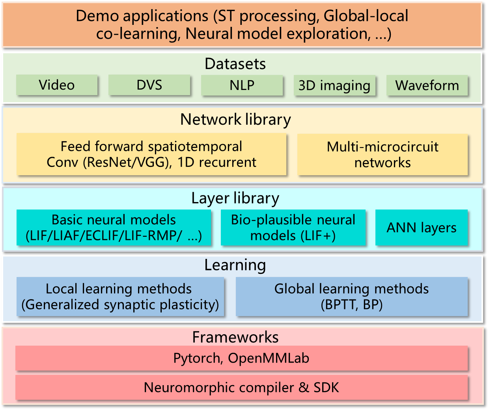

Overview
==================================================================================================

Brain-inspired deep learning development platform (BIDL) 
is a software stack for training brain-inspired deep learning networks and deploys on 
Lynxi brain-inspired systems. The framework is based on Pytorch, it can be treated as 
a reference application library and a tutorial for researchers on brain-inspired algorithms and 
neuromorphic computing.

BIDL supports the high-precision BPTT training method, which can be used to train 
typical SNN models and can be mixed with traditional deep learning network layers to 
achieve the construction and training of hybrid networks. This training 
platform fully considers the computing characteristics of Lynxi brain-inspiredchips, 
allowing networks trained by the platform to be automatically compiled and deployed on 
Lynxi brain-inspired systems for high-efficiency inference, as well as supporting 
global-local fusion online learning capacity in the head part of the network.

BIDL's main applications include dynamic vision sensor (DVS) data processing, video 
processing, and one-dimensional temporal data processing (such as speech and text).

BIDL's feature is using neurons' intrinsic capability for temporal data processing to 
construct lightweight networks for spatiotemporal processing, with significantly lower overhead 
compared to networks built with Conv3D or ConvLSTM, thus allowing for efficient spatiotemporal 
processing tasks.

Main Features
----------------------------------------------------------------------------------------------------------------------

The current features supported by BIDL are listed in the table below. The neuron model supports 
LIF and LIFplus, including one-dimensional data (1D) and frame data (2D), supporting spike firing 
modes and analog value firing modes. Users can also define neuron internal implementations themselves. 
In terms of network morphology, current support includes VGG-like (i.e., sequential, each layer only 
connects with one previous layer), resnet-like (with residual connections), Transformer-like, and  
YoloV5-like, etc. Currently, the mapping 
method supports only slicing according to time-steps (the aforementioned outer loop mode), supporting 
inner loop mode in future updates (mentioned as form 1 above). Synapse models include convolution/full 
connection. The learning mechanism currently employs BPTT offline training, and supporting on-chip 
learning (brain-inspired chip) for the head of the network. Network construction uses the Pytorch language, with 
inference support for the C++ SDK. Physical forms supported include box shape and board shape. Currently, 
the toolchain mapping is based on a single chip, the inference engine supports data parallelism; 
for model parallelism, users need to split the network and compile successively.

Table: BIDL Feature List

+---------------------+------------------------------------------------+
| Attribute           | Parameters                                     |
+=====================+================================================+
| Basic LIF Neurons   | LIF1D/2D                                       |
| Model               |                                                |
|                     | LIFplus1D/2D five cross-varieties              |
|                     |                                                |
|                     | Supports custom neurons                        |
+---------------------+------------------------------------------------+
| Basic LIF Output    | Spike firing                                   |
| Mode                |                                                |
|                     | Analog value firing                            |
+---------------------+------------------------------------------------+
| Basic LIF Internal  | Channel-wise sharing                           |
| Parameter Sharing   |                                                |
| Mode                | Full sharing                                   |
+---------------------+------------------------------------------------+
| Network Morphology  | VGG-like                                       |
|                     |                                                |
|                     | ResNet-like                                    |
|                     |                                                |
|                     | Support for variable input size, output size,  |
|                     | and layer number                               |
+---------------------+------------------------------------------------+
| Mapping Method      | Automatic mapping by time-step slicing         |
+---------------------+------------------------------------------------+
| Simple Synapse      | 2D convolution (only with LIF2D)               |
| Models              |                                                |
|                     | Full connection                                |
+---------------------+------------------------------------------------+
| Auxiliary Layer     | Temporal Aggregation Layer                     |
+---------------------+------------------------------------------------+
| Learning Mechanism  | BPTT - Approximate Step Function Derivatives   |
+---------------------+------------------------------------------------+
| Execution Platform  | BPTT training, inference                       |
| (GPU)               |                                                |
+---------------------+------------------------------------------------+
| Execution Platform  | Inference                                      |
| (Lite)              |                                                |
+---------------------+------------------------------------------------+
| Programming Language| Network construction and training: Python      |
|                     | (Pytorch)                                      |
|                     |                                                |
|                     | Network inference: Python or C++               |
+---------------------+------------------------------------------------+

Software Architecture
----------------------------------------------------------------------------------------

The architecture of the BIDL system is shown in the figure below, including Frameworks, 
Learning mechanisms, a Library of modules and components, a Network library, and various 
datasets and applications.

  Figure: BIDL System Architecture

Table: Explanation of BIDL System Architecture

+--------------+---------------------------------------------------------+
| Component    | Explanation                                             |
+==============+=========================================================+
|| Learning    || Learning mechanism, currently supports BP method via   |
||             || intrinsic support from Pytorch, needs Back Propagation |
||             || Through Time (BPTT) + surrogate gradient for SNN with  |
||             || time dimension, where surrogate gradient is employed   |
||             || for backward computation of spike firing steps         |
||             || (step functions). For principle explanations see       |
||             || :ref:`bptt`, with plans to support biomimetic          |
||             || plasticity methods in the future.                      |
+--------------+---------------------------------------------------------+
|| Layer Lib.  || Layer model library, mainly includes LIF/LIF+ models   |
||             || and other brain-inspired models, supports custom       |
||             || models as well.                                        |
+--------------+---------------------------------------------------------+
|| Network Lib.|| Network library, primarily includes spatiotemporal     |
||             || forward networks like ResNet-LIF, VGG-LIF, and 1D LIF  |
||             || networks.                                              |
+--------------+---------------------------------------------------------+
|| Datasets    || Includes:                                              |
||             || - DVS datasets: DVS Gesture, CIFAR10-DVS, MNIST-DVS;   |
||             || - Video datasets: Jesture, RGB-Gesture;                |
||             || - NLP datasets: IMDB, BabiQA;                          |
||             || - 3D medical image dataset Luna16Cls.                  |
||             || - ...                                                  |
+--------------+---------------------------------------------------------+
|| Demo        || Application cases including real-time DVS recognition, |
|| Application || and video stream recognition, etc.                     |
+--------------+---------------------------------------------------------+
|| Compiler    || Model compilation, mainly based on Lyngor, for         |
||             || compiling computational graphs exported from Pytorch,  |
||             || implementing full flow of mapping Pytorch models to    |
||             || chips, generating chip-executable programs.            |
+--------------+---------------------------------------------------------+
|| SDK         || For inference, including LynSDK (C++ and Python        |
||             || versions) and inference runtime built based on LynSDK. |
+--------------+---------------------------------------------------------+

Applicable Products
-------------------------------------------------------------------------------------------------

In the inference stage, BIDL is currently applicable to the following products:

- HP Series Brain-inspired Computing Accelerator Cards (for Servers)
- HS Series Edge Computing Devices
- SL Series Brain-inspired Computing Servers
- Other brain-inspired computing products developed based on HM100 Brain-inspired Computing Modules

In the training stage, the computer equipment for training networks can be desktop computers or 
servers, which should be equipped with Nvidia GPUs (2070 and above for desktop versions or server 
versions).

Basic Concepts
--------------------------------------------------------------------------------

+---------------------------+------------------------------------------------------------+
| Term                      | Explanation                                                |
+===========================+============================================================+
| SNN                       | Spiking Neural Network                                     |
+---------------------------+------------------------------------------------------------+
| ANN                       | Artificial Neural Network, mainly refers to deep neural    |
|                           | networks in this description                               |
+---------------------------+------------------------------------------------------------+
| LIF                       | Leaky Integrate and Fire, a neuron model commonly used in  |
|                           | SNN                                                        |
+---------------------------+------------------------------------------------------------+
| Membrane Potential        | A variable representing the temporal state of neurons,     |
|                           | biomimetic to biological neurons                           |
+---------------------------+------------------------------------------------------------+
| Spatiotemporal Processing | Processing of space and time dimensions                    |
|                           | concurrently, with space dimensions usually referring to   |
|                           | images, phonemes, words, which together form sequences     |
|                           | upon adding time dimensions like short video, audio, and   |
|                           | sentences.                                                 |
+---------------------------+------------------------------------------------------------+
| VGG                       | A type of sequential model, refers to sequential models    |
|                           | composed of ConvLIF sequential layers in this article,     |
|                           | without any branching.                                     |
+---------------------------+------------------------------------------------------------+

Restrictions
--------------------------------------------------------------------------------
**Hardware**

A Lynxi brain-inspired system or GPU is required to run this software. 
The brain-inspired system can be Server (SL800) / computing card 
(HP300 / HP280 / HP201)  / embedded platforms (HS110 / HS100) / 
systems with Lynxi modules (HM100). The framework can be run on 
both GPU systems and Lynxi systems.
Note that Lynxi systems are mainly designed for network inference. 
If using BIDL for network training, a GPU device is required.

**Software**

- Linux is required, Ubuntu 18.04 and higher versions are recommended.

- LynDriver+LynSDK must be installed if you run on Lynxi system. 

- Lyngor must be installed if you want to compile the network to Lynxi systems. 
