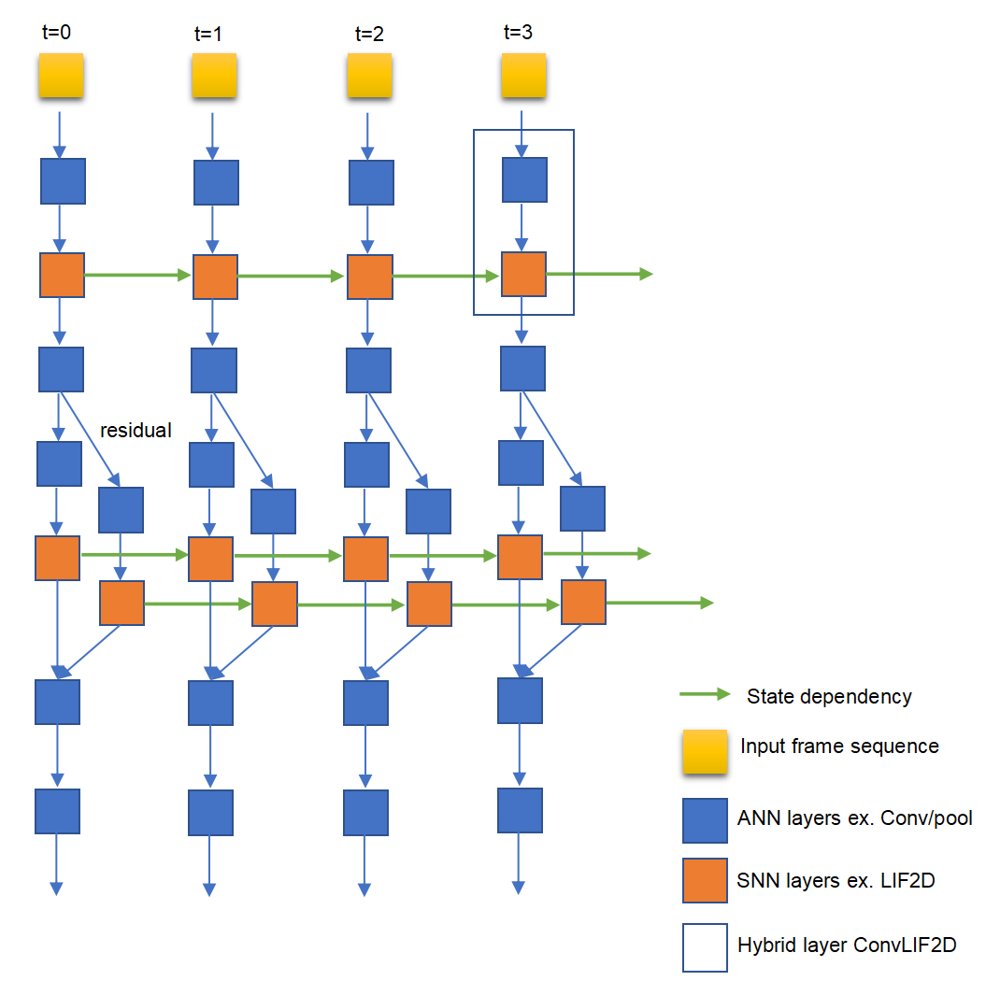

Introduction to Principles
===============================================================================

ANN+SNN Hybrid Neural Network
--------------------------------------------------------------------------------

The hybrid network adopts a multi-timestep forward network structure, where each timestep is a forward network, and the timesteps iterate in the SNN layer via state variables (such as membrane potential). The network includes SNN layers and ANN layers, where SNN layers refer to brain-inspired neuron layers like Leaky Integrate and Fire (LIF), LIF variants (LIFPlus), Izhikevich, etc., and ANN layers refer to artificial neural network layers such as Conv, Pooling, Batch Normalization. Additionally, to collect temporal dimension information, there is a temporal dimension aggregation layer (can be understood as summation in the time domain dimension).

The input form of the network is a frame sequence, including sequences obtained from short videos or DVS, each frame may have three dimensions [C, H, W]. When having multiple batches and multiple timesteps, the input data dimension is [B, T, C, H, W]. The input form can also be a one-dimensional sequence, such as text/speech, where each frame has only one dimension L. When having multiple batches and multiple timesteps, the input data dimension is [B, T, L]. Each timestep requires inputting one frame of data. The network has output at each timestep, the output can also be obtained from only the last timestep. The output can be multi-dimensional or one-dimensional (dimensional changes are achieved using global average pooling or flatten). Currently, when using Lynxi brain-inspiredcomputing platform for inference, only B=1 is supported.

For frame sequence processing, its main network is stacked with ConvLIF/ConvLIAF layers, and the interface between layers is a 5D tensor of dimension [B, T, C, H, W], representing batch size, time steps, number of feature maps, height, and width, respectively. For one-dimensional information processing, its main network is stacked with LIF/LIAF layers, and the interface between layers is a 3D tensor of dimension [B, T, L], where L is the number of neurons. Similarly, when building networks with ANN layers, for frame sequence processing, Conv3D/ConvLSTM layers also use a similar 5D tensor, and for one-dimensional information processing, LSTM/GRU also uses a similar 3D tensor. Thus, LIAF shares the same data format and interface with other ANN layers, making it easy to replace or integrate LIF/LIAF with spatial-temporal layers like Conv3D or ConvLSTM. The network structure is as shown below.

.. attention:: In the Pytorch description, the channel dimension is in the middle, namely [B, T, C, H, W], while in Lynxi mapping tool and chip implementation, the channel dimension is at the end, namely [B, T, H, W, C]. For convenience, unless specifically indicated otherwise, Pytorch's representation is used below.

.. _fig_2:

   Figure: Schematic Diagram of Hybrid Network Structure for Spatiotemporal Processing

Code Expression Form of Spatiotemporal Hybrid Network
--------------------------------------------------------------------------------

Based on the fundamental shape in :ref:`fig_2`, the spatiotemporal hybrid network has two expression forms, mainly for easy code representation.

Inner Loop Mode
~~~~~~~~~~~~~~~~~~~~~~~~~~~~~~~~~~~~~~~~~~~~~~~~~~~~~~~~~~~~~~~~~~~~~~~~~~~~~~~~

Each layer has multiple timesteps, and the input and output variables of the layer carry a time dimension. For purely spatial processing layers that can only handle one timestep of information, such as convolution layers, it is necessary to add a time_distributed identifier to indicate repeated computation for each timestep, such as time_distributed(conv). For layers like Lif with timestep updates, the update content for each timestep is described as a cell, and each layer includes a description of the process of executing the cell multiple times, along with an initialization description of the initial state values, thereby achieving multiple executions in the time dimension, as shown below.

   Figure: Inner Loop Mode of Hybrid Spatiotemporal Network (Layer Contains Timestep Form)

Outer Loop Mode
~~~~~~~~~~~~~~~~~~~~~~~~~~~~~~~~~~~~~~~~~~~~~~~~~~~~~~~~~~~~~~~~~~~~~~~~~~~~~~~~

The expression of all network structures is a single timestep description, with a timestep loop on the outermost layer to loop through multiple timesteps. For purely spatial layers without state variables, such as convolution layers, it is the same as ordinary DNN image processing networks. For layers with state variables, such as SNN, the state variables are placed in the private variable of each layer. In this structure, each layer only contains the cell, such as LIFCell, and the outer shell no longer includes the loop, with the network having a timestep loop only in the outermost layer, as shown below.

   Figure: Outer Loop Mode of Hybrid Spatiotemporal Network (Outer Loop Timestep Form)

It is visible that the spatiotemporal network constructed in the above two forms is logically equivalent and equivalent to the form in :ref:`fig_2`. Currently, Lynxi Lyngor compilation mainly targets compilation and deployment in the outer loop mode, and support for the inner loop mode will be expanded in the future.

Outer Loop Extension Mode
~~~~~~~~~~~~~~~~~~~~~~~~~~~~~~~~~~~~~~~~~~~~~~~~~~~~~~~~~~~~~~~~~~~~~~~~~~~~~~~~

When performing classification tasks, the input information typically has a time dimension and the output is a classification result without a time dimension. Therefore, it is logically divided into a multi-layer looping (multi-timestep) backbone (usually VGG or ResNet) and a non-looping head (usually multi-layer fully connected), with a temporal aggregation layer used to reduce the time dimension between the two (pooling of the time dimension). During training in this framework, the head input is usually head input=\ :math:`sum\ of\ each\ timestep\ backbone\ output/timesteps`\ , which is taking the average in the time dimension. Pseudocode is as follows:

::

   reset_states()
   for t = 0 : T - 1
   rst(t) = backbone(in(t))
   rst_no_temporal = sum(rst)/T
   out_cls = head(rst_no_temporal)

When using Lynxi chip for inference, since only the outer loop mode is currently supported, the above code is transformed into the following form:

::

   reset_states()
   for t = 0 : T - 1
   rst(t) = backbone(in(t))
   temporal(t) = add(rst(t), temporal(t))
   out(t) = head(temporal(t)/T)

The output ``out(T)`` at the last timestep is consistent with the original out_cls result, and the rest of ``out(t)`` can be discarded.

The principle is to convert the addition of multiple timesteps into cumulative addition at each timestep, so the last timestep's\ :math:`temporal(t)/T`\ 
is the same as the original\ :math:`sum(rst)/T`\ .

Network Structures Supported by BIDL
--------------------------------------------------------------------------------

Input Processing
~~~~~~~~~~~~~~~~~~~~~~~~~~~~~~~~~~~~~~~~~~~~~~~~~~~~~~~~~~~~~~~~~~~~~~~~~~~~~~~

For DVS data, which usually takes the form of event data, each event is a quadruple (x, y, ts, p), representing the event's x and y coordinates, timestamp, and brightness increase/decrease indicator, respectively. A large number of events form an event sequence, representing the current perception of image brightness changes. To use the aforementioned structure, the event information over a period of time needs to be processed into frames to form a frame sequence. For example, events within every 15ms can be merged into one frame data, which has dimensions [C, H, W], where C=2, indicating two channels storing events with p=1 and p=-1, respectively. A sample contains a sequence of multiple frames, usually representing a dynamic light intensity variation sequence captured by DVS over a short period. The input data to Lynxi brain-inspired systems can be in fp16 or int8 formats; thus, p can be an analog value rather than binary, depending on the user's needs.

For short video data, it also needs to be processed into the above-mentioned frame sequence form, where each frame is a small image, and the sizes of all frame images must be consistent.

For one-dimensional data processing, it is usually necessary to preprocess into a sequence of one-dimensional vectors (taking each time snapshot as a one-dimensional vector) to input into the network.

Output Processing
~~~~~~~~~~~~~~~~~~~~~~~~~~~~~~~~~~~~~~~~~~~~~~~~~~~~~~~~~~~~~~~~~~~~~~~~~~~~~~~

Currently, the main focus is on recognition (classification) networks, with the output being probabilities of several classifications. If other output forms need to be supported, logically, it is feasible and requires users to construct by themselves.

Network Description and Training Description Method
~~~~~~~~~~~~~~~~~~~~~~~~~~~~~~~~~~~~~~~~~~~~~~~~~~~~~~~~~~~~~~~~~~~~~~~~~~~~~~~

In terms of network building and training, BIDL is constructed based on Pytorch, with the specific usage scheme elaborated in the code usage guide.

For compilation and deployment, the constructed network is fully automatically compiled using Lyngor and inference is implemented using LynSDK. BIDL provides sample code in this aspect.

Example Network Structure
~~~~~~~~~~~~~~~~~~~~~~~~~~~~~~~~~~~~~~~~~~~~~~~~~~~~~~~~~~~~~~~~~~~~~~~~~~~~~~~

An example network structure for processing CIFAR10 DVS data is shown in the following figure.

.. figure:: _images/空时处理网络结构示意.png
   :alt: Spatiotemporal Processing Network Structure Schematic

   Figure: Spatiotemporal Processing Network Structure Schematic

The network structure includes five spatiotemporal convolution networks (LIF Block) + SumLayer (used to eliminate the temporal dimension, reducing feature dimensions from [T, H, W, L] to [H, W, L]) + two fully connected layers. The LIF Block layer consists of Conv2d, Layer Normalization (extremely effective for stabilizing dynamics in recurrent network hidden states), Relu, AvgPool2D, TLIF2D; DenseBlock consists of a dropout layer (optional) and a fully connected layer.

.. _bptt:

BPTT Training of Hybrid Networks
--------------------------------------------------------------------------------

Hybrid networks can be trained through Backpropagation Through Time (BPTT), which is widely used in training neural networks in the time domain. hybrid networks are recursive networks, so we expand the time domain, forming a two-dimensional grid, as shown in :ref:`fig_7` (a). Each node represents a node function (NF), defined as:

.. math::

   \begin{array}{r}
   \left( V_{m}^{l,t},X^{l + 1,t} \right) = NF\left( V_{m}^{l,t - 1},X^{l,t} \right)
   \end{array}

Where: \ :math:`l`\ is the layer index, \ :math:`t`\ is the current time step, \ :math:`V_{m}^{l,t}`\ is the neuron's membrane potential (hidden state), and \ :math:`X^{l,t}`\ is the activation.

Since the graph of the recursive network is the same as :ref:`fig_7` (a), the same backpropagation rules are used for training at the NF level. The difference lies within the nodes. We can detail the LIAF node function in :ref:`fig_7` (b). For LIAF, the relationship between \ :math:`U_{m}^{l,t}`\ and \ :math:`V_{m}^{l,t}`\ can be described as a \ :math:`\tau( \cdot )`\ function:

.. math::
   
   {\tau(U}_{m}^{l,t}) = \alpha \cdot S\left( U_{m}^{l,t - 1} - V_{th} \right) \cdot V_{reset} + \alpha \cdot \left\lbrack 1 - S\left( U_{m}^{l,t} - V_{th} \right) \right\rbrack \cdot U_{m}^{l,t} + \beta

Where \ :math:`S(x)`\ is the Heaviside step function.
Using the BPTT algorithm, according to the derivative chain, when deriving the partial derivative of \ :math:`V_{m}^{l,t}`\ with respect to \ :math:`U_{m}^{l,t}`\, we have:

.. math::

   \begin{array}{r}
   \frac{\partial\tau\left( U_{m}^{l,t} \right)}{U_{m}^{l,t}} = \alpha \cdot \delta\left( U_{m}^{l,t} - V_{th} \right) \cdot \left( V_{reset} - U_{m}^{l,t} \right) + \alpha \cdot \left( 1 - S\left( U_{m}^{l,t} - V_{th} \right) \right)
   \end{array}

:math:`\delta(x)` is the Dirac Delta function, which is unfriendly for backpropagation. Therefore, we introduce a rectangular window approximation for\ :math:`\delta(x)`\, defined as:

.. math::

   \begin{array}{r}
   \overline{\delta}(x) = \left\{ \begin{aligned}
   1,\ \  & when\ |x| < \mu \\
   0,\ \  & otherwise
   \end{aligned} \right.
   \end{array}

Where \ :math:`\mu`\ is a small positive number. In LIAF-Net, the partial derivatives of other operations are easily obtainable and can be automatically handled by deep learning frameworks.

.. _fig_7:

   Figure: Training Method Schematic Diagram

.. attention:: Currently, BIDL requires a GPU for BPTT training.

Description of Supported Neuron Models in BIDL
--------------------------------------------------------------------------------

The main neuron models supported by BIDL are listed in the table below. Additionally, BIDL can implement custom neuron models using code descriptions.

Table: List of Supported Neuron Models (Layers)

+----------------+-------------------------------------------------------+
| Model (Layer)  | Description                                           |
+================+=======================================================+
| LIF/LIAF       | Standard LIF/LIAF model (compatible with IF model)    |
+----------------+-------------------------------------------------------+
| LIFPlus        | Various variants of the LIF model, including various  |
|                | types of post-synaptic current models, such as        |
|                | exponential forms, alpha forms, inversion voltage     |
|                | forms; refractory methods (absolute, relative,        |
|                | cancellation); spike trigger types (immediate,        |
|                | quadratic, exponential), inhibitory methods (adaptive |
|                | consistency, subthreshold consistency); decay methods |
|                | (linear, exponential), etc.                           |
+----------------+-------------------------------------------------------+
| Custom         | Custom using Pytorch                                  |
| (To be opened) |                                                       |
+----------------+-------------------------------------------------------+

LIFPlus is a variation of LIF in the various execution stages, as shown in the figure below.

   Figure: LIFPlus Neuron Options and Combinations Overview

The following sections will introduce each model specifically. For more detailed neuron API descriptions, please refer to the detailed usage instructions (readme.md).

LIF and LIAF Neuron Models
~~~~~~~~~~~~~~~~~~~~~~~~~~~~~~~~~~~~~~~~~~~~~~~~~~~~~~~~~~~~~~~~~~~~~~~~~~~~~~~~~~~~~~

Dynamical Equation of the Basic LIF Model
^^^^^^^^^^^^^^^^^^^^^^^^^^^^^^^^^^^^^^^^^^^^^^^^^^^^^^^^^^^^^^^^^^^^^^^^^^^^^^^^^^^^^^

The original LIF model is described by a differential equation to exhibit the dynamic characteristics of neurons, as expressed below:

.. math::

   \begin{array}{r}
   \tau\frac{dV(t)}{dt} = - \left( V(t) - V_{reset} \right) + \sum_{i = 1}^{n}{W_{i} \cdot X_{i}(t)}
   \end{array}

where \ :math:`\tau`\ is the time constant of the neuron, \ :math:`V_{reset}`\ is the reset potential. \ :math:`Xi(t)`\ 
is the input signal (either spike or no signal) from the i-th neuron connected to the current neuron with weight \ :math:`W_{i}`\ .
When \ :math:`V(t)`\ reaches a certain threshold \ :math:`V_{th}`\ , a spike is emitted, and
\ :math:`V(t)`\ is reset to its initial value \ :math:`V_{reset}`\ .

Iterative Form Description
^^^^^^^^^^^^^^^^^^^^^^^^^^^^^^^^^^^^^^^^^^^^^^^^^^^^^^^^^^^^^^^^^^^^^^^^^^^^^^^^^^^^^^

Due to the better performance of simulating value transmission in spatiotemporal fusion neural networks, we extended the LIF to LIAF neuron. BIDL supports LIF/LIAF; due to their similarity, they are introduced together here.

LIF and LIAF neurons are similar, having analogous dendritic integration processes, and integrating temporal dynamics, including threshold comparison and spike emission, membrane potential reset. The input and output values of LIF are spike values (0/1 sequences or event sequences), whereas those of LIAF are continuous values, as shown in the figure. Unlike LIF, in LIAF, the spikes emitted by the neuron model are only used to reset the membrane potential; thus, the membrane potential of the LIAF neuron is similar to that in LIF, but the output activation is achieved through another activation function.

.. figure:: _images/传统感知器、LIF和LIAF神经元模型的比较.png
   :alt: Comparison of Traditional Perceptron, LIF and LIAF Neuron Models

   Figure: Comparison of Traditional Perceptron, LIF and LIAF Neuron Models

LIAF maintains analog input and analog output similar to perceptron neurons, and retains time dynamics similar to LIF neurons.

Mathematical Description of the LIF/LIAF Models
^^^^^^^^^^^^^^^^^^^^^^^^^^^^^^^^^^^^^^^^^^^^^^^^^^^^^^^^^^^^^^^^^^^^^^^^^^^^^^^^^^^^^^

The original LIF model is described by a differential equation to exhibit the dynamic characteristics of neurons, as expressed below:

.. math::

   \begin{array}{r}
   \tau\frac{dV(t)}{dt} = - \left( V(t) - V_{rest} \right) + \sum_{i = 1}^{n}{W_{i} \cdot X_{i}(t)}
   \end{array}

where \ :math:`\tau`\ is the time constant of the neuron, \ :math:`V_{rest}` \ is the resting potential. \ :math:`Xi(t)` \ 
is the input signal from the i-th neuron connected to the current neuron with weight \ :math:`W_{i}`\ .
When \ :math:`V(t)`\ reaches a certain threshold \ :math:`V_{th}`\ , a spike is emitted, and \ :math:`V(t)`\ 
is reset to its initial value \ :math:`V_{reset}`\ . For ease of derivation and training, we adopt the iterative 
version of LIF in discrete time[34,35]. Below, LIF and LIAF neuron models are compared as follows:

1. Synaptic Integration:

   .. math::

      \begin{array}{r}
      I^{t} = \left\{ \begin{array}{r}
      X^{t} \cdot W, for\ dense; \\
      Conv\left( X^{t},W \right), for\ convolution;\\
      X^{t}, for\ synapse-free.\ 
      \end{array} \right.\ 
      \end{array}

   where:

   - :math:`X^{t}`\ denotes the activation value of the presynaptic neuron;
   - W refers to the synaptic weight.

   Synaptic integration can adopt either a fully connected or convolutional form.

2. Combine Spatial and Temporal Information:

   .. math::

      \begin{array}{r}
      U_{}^{t} = I^{t} + V_{m}^{t - 1}
      \end{array}

   where:

   - :math:`V_{m}^{t - 1}`\ : the previous membrane potential;
   - :math:`U_{}^{t}`\ : the current membrane potential.

3. Homeostasis, Perform Batchnorm Operation:

   .. math:: U_{bn}^{t} = \ BatchNorm(U_{}^{t})

4. Threshold Comparison, Spike Emission:

   .. math::

      \begin{array}{r}
      F^{t} = U_{bn}^{t} \geq V_{th}
      \end{array}

   where, \ :math:`F^{t}`\ is the emission signal.

   .. note:: 
      
      For each \ :math:`F_{j}^{t}`\ in \ :math:`F^{t}`\ , \ :math:`F_{j}^{t}` 
      = 1 signifies a spike emission event, otherwise \ :math:`F_{j}^{t}` = 0.

5. Reset Membrane Potential.

   .. math::

      \begin{array}{r}
      R_{m}^{t} = F^{t} \cdot V_{reset} + \left( 1 - F^{t} \right) \cdot \ U_{bn}^{t}
      \end{array}

6. Perform Leakage.

   .. math::

      \begin{array}{r}
      V_{m}^{t} = \alpha \cdot R_{m}^{t} + \beta
      \end{array}

   where α and β represent the multiplicative decay coefficient and additive decay coefficient, respectively.

7. Output.

   .. math::

      \begin{array}{r}
      Y^{t} = \left\{ \begin{aligned}
      F^{t},\ \  & for\ LIF; \\
      f(U_{bn}^{t},V_{th}),\ \  & for\ LIAF.
      \end{aligned} \right.
      \end{array}

   :math:`f(U_{m}^{t},V_{th})`\ is an analog activation function. It can be threshold-related (TR mode),
   or not (NTR mode).

   .. math::

      \begin{array}{r}
      f\left( x,V_{th} \right) = \left\{ \begin{aligned}
      Act\left( x - V_{th} \right),\ \  & for\ TR\ mode; \\
      Act(x),\ \  & for\ NTR\ mode.
      \end{aligned} \right.
      \end{array}

We name the Dense integration, Convolutional integration, and integration 
free in LIAF/LIF as DenseLIAF/DenseLIF, ConvLIAF/ConvLIF, and DirectLIAF/DirectLIF 
respectively, where convolution refers to 2D convolution.

Moreover, \ :math:`V_{th}`\ , \ :math:`V_{reset}`\ , \ :math:`\alpha`\ , and
\ :math:`\beta`\ may vary across each convolutional channel (neurons within a channel share 
the same value), may vary across each neuron, or may be the same for all neurons in the network. 
These three scenarios are named: Channel-Sharing mode, Non-Sharing mode, and All-Sharing mode, 
respectively.

To reduce the number of parameters in experiments, Non-Sharing mode should be avoided in
ConvLIAF/ConvLIF.

LIFPlus Neuron Model
~~~~~~~~~~~~~~~~~~~~~~~~~~~~~~~~~~~~~~~~~~~~~~~~~~~~~~~~~~~~~~~~~~~~~~~~~~~~~~~~~~~~~~

The LIF variant (LIFPlus) refers to some LIF variant models formed by finer or differentiated 
modeling of the membrane potential decay, input pulse accumulation, pulse triggering, 
pulse-triggered current, and refractory period of LIF, collectively referred to as LIFPlus.

LIF model modeling:

.. math::

   \begin{array}{r}
   \tau\frac{dv}{dt} = v_{0} - v + I\ \ \ \ \ if\ v > \theta,then\ fire\ a\ spike\ and\ v = v_{0}
   \end{array}

Using the Euler method:

.. math::

   \begin{array}{r}
   v_{t} = v_{t - 1} + \frac{\mathrm{\Delta}t}{\tau}\left( v_{0} - v_{t - 1} + I_{t} \right)\ \ \ \ ifv_{t} > \theta,then\ fire\ a\ spike\ and\ v_{t} = v_{0}
   \end{array}

Where :math:`\mathrm{\Delta}t` represents the sampling time interval, and :math:`\tau` is the 
time constant of the neuron.

Using the LIF model as the baseline neuron model, the identified features are classified into 
five categories based on how they affect neuron behavior: membrane decay, input pulse accumulation, 
pulse triggering, pulse-triggered current, and refractory period.

Membrane Decay: According to the manner in which a neuron's membrane potential decays over time, 
there exist two biological characteristics: exponential decay (EXD) and linear decay (LID) 
(mainly used by LLIF).

.. math::

   \begin{array}{r}
   v_{t} = \left\{ \begin{array}{r}
   v_{t - 1} + \frac{\mathrm{\Delta}t}{\tau}\left( v_{0} - v_{t - 1} + I_{t} \right)\ \ \ (EXD mode) \\
   v_{t - 1} + I_{t} - V_{leak}\ \ \ \ \ \ (LID mode)
   \end{array}\ \ \ \ \  \right.
   \end{array}

.. math::

   \text{if } v_t > \theta, \text{ then fire a spike and } v_t = v_0

Where\ :math:`V_{leak}`\ is the linear delay constant.

Input Pulse Accumulation: When a neuron receives pulses through synapses, it updates the 
membrane potential based on synaptic weights, with two types of accumulation: instantaneous and 
non-instantaneous, with four biological characteristics.

Current Accumulation (CUB): After a neuron receives input pulse signals, it immediately 
accumulates the synaptic weight of the input pulse signal to the membrane potential.

Conductance Accumulation: Depending on the type of surrogate function, it is categorized into 
exponential function type (COBE) and alpha function type (COBA).

Reversal Voltage (REV): Regulates the effect of the surrogate function on the membrane potential. 
The smaller the difference between the current membrane potential and the reversal voltage, the 
less its contribution.

Extending the LIF model using additional variables:

.. math::

   \begin{array}{r}
   y_{t,i} = \left( 1 - \varepsilon_{g,i} \right)y_{t - 1,i} + I_{t,i}
   \end{array}

.. math::

   \begin{array}{r}
   g_{t,i} = \left\{ \begin{array}{r}
   I_{t,i},\ \ \ \ \ \ \ \ \ \ \ \ \ \ (CUB mode) \\
   \left( 1 - \varepsilon_{g,i} \right)g_{t - 1,i} + I_{t,i},\ \ \ \ \ (COBE mode) \\
   \left( 1 - \varepsilon_{g,i} \right)g_{t - 1,i} + e\varepsilon_{g,i}y_{t,i}\ ,(COBA mode)
   \end{array} \right.
   \end{array}

.. math::

   \begin{array}{r}
   v_{rev,i} = \left\{ \begin{aligned}
   1,\ \  & (\text{Non-REV mode}) \\
   v_{g,i}{- v}_{t - 1},\ \  & (\text{REV mode, cannot be CUB mode simultaneously})
   \end{aligned} \right.
   \end{array}

.. math::

   \begin{array}{r}
   v_{t} = v_{t - 1} + \frac{\mathrm{\Delta}t}{\tau}\left( v_{0} - v_{t - 1} + \sum_{}^{i}{v_{rev,i} \cdot g_{t,i}} \right)
   \end{array}

In these equations, \ :math:`\varepsilon_{g,i}`\ and \ :math:`v_{g,i}`\ are the conductance 
decay constant and reversal voltage constant of the \ :math:`i`\ th synapse type, and e is Euler's 
number.

Pulse Triggering: In the LIF model, when a neuron's membrane potential reaches the threshold 
voltage \ :math:`\theta`\ , the neuron immediately fires a spike and sets its membrane potential 
to the resting potential \ :math:`v_{0}`\ . Another type of neuron model does not immediately 
trigger a pulse. This neuron model uses a surrogate non-instantaneous function to control the 
membrane potential once it reaches the threshold voltage. There are two other biological 
characteristics in this category: quadratically (QDI) and exponentially (EXI) initiated spikes. 
Similar to input spike accumulation, QDI and EXI use quadratic functions and exponential functions as surrogate functions, respectively.

.. math::

   \begin{array}{r}
   f(t) = \left\{ \begin{array}{r}
   v_{0} - v_{t - 1} + \mathrm{\Delta}T \cdot e^{\frac{v_{t - 1} - \theta}{\mathrm{\Delta}T}}\ \ \ (\text{EXI mode}) \\
   \left( v_{0} - v_{t - 1} \right)\left( v_{c} - v_{t - 1} \right)\ (\text{QDI mode})
   \end{array}\ \ \ \ \ \ \  \right.
   \end{array}

.. math::

   \begin{array}{r}
   v_{t} = v_{t - 1} + \frac{\mathrm{\Delta}t}{\tau}\left( f(t) + I_{t} \right)
   \end{array}

.. math:: if\ \ v_{t} > v_{\theta}\ \ ,then\ fire\ a\ spike\ and\ v_{t} = v_{0}

Where \ :math:`v_{\theta}`\ is the trigger voltage (greater than the threshold voltage 
\ :math:`\theta`\ ), and \ :math:`\mathrm{\Delta}T`\ is the sharpness factor (not infinite), 
\ :math:`v_{c}`\ is the critical voltage.

Pulse-Triggered Current: In certain neuron models, including the AdEx model, neurons 
self-inhibit their membrane potential after triggering an output pulse. In this category, there 
are two biological characteristics: adaptation (ADT) and subthreshold oscillation (SBT).

- ADT: Slowly decreases the neuron's allowable pulse triggering frequency upon receiving a large 
  number of continuous input pulses over a short period. It enables encoding of timing information 
  from the start of the input.

- SBT: Causes the neuron's membrane potential to oscillate around a certain voltage level, 
  usually higher than the resting potential. Neurons enhanced with SBT can filter spikes within 
  a specific time interval, thus acting as a band-pass filter.

The LIF model can be extended as:

.. math::

   \begin{array}{r}
   w_{t} = \left\{ \begin{aligned}
   (1 - \varepsilon_{w})w_{t - 1},\ \  & (\text{ADT mode}) \\
   \left( 1 - \varepsilon_{w} \right)w_{t - 1} + \frac{\mathrm{\Delta}t}{\tau}a\left( v_{t - 1} - v_{w} \right),\ \  & (\text{SBT mode})
   \end{aligned} \right.
   \end{array}

.. math::

   v_{t} = v_{t - 1} + \frac{\mathrm{\Delta}t}{\tau}\left( v_{0} - v_{t - 1} + I_{t} \right) + w_{t}

.. math::
   
   \text{if } v_t > \theta, \text{ then fire a spike and } v_t = v_0, w_t = w_t - b
   

Where,

- :math:`\varepsilon_{w}`\ is the adaptation decay constant;
- :math:`a`\ is the subthreshold coupling constant;
- :math:`b`\ is the jump size of the pulse trigger;
- :math:`v_{w}`\ is the coupling membrane potential offset constant;
- Since ADT and SBT are triggered by the generation of output pulses, \ :math:`w_{t}`\ and \ :math:`v_{t}`\ are adjusted together during pulse triggering.

Refractory Period: Prevents neurons from emitting too many output pulses in a short period. 
Two biological characteristics in this category are absolute refractory period (AR) and relative 
refractory period (RR).

The AR in the LIF model can be expressed as:

.. math::

   \begin{array}{r}
   if\ {cnt}_{t - 1} > 0,then\ \ I_{t} = 0
   \end{array}

.. math::

   \begin{array}{r}
   {cnt}_{t} = \max\left( 0,{cnt}_{t - 1} - 1 \right)
   \end{array}

.. math::

   \begin{array}{r}
   v_{t} = v_{t - 1} + \frac{\mathrm{\Delta}t}{\tau}\left( v_{0} - v_{t - 1} + I_{t} \right)
   \end{array}

.. math::
   
   \text{if } v_t > \theta, \text{ then fire a spike and } v_t = v_0, \text{cnt}_t = \text{cnt}_{\max}

The RR LIF model can be expressed as:

.. math::

   \begin{array}{r}
   r_{t} = \left( 1 - \varepsilon_{r} \right)r_{t - 1}
   \end{array}

.. math::

   \begin{array}{r}
   w_{t} = \left( 1 - \varepsilon_{w} \right)w_{t - 1}
   \end{array}

.. math::

   \begin{array}{r}
   v_{t} = v_{t - 1} + \frac{\mathrm{\Delta}t}{\tau}\left( v_{0} - v_{t - 1} + I_{t} \right) + r_{t}\left( v_{rr} - v_{t - 1} \right) + w_{t}\left( v_{ar} - v_{t - 1} \right)
   \end{array}

.. math::

   \text{if } v_t > \theta, \text{ then fire a spike and } v_t = v_0, r_t = r_t - q_r, w_t = w_t - b

Where,

- :math:`\varepsilon_{r}`\ is the relative refractory decay constant;
- :math:`\varepsilon_{w}`\ is the adaptive decay constant;
- :math:`v_{ar}`\ is the adaptive reversal voltage;
- :math:`q_{r}`\ is the jump size of the relative refractory period;
- :math:`v_{rr}`\ is the relative refractory reversal voltage.

.. _zdysjymx:

Custom Neuron Model
~~~~~~~~~~~~~~~~~~~~~~~~~~~~~~~~~~~~~~~~~~~~~~~~~~~~~~~~~~~~~~~~~~~~~~~~~~~~~~~~~~~~~~

BIDL supports custom neurons. Users can describe neurons using PyTorch's default syntax conventions.

Building custom neurons: Create a new file *custom_neuron.py* in the */bidlcls/models/layers* directory under the BIDL project, which first constructs the code implementation for the custom neuron model. The *custom_neuron.py* needs to include implementations of the classes ``Custom_neuron``, ``Custom_neuron1d``, ``Custom_neuron2d``, ``Fc_Custom_neuron``, and ``Conv2d_Custom_neuron``.

The *Custom_neuron* class is the base class for custom neurons, implementing the complete process of custom neuron calculations, inheriting from ``torch.nn.Module``. In the ``init`` method of this class, in addition to including several commonly used parameters of neurons, namely norm (homeostasis), mode (whether the output value is spike or analog), soma_params (neuron soma parameters), noise (noise added during training), etc., it also needs to include flags ``on_apu`` and ``fit`` used to distinguish whether it is compiled on the APU. During initialization, if ``on_apu`` is judged to be ``True``, a UUID value for the neuron needs to be generated using the uuid1 function. In addition, for the state variables of this custom neuron (such as membrane potential, etc.), they need to be initialized to ``None`` in the ``init`` method. The ``forward`` method of the ``Custom_neuron`` class specifically implements the neuron operation process. At the beginning and end of the ``forward`` method, it checks whether the class has the ID attribute. If it does, and it needs to be compiled on APU, it calls custom operators ``load`` and ``save`` to implement the reading and saving of state variables, as shown in the Lif neuron example below:

::

    def forward(self, xi: pt.Tensor) -> pt.Tensor:
       if hasattr(self, 'id'):  # for lyngor apu
           self.v = ops.custom.load(self.v, f'v{self.id}')
   
   ....
   
      if hasattr(self, 'id'):  # for lyngor apu
          self.v = ops.custom.save(self.v, f'v{self.id}')

If the custom neuron has threshold comparison and spike firing operations, the threshold comparison operation is implemented as follows:

.. math::
   
   \begin{array}{r}
   F^{t} = V^{t} \geq V_{th}\ \ \ \ 
   \end{array}

Then when the APU compilation flag is ``True``, a custom operator can be used to replace it to improve APU execution speed.

::

   fire = ops.custom.cmpandfire(self.v.clone(), self.v_th)

In addition to implementing the ``init`` method and ``forward`` method, the ``Custom_neuron`` class also needs to implement the ``add_noise`` method and ``reset`` method.

``add_noise`` method: If the mode is training and the noise parameter in initialization is non-zero, random noise is added to the neuron state variable. Below is the implementation of the ``add_noise`` method for the Lif neuron:

::

   def add_noise(self):
       with pt.no_grad():
           v_shape = self.v.shape
           noise = pt.randn(v_shape, dtype=self.v.dtype, device=self.v.device)
           scale = pt.std(self.v, dim=[_ for _ in range(2, len(v_shape))], keepdim=True) * self.noise
           self.v += noise * scale

``reset`` method: Used to define the size of the state variable shapes and initialize them to 0. If compiling on APU, call its ``reset`` method before each custom neuron execution; otherwise, call ``reset`` at the first beat of each sample. Below is an example of the ``reset`` method in Lif:

::

      def reset(self, xi):
         self.v = pt.zeros_like(xi)

The ``Custom_neuron1d`` and ``Custom_neuron2d`` classes are one-dimensional and two-dimensional wrappers for custom neurons, respectively, both inheriting from the ``Custom_neuron`` class. If homeostasis is needed in ``Custom_neuron1d``, the ``nn.BatchNorm1d`` operation is directly used, while in ``Custom_neuron2d`` it is ``nn.BatchNorm2d``. Both of these classes have only an ``init`` method, the ``forward`` method directly uses the base class's ``forward``.

The ``Fc_Custom_neuron`` class: Wraps the fc layer and custom neurons, inheriting from ``torch.nn.Module``, and includes ``init``, ``forward``, and ``reset`` methods. Note that the fc layer is a two-dimensional operation, while custom operators in custom neurons only support four-dimensional operations when compiled on APU, so dimensional operation adjustments are needed based on flag bits. Specific operations include the following aspects:

- In the ``init`` method, if the ``on_apu`` flag is ``True`` and homeostasis is needed, the ``nn.BatchNorm2d`` method is called, otherwise, ``nn.BatchNorm1d`` is used.
- In the ``reset`` method, if the ``on_apu`` flag is ``True``, state variables are initialized as 4-dimensional tensors, otherwise, they are initialized as 2-dimensional tensors.
- In the ``forward`` operation, if the ``on_apu`` flag is ``True`` and the current input is two-dimensional, the ``unsqueeze`` method is called twice consecutively to raise the input to 4-dimensional, then operations on custom neuron layers are performed, after which ``reshape`` is used to reduce the dimensions back to 2-dimensional.

The ``Conv2d_Custom_neuron`` class encloses the convolutional 2D layers and custom neuron layers, inheriting from ``torch.nn.Module``. As the input and output of the 2D convolutional layer are inherently four-dimensional, there is no need for the dimensional operation adjustments present in the ``Fc_Custom_neuron`` class.

Using Custom Neurons: After the custom neurons and their encapsulated classes are constructed, they can be used to build models. For the outer loop network, the construction of the backbone is in the *bidlcls/models/backbones/bidl_backbones_itout.py* file. To build a model class based on a custom neuron ``custom_neuron``, first import ``Fc_Custom_neuron`` and ``Conv2d_Custom_neuron`` defined in *custom_neuron.py* in the *bidl_backbones_itout.py* file. Then, write the model's ``backbone`` class, inheriting from ``torch.nn.Module``. In the model class's ``init`` method, add ``Conv2d_Custom_neuron`` layer or ``Fc_Custom_neuron`` layer as needed.
